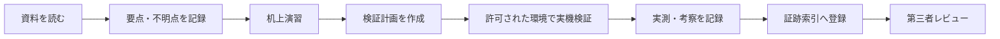

# リポジトリ利用ガイド

## 現在の状態

> [!IMPORTANT]
> **状態:** 提出構成・学習資料準備済み / docs/00〜27 初回通読済み / 詳細レビュー継続中 / リポジトリ内演習未実施 / 実機証跡なし
>
> この状態は、技能の習得や演習の完了を示すものではありません。本文を本人が確認し、要点・不明点の記録、机上演習、実機検証を実施した事実だけを、後から証跡として記録します。

本リポジトリは、前回の意見交換で関心・期待が示された OpenShift 周辺技術を、自主的なキャッチアップ対象として整理したものです。特定案件の正式要件、参画の確約、商用環境での実績を示すものではありません。

## 最初に読む提出導線

外部共有時は、次の順に読むことで、目的、経験境界、学習対象、実施状況を短時間で確認できます。

1. [README](../README.md) — 目的、位置づけ、全体構成
2. [キャッチアップ成果報告](../learning-report.md) — 要求領域、現在地、ギャップ、現時点の実施状況
3. [面談要求領域の整理](01-meeting-requirements-summary.md) — 意見交換から抽出した関心・期待領域
4. [現在地のスキル整理](02-current-skill-position.md) — 商用経験、教材・検証、概要理解、未経験の境界
5. [スキルギャップ分析](03-skill-gap-analysis.md) — 不足点と確認方法
6. [30 日学習ロードマップ](04-learning-roadmap.md) — 今後の学習・演習順序
7. [証跡索引](../evidence/README.md) — 本人が実施した記録だけを一覧化

技術詳細は `docs/05` 以降、演習素材は `labs/`、本人の実施記録は `evidence/` に分けています。参考回答やサンプルは証跡として扱いません。

## 学習時の番号順

学習するときは、[README](../README.md) と [learning-report.md](../learning-report.md) を確認した後、この `docs/00` から `docs/27` まで番号順に進めます。番号は本文を初めて読む順番です。対応するラボの実施時期は [docs/04](04-learning-roadmap.md) に従います。

## 状態モデル

学習の進捗は、経験レベルとは別に、次の状態で管理します。上位状態へ進めるときは、日付と成果物へのリンクを [証跡索引](../evidence/README.md) に記録します。

| 状態 | 判定条件 | 証跡の例 |
| --- | --- | --- |
| 資料準備済み | 学習対象、参考資料、演習手順が用意されている | 本リポジトリの解説・ラボ |
| 本人読了・要点整理済み | 本人が本文を確認し、要点と不明点を自分の言葉で記録した | 要点・不明点の記録、確認日 |
| 机上演習済み | 架空要件で設計・調査・回答を自分の言葉で作成した | 設計演習、障害報告、自己採点 |
| 実機検証済み | 許可された検証環境で実行し、期待値と実測値を記録した | 環境・版・日時・コマンド・結果 |
| 第三者レビュー済み | 成果物を第三者が確認し、指摘と反映結果を残した | レビュー記録、修正履歴 |

全章を一度通読した事実は記録しますが、それだけで **本人読了・要点整理済み** にはしません。要点と不明点を記録したテーマだけを上位状態へ進め、演習や実機検証も推測で完了扱いにしません。

## 経験レベルの区分

進捗状態とは別に、対外説明では次の四区分を使用します。

| 区分 | 意味 | 説明時の注意 |
| --- | --- | --- |
| 商用経験 | 実案件で責任範囲を持って実施した事実 | 役割、期間、規模、レビュー体制を限定して述べる |
| 教材・検証 | 研修、教材作成、許可された非本番環境で実施した事実 | 環境、対象、結果を具体化する |
| 概要理解 | 用途、構成、主な論点を説明できる状態 | 導入・運用経験とは表現しない |
| 未経験 | 操作、設計、導入を実施していない状態 | 未経験を明示し、次の確認・検証方法を示す |

資料が存在すること、資格を学習したこと、サンプル回答を読んだことだけでは、実機検証済みまたは商用経験にはなりません。

## フォルダ別索引

### 提出用の概要

| ファイル | 内容 |
| --- | --- |
| [README](../README.md) | リポジトリの目的、読み方、注意事項 |
| [learning-report.md](../learning-report.md) | 自主的なキャッチアップ成果報告と現状 |
| [docs/01](01-meeting-requirements-summary.md) | 前回の意見交換から整理した領域 |
| [docs/02](02-current-skill-position.md) | 現在地と経験境界 |
| [docs/03](03-skill-gap-analysis.md) | 不足スキルと今後の検証 |
| [docs/04](04-learning-roadmap.md) | 30 日の学習順序 |
| [evidence/](../evidence/README.md) | 実施済み事項の証跡索引 |

### 技術解説

| ファイル | 主題 |
| --- | --- |
| [docs/05](05-infra-project-process.md) | 基盤案件の工程と成果物 |
| [docs/06](06-openshift-core-knowledge.md) | OpenShift 基本知識 |
| [docs/07](07-openshift-basic-design.md) | OpenShift 基本設計 |
| [docs/08](08-openshift-virtualization.md) | OpenShift Virtualization |
| [docs/09](09-kvm-qemu-kubevirt.md) | KVM / QEMU / libvirt / KubeVirt |
| [docs/10](10-mtv-vm-migration.md) | MTV と VM 移行 |
| [docs/11](11-rhel-linux-foundation.md) | RHEL / Linux 基盤 |
| [docs/12](12-ansible-automation.md) | Ansible と自動化 |
| [docs/13](13-kubernetes-troubleshooting.md) | Kubernetes 障害調査 |
| [docs/14](14-openshift-troubleshooting.md) | OpenShift 障害調査 |
| [docs/15](15-monitoring-logging-backup.md) | 監視、ログ、バックアップ |
| [docs/16](16-storage-csi-odf.md) | Storage / CSI / ODF |
| [docs/17](17-network-dns-lb-firewall.md) | Network / DNS / LB / Firewall |
| [docs/18](18-airgap-disconnected-install.md) | Airgap / Disconnected Install |
| [docs/19](19-rosa-aro-comparison.md) | ROSA / ARO / オンプレミス OCP の比較 |
| [docs/20](20-kong-api-ai-gateway.md) | Kong / API Gateway / AI Gateway |
| [docs/21](21-sysdig-container-security.md) | Sysdig とコンテナセキュリティ |
| [docs/22](22-openshift-ai-overview.md) | OpenShift AI |
| [docs/23](23-ai-governance-for-infra-work.md) | インフラ業務での AI 利用ガバナンス |

OpenShift AI など一部テーマは、面談で明示的に示された領域ではなく、周辺技術として自主的に追加した学習対象です。要求領域との関係は [docs/01](01-meeting-requirements-summary.md) で区別します。

### 補助ガイド

| ファイル | 位置づけ |
| --- | --- |
| [docs/24](24-design-document-guide.md) | `templates/` の使い分けを説明する設計・管理文書ガイド |
| [docs/25](25-test-document-guide.md) | 試験仕様と結果証跡を整理する試験文書ガイド |
| [docs/26](26-interview-answer-guide.md) | 経験境界を守るための面談回答ガイド |
| [docs/27](27-glossary.md) | 学習中にも参照できる用語集 |

補助ガイドにある回答例は本人の実績を示す文ではありません。必ず実際の経験と最新の証跡に合わせて書き換えます。

### 演習

| ディレクトリ | 内容 | 初期状態 |
| --- | --- | --- |
| [lab01](../labs/lab01-k8s-troubleshooting/README.md) | Kubernetes の代表障害 | 未実施 |
| [lab02](../labs/lab02-openshift-basic-resources/README.md) | OpenShift 基本リソース | 未実施 |
| [lab03](../labs/lab03-ansible-linux-basics/README.md) | Ansible による Linux 設定 | 未実施 |
| [lab04](../labs/lab04-design-document-practice/README.md) | 基盤設計書の机上演習 | 未実施 |
| [lab05](../labs/lab05-troubleshooting-report-practice/README.md) | 障害報告書の机上演習 | 未実施 |
| [lab06](../labs/lab06-interview-practice/README.md) | 面談回答の自己練習 | 未実施 |

`answers/`、`sample-answers/`、`sample-reports/`、`model-answers.md` は比較用の参考資料です。本人が作成した成果物や実機証跡として数えません。

### 実務模擬プロジェクト

| ディレクトリ | 内容 | 初期状態 |
| --- | --- | --- |
| [enterprise-openshift-platform](../projects/enterprise-openshift-platform/README.md) | 架空要件を、設計・構築・試験・移行・運用・管理文書へつなぐ総合演習 | AI 支援ドラフト作成済み / 本人学習未着手 / 実機未実施 |

全章の初回通読後は、このプロジェクトの `docs/00` から番号順に進めます。机上で確認した内容と、将来実機で得る実測結果を分けて記録します。

### テンプレート、図、面談補助、チェックリスト

- [templates/](../templates/) — 設計、構築、試験、移行、変更、障害報告のひな型
- [diagrams/](../diagrams/) — 構成・移行・障害調査・ガバナンスの Mermaid 図
- [interview/](../interview/) — 自己紹介、想定質問、経験境界などの自己練習用資料
- [学習チェックリスト](../checklist/learning-checklist.md) — 日次・週次記録への入口と進捗管理
- [検証計画](../checklist/verification-plan.md) — 実機検証前の計画と判定条件
- [準備度スコアカード](../checklist/readiness-scorecard.md) — 詳細レビュー後に根拠付きで採点

## 学習から証跡化までの流れ

実機検証では、対象環境、製品バージョン、日時、実行コマンド、期待結果、実測結果、差異、後処理を記録します。顧客情報、内部ホスト名・IP、認証情報、Secret、未公開ログはリポジトリへ保存しません。

## 面談での説明例

> [!NOTE]
> 次の文は回答の型です。本人が本文を確認し、該当する演習を完了した後に、実際の事実だけを残して使用します。

> 前回の意見交換で関心が示された OpenShift 周辺領域について、現在地、不足点、学習計画を整理しました。商用 OpenShift の構築実績を示す資料ではありません。現時点で完了した内容は証跡索引に限定して記載し、未実施の演習や概要理解の領域とは分けて説明します。
