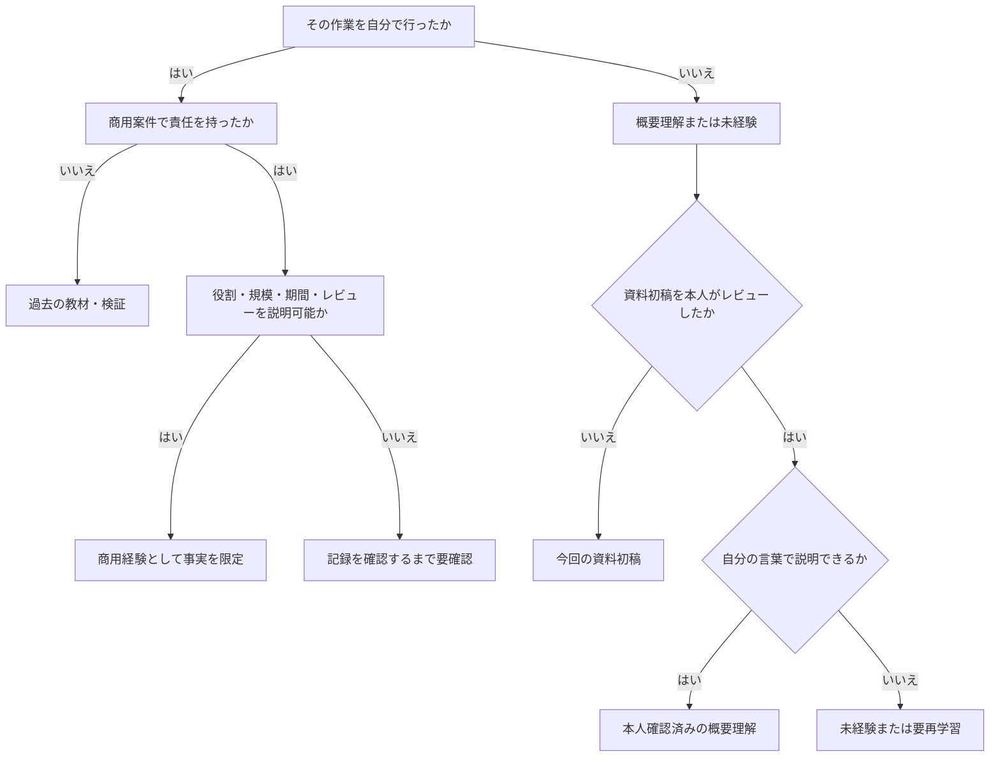

# 経験境界の守り方

> [!IMPORTANT]
> 本ファイルは自己練習用の判定基準です。このリポジトリの本人レビュー、学習、ラボ実施、技能獲得が完了した証拠ではありません。現時点の資料初稿を、教材・検証経験や概要理解へ自動的に格上げしません。

## 五つの区分

| 区分 | 判定 | 回答の始め方 |
| --- | --- | --- |
| 商用経験 | 実案件で責任範囲を持ち、変更・試験・引き継ぎを行った | 「○○案件で、私は△△を担当しました」 |
| 過去の教材・検証 | 非本番環境で本人が操作し、教材化・講義・結果確認を行った | 「過去に教材・検証環境で○○を行いました」 |
| 今回の資料初稿 | 文書や lab ファイルはあるが、本人レビューまたは実行が未完了 | 「資料初稿が準備され、本人レビュー・演習はこれからです」 |
| 本人確認済みの概要理解 | 本人レビュー後、自分の言葉で目的、構成、論点を説明できる | 「本人レビュー済みの概要説明範囲です。実施経験はありません」 |
| 未経験 | 操作・設計・導入をしていない | 「実施経験はありません」 |

## 判断フロー

## 境界を越えやすい例

- Web Console で resource を作った → cluster 構築経験ではない。
- YAML を作った → 基本設計・詳細設計を担当したとは限らない。
- 障害 manifest を直した → 商用障害対応経験ではない。
- 製品資料を読んだ → 導入経験ではない。
- 資格を取得した → 本番運用経験ではない。
- チームの作業を見た → 自分が担当した経験ではない。
- リポジトリに説明文がある → 本人が読了・理解・再現した証拠ではない。
- lab ファイルがある → lab を実行したことにはならない。

## 現時点の境界

| 領域 | 現時点の区分 |
| --- | --- |
| Kubernetes | 過去の教材作成・講義・学習検証環境構築。商用経験なし。具体的な方式は本人再確認 |
| OpenShift | CRC / Web Sandbox と Project / Route / Operator の入門範囲。商用経験なし。SCC / RBAC / `oc` の詳細は本人再確認 |
| 商用障害対応 | 未経験。過去実績は受講者のつまずき・質問の整理と講師間共有 |
| Ansible / Terraform | 基礎理解との本人申告。今回の Ansible lab は未実施 |
| Virtualization / MTV / Airgap | 資料初稿。本人未レビュー・未検証 |
| Kong / Sysdig / OpenShift AI | 資料初稿。本人未レビュー・利用経験未確認 |
| 資格 | 正式名称、取得日、有効期限を本人確認するまで要確認 |

## 分からないことを聞かれたとき

> その機能は実施経験がなく、現時点では要確認です。確認する場合は、まず対象の OpenShift と Operator のバージョン、現象または要件、サポート条件を整理し、公式資料と既存設計を確認します。変更が必要なら影響と切り戻しをレビューしてから進めます。

## 回答前の 5 秒チェック

1. 主語は自分か、チームか。
2. 環境は教材・検証か、商用か。
3. 見たのか、実行したのか、設計したのか。
4. 成果物と結果を示せるか。
5. 単独実施とレビュー下の担当を区別したか。
