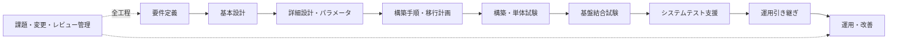

# 基盤案件の進め方

> [!IMPORTANT]
> **資料状態（v0.1）**: 技術資料の初稿です。`docs/00`〜`docs/27` の初回通読は完了していますが、詳細レビューと本リポジトリの演習は未実施です。本章の存在や初回通読だけでは、習得・実機検証・商用経験を示しません。章末の説明例も、本人が内容を確認し、自分の言葉で説明できた範囲だけ使用します。実施状況は [証跡台帳](../evidence/README.md) で管理します。

## まず押さえる全体像

基盤案件は、機器やクラスタを作って終わりではありません。要件を追跡可能な設計へ変換し、安全に構築し、期待結果を定めて試験し、運用できる状態で引き渡す活動です。

工程名や分担は組織によって異なります。大切なのは、入力、判断、成果物、完了条件、承認者を明確にすることです。

## 1. 要件定義

### 何を決めるか

- 業務目的、対象利用者、対象アプリケーション、サービス時間
- 可用性、性能、拡張性、セキュリティ、監査、保守性
- RPO / RTO、バックアップ、災害対策
- 予算、納期、サポート、ライセンス、法令・社内標準
- 現行環境、移行対象、停止可能時間、外部システムとの境界

> [!NOTE]
> **RPO / RTO は、バックアップ方式を決める前に確認する復旧目標です。**
>
> - **RPO（Recovery Point Objective／目標復旧時点）**: 障害発生時点から、どの程度過去までのデータ消失を許容するか。RPO が1時間なら、最大1時間分の更新データが失われる可能性を許容します。
> - **RTO（Recovery Time Objective／目標復旧時間）**: 障害発生後、どの程度の時間でサービスを再開するか。RTO が4時間なら、障害発生から4時間以内の再開を目標にします。
>
> 例えば10:00に障害が発生した場合、RPOが1時間なら9:00時点まで復元できること、RTOが4時間なら14:00までにサービスを再開できることを目指します。値が短いほど厳しい要件となり、バックアップ頻度、レプリケーション、冗長化、復旧手順、自動化、費用へ影響します。詳細は [監視・ログ・バックアップ](15-monitoring-logging-backup.md)、短い定義は [用語集](27-glossary.md) を参照してください。

### 主な成果物

- 要件一覧、非機能要件、前提・制約一覧
- スコープ、体制、責任分界、概算、マイルストーン
- 未確定事項と意思決定者

### OpenShift 案件で見ること

ワークロード特性、コンテナと VM の比率、導入基盤、接続ネットワーク、必要 Operator、ストレージ性能、外部認証、監視、バックアップ、非接続要件を確認します。製品名を先に決めず、要件との対応を残します。

### 品質ゲート

要件ごとに識別子、根拠、受入条件、優先度、責任者があり、スコープ外も合意されていることです。

## 2. 基本設計

### 何を決めるか

要件を満たす方式とシステム境界を決めます。クラスタ数、環境分離、ノード役割、DNS / LB、ネットワーク、認証、ストレージ、監視、バックアップ、運用方式などが対象です。

### 主な成果物

- システム構成図、ネットワーク構成図、責任分界
- 方式設計、可用性・セキュリティ・運用設計
- 設計判断記録と要件トレーサビリティ

### OpenShift 案件で見ること

API / Ingress の公開方式、Pod / Service CIDR の重複、ノード障害時の余力、StorageClass、証明書、ID Provider、Operator のライフサイクル、監視通知、etcd / OADP の保護対象などを決めます。

### 品質ゲート

要件が設計へ対応し、代替案と採否理由、障害時の動き、運用担当者の実行可能性がレビューされていることです。

## 3. 詳細設計

### 何を決めるか

基本設計の方式を、設定へ落とせる粒度まで具体化します。命名、ラベル、CIDR、ポート、タイムアウト、証明書、RBAC、容量、アラート閾値などを決めます。

### 主な成果物

- 詳細設計書、パラメータシート
- 通信要件表、アカウント・権限表、監視項目表
- 設定ファイルや Manifest の設計

### OpenShift 案件で見ること

namespace / Project 命名、Quota / LimitRange、MachineConfigPool、IngressController、NetworkPolicy、StorageClass、Operator Subscription、ログ保持などを対象環境に合わせて具体化します。

### 品質ゲート

値の単位・初期値・設定先・変更方法・確認方法・機密区分が明確で、未確定値に担当者と期限があることです。

## 4. パラメータ設計

パラメータシートは単なる値一覧ではありません。各値に次を持たせます。

| 項目 | 内容 |
| --- | --- |
| 設定対象 | API、リソース、ファイル、外部機器など |
| パラメータ | 正確なキーやフィールド |
| 設定値 / 単位 | CIDR、GiB、秒、件数など |
| 根拠 | 要件 ID、設計節、製品既定値、測定結果 |
| 環境差 | dev / stg / prod の差 |
| 機密区分 | Secret は値を記載せず保管先を示す |
| 変更・確認方法 | 適用コマンド、読取コマンド、期待結果 |
| 状態 | 確定 / 要確認 / 対象外 |

## 5. 構築手順書作成

### 必須要素

- 目的、対象、実施者、承認者、予定時間
- 前提条件、入力ファイル、必要権限、バックアップ
- 変更前確認、番号付き手順、コマンド全文、期待結果
- 異常時の中断基準、切り戻し条件、連絡先
- 変更後確認、証跡、残課題

コマンドだけの羅列にせず、どの結果なら次へ進めるかを書きます。秘密値はプレースホルダーまたは承認された Secret 管理を使います。

## 6. 構築

構築当日は、対象・版数・承認済み手順を再確認し、原則として一つずつ適用・確認します。想定外の結果が出たら、その場の思いつきで追加変更せず、事実を記録して中断・相談します。

OpenShift では、手動変更が Operator によって戻されることがあります。管理主体が Operator、GitOps、MachineConfig、直接編集のどれかを確認します。

## 7. 単体試験

単一の構成要素が設計どおりかを確認します。

- Node / ClusterOperator の状態
- DNS 解決、NTP 同期、証明書期限
- StorageClass からの PVC 動的払い出し
- Project の Quota、RBAC、NetworkPolicy
- 監視ルールと通知経路

試験仕様には、前提、操作、期待結果、実測結果、証跡、判定、障害票 ID を含めます。

## 8. 基盤結合試験

複数要素をまたぐ経路を確認します。例えば、利用者の DNS 問合せから LB、Ingress、Route、Service、Pod まで、または Pod から CSI を介したストレージまでです。

正常系だけでなく、ノード停止、Pod 再配置、証明書異常、DNS 不達、容量不足など、合意した異常系を含めます。破壊試験は影響と復旧方法を承認してから行います。

## 9. システムテスト支援

アプリケーションを含む業務シナリオに対し、基盤側の監視、ログ、性能、障害切り分けを支援します。アプリ側と基盤側の境界で責任を押し付け合わないよう、時刻、リクエスト ID、通信経路、リソース状態を共有します。

## 10. 移行計画

### 決めること

- 対象と除外、依存関係、移行順序
- 事前同期 / 停止移行などの方式
- リハーサル、データ整合性、受入確認
- 当日体制、Go / No-Go 判定、連絡経路
- 停止可能時間、切り戻し条件、旧環境保持期間

OpenShift Virtualization への VM 移行では、OS、仮想ハードウェア、ディスク、ネットワーク、固定 IP、性能、バックアップ製品、ライセンスの互換性を事前評価します。

## 11. 切り戻し計画

切り戻しは「失敗したら元へ戻す」という一文では不十分です。開始条件、最終判断時刻、判断者、データ差分の扱い、DNS / LB の戻し方、旧環境の起動、確認項目、所要時間を決めます。移行後に更新されたデータを旧環境へ戻せるかは特に重要です。

## 12. 運用設計

- 監視対象、閾値、通知先、一次対応、エスカレーション
- 定常作業、容量管理、証明書・Secret・アカウント更新
- バックアップ、復元試験、RPO / RTO
- パッチ・Operator・クラスタ更新、互換性確認
- インシデント、問題、変更、構成、脆弱性管理
- 保守窓口、ログ収集、サポートケース用情報

設計した運用が担当者の権限・時間・スキルで実行できるか、引き継ぎ前にリハーサルします。

## 13. 課題管理

課題には ID、発生日、内容、影響、優先度、担当、期限、次の行動、判断待ち相手、状態を持たせます。「調査中」だけで止めず、次の確認と期限を書きます。課題とリスク、障害、変更要求を混同しないよう定義します。

## 14. 変更管理

変更要求には、目的、対象、差分、影響、リスク、試験、作業時間、切り戻し、承認、証跡を含めます。緊急変更でも記録を省略せず、事後レビューを行います。

## 15. レビュー

レビューは誤字確認だけではありません。

- 要件との整合性
- 前提、例外、障害時の動作
- 設定値の一貫性と環境差
- セキュリティ、保守、サポート条件
- 手順の再現性、試験の判定可能性
- 誰がいつ判断したかの記録

指摘は重大度、根拠、対応方針、担当、期限を管理します。

## 16. 成果物一覧

| 工程 | 代表成果物 | 主なレビュー相手 |
| --- | --- | --- |
| 要件定義 | 要件一覧、非機能要件、スコープ、責任分界 | 顧客、PM、運用、セキュリティ |
| 基本設計 | 構成図、方式設計、運用設計 | アーキテクト、各基盤担当 |
| 詳細設計 | 詳細設計、パラメータ、通信・権限表 | 構築担当、NW、Storage、Security |
| 構築準備 | 構築手順、移行・切り戻し計画 | 作業責任者、変更審査 |
| 試験 | 単体・結合試験仕様、結果、障害票 | 品質担当、アプリ、運用 |
| 引き継ぎ | 運用手順、監視一覧、既知課題、構成管理 | 運用・保守担当 |

## 17. 各工程で何を決めるか

同じ話題でも粒度が変わります。例としてバックアップを追います。

- 要件定義: 何を、どこまで失ってよいか（RPO）、何時間で戻すか（RTO）。
- 基本設計: etcd、アプリリソース、PV、外部 DB をどう保護するか。
- 詳細設計: スケジュール、保持数、保存先、暗号化、権限、アラート。
- 構築手順: 設定手順、変更前後確認、Secret の投入方法。
- 試験: バックアップ成功だけでなく、隔離環境で復元して受入条件を確認。
- 運用: 失敗通知、再実行、容量確認、定期復元試験、製品更新時の互換性確認。

## OpenShift の操作と基盤案件遂行は別物

`oc apply` や Web Console の操作を知っていても、要件、設計根拠、影響評価、承認、試験、切り戻し、運用引き継ぎがなければ基盤案件を完遂したことにはなりません。逆に、すべてのコマンドを暗記していなくても、工程と責任を理解し、公式資料で確認し、レビュー可能な成果物を作ることは重要な貢献です。

現在は、過去の教材・学習環境での経験とは別に、案件工程に沿った文書と演習の**初稿を一度通読した段階**です。詳細レビューと記入演習はまだ実施していません。商用 OpenShift 案件を進めた経験があるとは表現しません。

## 参考資料

- [OpenShift Container Platform documentation](https://docs.redhat.com/en/documentation/openshift_container_platform/)
- [Kubernetes: Production environment](https://kubernetes.io/docs/setup/production-environment/)

## 面談での説明例

> 商用 OpenShift 案件の遂行経験はありません。現在は、要件定義から運用引き継ぎまでの工程、成果物、課題・変更・レビュー管理を扱う練習資料の初稿を一度通読し、詳細レビューと演習は未実施です。演習後は、設計理由、期待結果、切り戻しまで自力で記入できた範囲を証跡とともに説明します。
