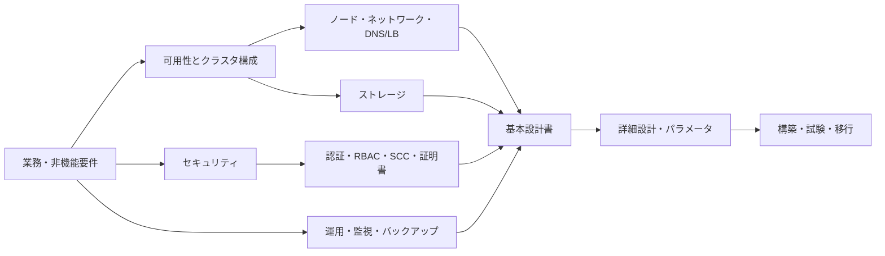

# OpenShift 基本設計

> [!IMPORTANT]
> **資料状態（v0.1）**: 技術資料の初稿です。`docs/00`〜`docs/27` の初回通読は完了していますが、詳細レビューと本リポジトリの演習は未実施です。本章の存在や初回通読だけでは、習得・実機検証・商用経験を示しません。章末の説明例も、本人が内容を確認し、自分の言葉で説明できた範囲だけ使用します。実施状況は [証跡台帳](../evidence/README.md) で管理します。


この章は、OpenShift Container Platform（OCP）の基本設計で「何を合意し、何を後工程へ渡すか」を整理するための学習資料です。個別製品の操作手順ではなく、要件から設計判断、試験、運用へつなぐ観点を扱います。

> **経験境界**
>
> - 商用 OpenShift 基盤の基本設計経験: **なし**
> - Developer Sandbox / CRC を用いた入門学習・教材作成: **本人申告に基づく教材・学習環境レベル**。具体的な操作範囲は提出前に本人確認します。
> - 本章の設計観点: **技術資料の初稿**。本人による読了・要点整理前であり、実案件で設計判断や承認を行った実績を示すものではありません。
> - 製品版、導入方式、クラウド、ネットワークプラグイン、契約サポート範囲で答えが変わる事項: **要確認**

## 設計の全体像



設計項目は独立していません。たとえば可用性要件はノード数、障害ドメイン、ロードバランサー、ストレージ、監視、バックアップ、保守時の余力へ連鎖します。各判断には、根拠、前提、未決事項、担当、試験方法を残します。

## クラスタ構成

### 何を決めるか

- クラスタの用途（本番、開発、検証、DR）、分離単位、配置先、導入方式を決めます。
- 単一／複数クラスタ、単一／複数サイト、障害ドメイン、可用性目標、管理境界を決めます。
- IPI、UPI、エージェントベースなど採用可能な導入方式は、対象 OCP 版と基盤のサポート条件を確認して選びます。

### なぜ重要か

クラスタ境界は障害影響、権限、アップグレード、コスト、運用組織を規定します。後からの統合・分割はアプリケーション移行を伴うため、最初に要件との対応を明確にします。

### 設計時の確認ポイント

- RTO/RPO、SLA、許容停止、保守時間、拠点障害をどこまで想定するか。
- 本番と非本番、機密度、テナント、ネットワーク到達性をクラスタで分けるか、Project で分けるか。
- サポート対象プラットフォーム、必要なサブスクリプション、接続環境、将来増設を **要確認** とする。
- 決定理由と却下案を ADR（Architecture Decision Record）に残す。

### 面談での説明例

「商用クラスタを設計した経験はありません。教材上では、用途、可用性、障害ドメイン、運用境界、導入方式を先に決め、そこからノード、ネットワーク、ストレージへ展開する流れを整理しています。」

## Control Plane / Worker / Infra Node

### 何を決めるか

- Control Plane、Worker の台数・配置・マシンタイプを決めます。
- Ingress、内部 Registry、監視などの基盤ワークロードを専用 Infra Node に分離するかを決めます。
- MachineSet、ラベル、taint/toleration、nodeSelector による配置方針を決めます。

### なぜ重要か

Control Plane は API、etcd、制御ループを担い、Worker はアプリケーションを実行します。役割分離を誤ると、アプリケーション負荷が基盤機能へ波及したり、保守時に必要な余力が不足したりします。

### 設計時の確認ポイント

- Control Plane の奇数台構成、etcd のクォーラム、障害ドメイン分散を確認する。
- Infra Node へ何を載せるか、ライセンス／サブスクリプション上の扱い、最低リソースを **要確認** とする。
- 専用ノードの taint に対応する toleration が各 Operator で設定可能か確認する。
- ノード停止、更新、drain 時にも必要な Pod が再配置できる余力を確保する。

### 面談での説明例

「Control Plane のクォーラムと障害ドメインを守り、Worker の業務負荷と Ingress・監視などの基盤負荷を分ける必要性を理解しています。Infra Node 採用は規模、負荷、運用、製品サポート条件を確認して判断します。」

## ノードサイジング

### 何を決めるか

- 各ノードの vCPU、メモリ、OS ディスク、追加ディスク、NIC、台数、増設単位を決めます。
- システム予約分、Pod requests/limits、DaemonSet、ログ、イメージ、更新・障害時余力を含む容量モデルを決めます。

### なぜ重要か

平均使用率だけで決めると、ノード障害や更新時に Pod を退避できません。CPU、メモリだけでなく、Pod 数、ディスク IOPS、ネットワーク帯域、接続可能ボリューム数も上限になり得ます。

### 設計時の確認ポイント

- 現行実績、ピーク、成長率、requests/limits、レプリカ数から需要を積み上げる。
- `N+1` などの障害・保守時容量と、オートスケール条件を明記する。
- インスタンスタイプやハードウェアが対象 OCP 版でサポートされるか **要確認**。
- VM を載せる場合はオーバーコミット、巨大ページ、CPU モデル、NUMA、デバイス割当も別途評価する。

### 面談での説明例

「サイジングは平均 CPU 使用率だけではなく、requests、基盤 DaemonSet、障害・更新時の退避余力、Pod 数やストレージ IOPSまで含めて考える、と整理しています。実案件での算定経験はありません。」

## DNS 設計

### 何を決めるか

- クラスタ名、ベースドメイン、API 用 FQDN、Ingress のワイルドカード FQDN、正引き・逆引きを決めます。
- 権威 DNS、社内 DNS からの委任／転送、内部・外部の名前解決経路、TTL、登録・変更担当を決めます。

### なぜ重要か

インストール、ノード参加、API、Route、証明書検証はいずれも DNS に依存します。名前解決の不整合は、LB やアプリケーション障害に見えるため切り分けが難しくなります。

### 設計時の確認ポイント

- 一般に `api.<cluster>.<base_domain>`、`api-int.<cluster>.<base_domain>`、`*.apps.<cluster>.<base_domain>` など、採用方式が要求するレコードを公式手順で **要確認**。
- インストール時と定常運用時で必要なレコード、bootstrap 削除後の向き先を確認する。
- 社内端末、運用端末、クラスタノード、外部利用者の各地点から `dig` で確認する。
- split DNS を使う場合は内部／外部ビューの差異と証明書名を明文化する。

### 面談での説明例

「API と `*.apps` の名前解決を利用元別に確認し、DNS、LB、証明書の FQDN を一致させる点が重要だと理解しています。具体的な必須レコードは導入方式と版の公式手順で確認します。」

## Load Balancer 設計

### 何を決めるか

- API、Machine Config Server、Ingress の VIP、待受ポート、バックエンド、ヘルスチェック、冗長方式を決めます。
- L4/L7、TLS の終端位置、送信元 IP 保持、タイムアウト、最大接続、運用監視を決めます。

### なぜ重要か

LB はインストール時だけでなく、API とアプリケーション公開の可用性を左右します。不適切なヘルスチェックや TLS 終端は、正常ノードの切離しや証明書不整合を生みます。

### 設計時の確認ポイント

- 必須ポート、bootstrap を含む初期バックエンド、定常バックエンドを公式資料で **要確認**。
- API は Control Plane、Ingress は Router Pod が動作するノードへ振り分ける設計との整合を取る。
- ヘルスチェック方式、間隔、失敗回数、drain、セッション維持要否を試験可能な値にする。
- LB 自体の冗長性、設定バックアップ、証明書更新、監視責任を決める。

### 面談での説明例

「API 系と Ingress 系の VIP、バックエンド、ヘルスチェック、TLS 終端、冗長性を分けて設計する観点を整理しています。採用 LB 固有の設定とポートは要確認です。」

## Ingress / Route 設計

### 何を決めるか

- IngressController の数、ドメイン、公開範囲、配置ノード、レプリカ、シャーディングを決めます。
- Route の TLS termination（edge、reencrypt、passthrough）、証明書、許可するアノテーションやタイムアウトの標準を決めます。

### なぜ重要か

Ingress は多数のアプリケーションの入口です。公開／内部用途を混在させると、セキュリティ境界、障害影響、証明書、容量管理が曖昧になります。

### 設計時の確認ポイント

- Internet、社内、管理系など公開範囲ごとに IngressController を分ける必要があるか。
- ワイルドカード DNS、LB、Router Pod 配置、NetworkPolicy、バックエンド TLS を一貫させる。
- Route と Kubernetes Ingress の使い分け、許可する TLS 方式、HTTP から HTTPS へのリダイレクト標準を決める。
- HSTS、暗号スイート、クライアント証明書、WAF 連携は要件と対象版で **要確認**。

### 面談での説明例

「Route は OpenShift の外部公開リソースで、IngressController が実際の入口を担うと理解しています。内部・外部の分離、TLS 終端、DNS/LB、配置と容量をまとめて設計します。」

## API エンドポイント

### 何を決めるか

- Kubernetes API の FQDN、VIP、公開／非公開、接続元、踏み台や VPN 経路を決めます。
- 管理者、CI/CD、監視、外部連携が使う認証方式、証明書、レートや監査要件を決めます。

### なぜ重要か

API は全クラスタ操作の入口です。過度な公開は攻撃面を広げ、閉じすぎると運用、GitOps、障害対応ができません。

### 設計時の確認ポイント

- 接続元を管理セグメントや承認済みサービスに限定し、Firewall と LB を対応付ける。
- `api` と内部通信用 `api-int` の役割を混同しない。
- kubeconfig、トークン、サービスアカウント、証明書の保管・失効・ローテーションを決める。
- マネージドサービスでは公開範囲や運用権限に制約があるため **要確認**。

### 面談での説明例

「API は管理の中核なので、FQDN/VIPだけでなく、接続元、認証、資格情報の保管、監査、緊急時経路まで設計対象にします。」

## Pod Network / Service Network

### 何を決めるか

- Cluster Network（Pod CIDR）、Service Network（Service CIDR）、hostPrefix、ネットワークプラグインを決めます。
- ノード、Pod、Service、外部／接続先ネットワークとの重複回避、拡張可能なアドレス容量を決めます。

### なぜ重要か

CIDR は通常、導入後に容易には変更できません。重複するとオンプレ／クラウド／他クラスタとのルーティングや移行が阻害されます。

### 設計時の確認ポイント

- 最大ノード数、1ノード当たり最大 Pod 数、将来クラスタ数から必要アドレスを算定する。
- 社内 WAN、VPN、VPC/VNet、対向先、Service CIDR、クラスタ間接続の重複を台帳で確認する。
- OVN-Kubernetes など、対象版で既定・サポートされるネットワークプラグインを **要確認**。
- MTU、出口通信、プロキシ、EgressIP、外部 DNS との関係も確認する。

### 面談での説明例

「Pod と Service の CIDR は将来規模と既存ネットワークとの非重複を確認して決めます。導入後の変更が難しいため、早い工程でネットワーク担当と合意する項目だと理解しています。」

## NetworkPolicy

### 何を決めるか

- Project 作成時の既定拒否、許可通信、DNS・監視・Ingress・外部 API への例外を決めます。
- namespaceSelector、podSelector、IPBlock、Ingress/Egress の責任分界と申請手順を決めます。

### なぜ重要か

既定の到達性に依存すると、侵害時の横展開や誤接続を防ぎにくくなります。一方、許可漏れはアプリケーション障害になるため、段階導入と試験が必要です。

### 設計時の確認ポイント

- `default-deny` を基準にするか、既存アプリへの影響をどう評価するか。
- Ingress Router、DNS、監視、Operator、外部依存先の通信を洗い出す。
- 適用前後で送信元・宛先・ポート別の疎通試験を用意する。
- CNI 実装が対応する機能と例外を対象版で **要確認**。

### 面談での説明例

「NetworkPolicy は Project 間・Pod 間の最小権限を実現する設計です。いきなり全面拒否せず、通信フローを棚卸しし、DNS や Ingress など必要通信を許可して試験します。」

## 認証設計

### 何を決めるか

- OAuth の Identity Provider、ユーザー／グループ同期、MFA、緊急管理者、サービスアカウントの扱いを決めます。
- ログイン元、セッション、退職・異動時の無効化、監査、資格情報保管を決めます。

### なぜ重要か

認証は「誰であるか」を保証する入口です。共有アカウントや退職者アカウントの残存は、追跡性と最小権限を損ないます。

### 設計時の確認ポイント

- LDAP、OIDC、GitHub など、組織の IdP と OCP 対象版が対応する方式を **要確認**。
- IdP の可用性、証明書、名前属性、グループ同期、重複 ID を確認する。
- `kubeadmin` など初期資格情報の廃止条件と、break-glass アカウントの統制を決める。
- 人の認証と、自動化用サービスアカウント／短命トークンを分離する。

### 面談での説明例

「認証は既存 IdP 連携、MFA、グループ同期、緊急時アカウント、退職・異動時の失効まで設計対象です。実 IdP 連携の商用経験はありません。」

## RBAC

### 何を決めるか

- 組織ロールと ClusterRole／Role、ClusterRoleBinding／RoleBinding の対応を決めます。
- クラスタ管理、Project 管理、開発、閲覧、監査、自動化の権限モデルと申請・棚卸しを決めます。

### なぜ重要か

RBAC は認証済み主体が「何をしてよいか」を制御します。広すぎる `cluster-admin` は誤操作と侵害の影響をクラスタ全体へ広げます。

### 設計時の確認ポイント

- 標準 ClusterRole を優先し、独自権限は必要最小限の verb/resource にする。
- 個人ではなく IdP グループへ付与し、期限、承認、定期棚卸しを記録する。
- `oc auth can-i` と impersonation を使った肯定・否定試験を設計する。
- Operator や CI/CD のサービスアカウント権限もレビュー対象にする。

### 面談での説明例

「RBAC はグループ単位の最小権限を基本にし、クラスタスコープと Project スコープを分け、`oc auth can-i` で許可・拒否の両方を確認します。」

## SCC

### 何を決めるか

- ワークロードが必要とする UID、capability、特権、hostPath、hostNetwork、SELinux 条件を整理します。
- 標準 SCC で満たせない場合の例外 SCC、付与先サービスアカウント、承認期限を決めます。

### なぜ重要か

Security Context Constraints（SCC）は Pod がホストへ与える影響を抑える OpenShift の制御です。安易な `privileged` 付与はコンテナ分離を弱めます。

### 設計時の確認ポイント

- まず制限の強い標準 SCC で動くようイメージと SecurityContext を調整する。
- `oc adm policy who-can use scc/<name>`、`oc auth can-i use scc/<name>` で付与範囲を確認する。
- 独自 SCC は理由、所有者、有効期限、代替不可の根拠を残す。
- Pod Security Admission との関係や評価方法は対象 OCP 版で **要確認**。

### 面談での説明例

「SCC は Pod の特権や UID、ホスト資源利用を制限する仕組みです。起動失敗時も即座に privileged を付けず、イベントと要求権限を確認し、最小の例外にします。」

## Operator 設計

### 何を決めるか

- 導入 Operator、提供元、Channel、InstallPlan 承認方式、更新順序、配置 namespace、権限を決めます。
- 依存関係、CRD、バックアップ対象、監視、サポート、廃止手順を決めます。

### なぜ重要か

Operator はアプリケーションの導入だけでなく、更新や運用ロジックをクラスタ内で実行します。権限、互換性、更新失敗はクラスタ全体へ影響し得ます。

### 設計時の確認ポイント

- Red Hat 提供、認定、コミュニティなど提供種別とサポート範囲を確認する。
- 自動承認か手動承認かを、更新統制とセキュリティ修正速度の両面で決める。
- 対象 OCP 版との互換性、Channel、CRD 変更、バックアップ／復元を **要確認**。
- 非本番で更新、ロールバック可否、OperatorConditions、CSV、Subscription を試験する。

### 面談での説明例

「Operator は導入可否だけでなく、提供元、Channel、承認方式、権限、CRD、更新試験、障害監視まで設計します。商用の Operator 選定経験はありません。」

## StorageClass / PVC

### 何を決めるか

- 用途別 StorageClass、CSI ドライバー、性能、容量、暗号化、拡張、スナップショット、 reclaimPolicy を決めます。
- PVC の accessModes、volumeMode、バックアップ、クォータ、既定 StorageClass を決めます。

### なぜ重要か

ステートフルワークロードの性能と復旧性はストレージに依存します。`Delete` の reclaimPolicy や AZ 制約を理解せず使うと、削除・障害時にデータを失う可能性があります。

### 設計時の確認ポイント

- RWO/RWX/ROX/RWOP の要求と、採用 CSI が実際に提供するモードを **要確認**。
- IOPS、スループット、遅延、容量拡張、スナップショット、クローン、暗号鍵を確認する。
- `WaitForFirstConsumer`、障害ドメイン、ノード接続上限と Pod スケジューリングの整合を取る。
- 削除、バックアップ、復元、DR の試験をデータ所有者と定義する。

### 面談での説明例

「StorageClass は単なる保存先名ではなく、CSI、性能、アクセスモード、reclaimPolicy、暗号化、障害ドメイン、バックアップを抽象化する設計項目だと理解しています。」

## ODF

### 何を決めるか

- Red Hat OpenShift Data Foundation（ODF）を採用するか、Internal／External などの構成、ノード、デバイス、容量を決めます。
- ブロック、ファイル、オブジェクトの用途、障害ドメイン、拡張、監視、バックアップを決めます。

### なぜ重要か

ODF はクラスタ内外へ永続ストレージ機能を提供できますが、CPU、メモリ、ディスク、ネットワークを消費します。障害ドメインや容量余力が不足すると、復旧や再配置に影響します。

### 設計時の確認ポイント

- 対象 OCP／ODF 版、プラットフォーム、デバイス、最小構成、サポートマトリクスを **要確認**。
- 専用／共用ノード、失敗ドメイン、複製、raw capacity と usable capacity の違いを確認する。
- バックフィル、リバランス時の性能と容量余力、障害交換手順を確認する。
- 「ODF 自体の冗長化」と「別障害ドメインへのバックアップ」を混同しない。

### 面談での説明例

「ODF は概要理解レベルで、実導入経験はありません。採用時は構成方式、障害ドメイン、デバイス、容量効率、再配置負荷、バックアップを確認する必要があると理解しています。」

## 内部 Registry

### 何を決めるか

- OpenShift Image Registry の利用範囲、永続ストレージ、レプリカ、公開方法、容量、保持・削除方針を決めます。
- 外部 Registry との役割分担、認証、信頼 CA、ミラー、脆弱性スキャンを決めます。

### なぜ重要か

内部 Registry は BuildConfig や ImageStream のイメージ保管に使われます。永続性や容量管理が不十分だと、ビルド・デプロイが停止します。

### 設計時の確認ポイント

- 採用基盤に応じたストレージバックエンドと高可用性要件を **要確認**。
- イメージの保存期間、タグ運用、pruning、容量アラート、バックアップ要否を決める。
- 外部公開の要否と、公開する場合の Route、TLS、認証、アクセス制御を確認する。
- pull-through、mirror、ImageContentSourcePolicy／後継 API は対象版で **要確認**。

### 面談での説明例

「内部 Registry はビルド成果物の保存先なので、永続ストレージ、容量、pruning、認証、外部 Registry との役割分担まで設計します。」

## 監視

### 何を決めるか

- クラスタ監視とユーザーワークロード監視の範囲、保持期間、容量、アラート、通知先を決めます。
- SLI/SLO、ダッシュボード、抑止、一次対応、外部監視連携を決めます。

### なぜ重要か

メトリクスを集めるだけでは障害を検知・対応できません。誰が、どの閾値で、何を確認し、どこへエスカレーションするかが必要です。

### 設計時の確認ポイント

- Platform とアプリケーションの責任分界、監視対象、メトリクス cardinality を確認する。
- Prometheus 保持期間と PVC 容量、Alertmanager の冗長性、通知経路を設計する。
- 正常、閾値超過、通知失敗、サイレンス期限の試験を定義する。
- 組み込み監視の変更可能範囲とサポート条件は対象版で **要確認**。

### 面談での説明例

「監視では収集対象だけでなく、閾値根拠、通知、一次対応、エスカレーション、保持容量、通知試験まで決めます。商用監視設計の経験はありません。」

## ログ

### 何を決めるか

- アプリケーション、インフラ、監査ログの収集範囲、転送先、保持、検索、アクセス権を決めます。
- 個人情報・機密情報のマスキング、改ざん防止、時刻同期、容量、障害時動作を決めます。

### なぜ重要か

ログは障害調査と監査の証拠ですが、無制限に保存すると容量・コストが増え、機密情報を集約するリスクも生まれます。

### 設計時の確認ポイント

- OpenShift Logging の構成要素は版により変化するため、Loki、Vector、転送 API などを **要確認**。
- 収集元、ラベル、マルチテナント、保持期間、削除、監査部門への転送を決める。
- 転送先停止時のバッファ、ドロップ、再送、アラートを確認する。
- ログに秘密情報を出さないアプリケーション標準も合わせて定める。

### 面談での説明例

「ログは application、infrastructure、audit を分け、転送先、保持、権限、機密情報、転送障害時の動作を設計する、と理解しています。」

## バックアップ

### 何を決めるか

- etcd、Kubernetes リソース、PV データ、外部 DB、Registry、Operator 固有データの保護方法を決めます。
- RPO/RTO、保存先、暗号化、世代、遠隔保管、復元責任、定期復元試験を決めます。

### なぜ重要か

etcd バックアップだけでは PV や外部サービスのデータは戻りません。逆に PV スナップショットだけではクラスタオブジェクトとの整合が取れません。

### 設計時の確認ポイント

- OADP、CSI snapshot、データベース固有バックアップなどをデータ単位で割り当てる。
- クラッシュ整合性とアプリケーション整合性の違い、停止・quiesce 要否を確認する。
- バックアップ保存先をクラスタ障害と同時に失わない構成にする。
- OCP／OADP／CSI の版互換、復元先条件、etcd 復元手順は必ず公式資料で **要確認**。

### 面談での説明例

「バックアップは etcd、クラスタリソース、PV、外部 DB を分けて考え、RPO/RTO と復元試験から方式を決めます。バックアップ成功ではなく復元可能性を確認する設計が必要です。」

## 証明書

### 何を決めるか

- API、Ingress、Registry、外部連携、内部 CA の証明書発行元、SAN、鍵長、更新、保管を決めます。
- 組織 CA の信頼配布、失効、期限監視、秘密鍵アクセス、更新時の影響を決めます。

### なぜ重要か

証明書の FQDN 不一致、信頼 CA 不足、期限切れは、API、Route、Registry、外部接続を広範囲に停止させます。

### 設計時の確認ポイント

- OCP が自動管理する証明書と、利用者が差し替え・更新する証明書を区別する。
- SAN と DNS、LB の TLS 終端位置、証明書チェーン、中間 CA を一致させる。
- 期限アラート、更新手順、ロールバック、秘密鍵の保管と権限を定義する。
- 対象版でサポートされる置換手順と再起動影響を **要確認**。

### 面談での説明例

「証明書は FQDN/SAN、終端位置、信頼チェーン、更新責任、期限監視を一体で設計します。OpenShift 管理証明書を手作業で変更しないよう公式手順を確認します。」

## NTP

### 何を決めるか

- 全ノード、LB、DNS、ストレージ、認証基盤が参照する時刻源、冗長性、到達経路を決めます。
- 許容オフセット、監視、異常時対応、閉域環境の内部 NTP を決めます。

### なぜ重要か

時刻ずれは TLS、認証トークン、etcd、ログ相関、監査を壊します。ログの時系列が合わなければ障害解析も困難です。

### 設計時の確認ポイント

- 複数の信頼できる時刻源、UDP/123 の通信、名前解決を確認する。
- RHCOS への設定方法は MachineConfig 等の対象版公式手順で **要確認**。
- `chronyc sources -v`、`chronyc tracking` の正常判定基準を決める。
- 仮想基盤の時刻同期とゲスト OS の chrony が競合しないか確認する。

### 面談での説明例

「NTP は補助設定ではなく、証明書、認証、etcd、監査ログの前提です。時刻源の冗長化、FW、監視、異常時の基準を設計します。」

## Firewall

### 何を決めるか

- ノード間、管理端末、DNS、NTP、LB、Registry、IdP、監視、外部 API の通信フローと許可ルールを決めます。
- 送信元、宛先、プロトコル、ポート、方向、用途、所有者、期限、変更手順を決めます。

### なぜ重要か

ポート番号だけの一覧では申請・試験・障害調査に使えません。また、クラスタ内部通信を過剰に制限すると Operator や更新が断続的に失敗します。

### 設計時の確認ポイント

- 導入方式と対象版の公式ポート要件を基準に、通信マトリクスを作る。
- DNS 名での許可可否、プロキシ、NAT、TLS inspection、MTU、非対称経路を確認する。
- インストール時のみ必要な通信と定常通信を分け、削除条件を記載する。
- `curl`、`nc`、`dig` などによる接続元別の試験とログ照合を定義する。

### 面談での説明例

「Firewall はポート一覧ではなく、送信元・宛先・方向・用途・期間を通信マトリクスにし、DNS、LB、プロキシと合わせて接続元別に試験します。」

## 運用設計

### 何を決めるか

- 監視、障害、変更、容量、バックアップ、証明書、アカウント、脆弱性、更新、問い合わせの運用を決めます。
- 体制、RACI、受付時間、優先度、エスカレーション、Runbook、証跡、定期作業を決めます。

### なぜ重要か

技術的に動くクラスタでも、所有者と判断基準がなければ安全に維持できません。OCP は複数 Operator が継続的に状態を調整するため、手作業変更の統制も必要です。

### 設計時の確認ポイント

- ClusterVersion、ClusterOperator、Node、証明書、容量、バックアップの定期確認を定義する。
- 更新前提条件、非本番検証、保守告知、中止・切り戻し判断を決める。
- `oc` 実行権限、kubeconfig、監査ログ、変更チケットとの紐付けを定める。
- マネージドサービスでは利用者とベンダーの責任分界を **要確認**。

### 面談での説明例

「運用設計では監視項目だけでなく、担当、判断基準、エスカレーション、変更証跡、更新、復元訓練まで具体化します。商用運用設計の経験はありません。」

## 試験観点

### 何を決めるか

- 構築結果、可用性、性能、セキュリティ、運用、バックアップ／復元、障害、更新の試験範囲と合格基準を決めます。
- 前提データ、実施者、証跡、影響、再試験、未実施項目の扱いを決めます。

### なぜ重要か

「リソースが存在する」だけでは要件を満たした証明になりません。障害時や権限拒否など、非正常系を確認して初めて運用可能性を評価できます。

### 設計時の確認ポイント

- Node／Pod／Ingress／Storage／DNS／IdP の単体と組合せを、要件 ID にトレースする。
- ノード停止、Router 再配置、PVC 作成、権限拒否、通知、バックアップ復元を含める。
- 本番で実施できない破壊試験は、非本番代替、分析、残留リスクを明記する。
- 期待値は「正常であること」ではなく、観測可能な値・状態・時間で記述する。

### 面談での説明例

「試験は要件と設計判断にひも付け、正常系だけでなく、ノード障害、権限拒否、通知、復元など非正常系を確認します。未実施項目は残留リスクとして扱います。」

## 設計確認に使うコマンド例

以下は検証環境で設計値と実状態を突き合わせる例です。実行権限、対象クラスタ、変更影響を確認し、まず読み取り専用コマンドから使います。

```bash
oc whoami
oc get clusterversion
oc get clusteroperators
oc get nodes -o wide
oc get machinesets -n openshift-machine-api
oc get infrastructure cluster -o yaml
oc get network.config.openshift.io cluster -o yaml
oc get ingresscontroller -n openshift-ingress-operator -o yaml
oc get storageclass
oc get authentication.config.openshift.io cluster -o yaml
oc get oauth.config.openshift.io cluster -o yaml
oc get subscriptions.operators.coreos.com -A
oc get clusterroles
oc get securitycontextconstraints
oc get route -A
oc get pvc -A
oc get events -A --sort-by=.lastTimestamp
```

DNS と証明書の外形確認例です。実際の FQDN に置換します。

```bash
CLUSTER_NAME=example
BASE_DOMAIN=example.com
dig +short "api.${CLUSTER_NAME}.${BASE_DOMAIN}"
dig +short "console-openshift-console.apps.${CLUSTER_NAME}.${BASE_DOMAIN}"
openssl s_client -connect "api.${CLUSTER_NAME}.${BASE_DOMAIN}:6443" -servername "api.${CLUSTER_NAME}.${BASE_DOMAIN}" </dev/null
curl --fail-with-body --silent --show-error --insecure "https://api.${CLUSTER_NAME}.${BASE_DOMAIN}:6443/readyz"
```

`--insecure` は証明書検証を省略する切り分け用です。正常性確認では組織 CA を指定して検証し、省略状態を恒常運用にしません。

## 公式情報

- [Red Hat OpenShift Container Platform ドキュメント](https://docs.redhat.com/en/documentation/openshift_container_platform/)
- [OpenShift Container Platform Architecture](https://docs.redhat.com/en/documentation/openshift_container_platform/4.22/html/architecture/)
- [OpenShift Container Platform Installing](https://docs.redhat.com/en/documentation/openshift_container_platform/4.22/html/installation_overview/)
- [OpenShift Container Platform Networking](https://docs.redhat.com/en/documentation/openshift_container_platform/4.22/html/networking_overview/)
- [OpenShift Container Platform Security and compliance](https://docs.redhat.com/en/documentation/openshift_container_platform/4.22/html/security_and_compliance/)

> 参照日は **2026-08-13** です。上記の版番号は学習時点の参照例であり、採用版を意味しません。実案件では対象 OCP の正確な z-stream、プラットフォーム、更新経路、サポートマトリクスを Red Hat 公式資料と契約条件で **要確認** です。

## 面談での説明例

「商用 OpenShift の基本設計経験はありません。過去の経験は Developer Sandbox / CRC を用いた入門学習・教材作成の範囲です。基本設計の資料初稿では、可用性とクラスタ境界から、ノード、DNS/LB、ネットワーク、認証・認可、Operator、ストレージ、監視・ログ、バックアップ、証明書、NTP、Firewall、運用・試験へ展開する観点を列挙しており、初回通読のみ完了しています。これから詳細レビューと演習を行い、参画時には要件と対象版の公式資料を照合し、未決事項をレビューに上げます。」
