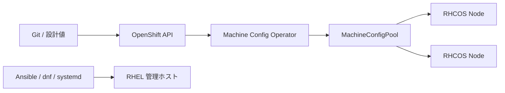

# RHEL / Linux 基盤

> [!IMPORTANT]
> **資料状態（v0.1）**: 技術資料の初稿です。`docs/00`〜`docs/27` の初回通読は完了していますが、詳細レビューと本リポジトリの演習は未実施です。本章の存在や初回通読だけでは、習得・実機検証・商用経験を示しません。章末の説明例も、本人が内容を確認し、自分の言葉で説明できた範囲だけ使用します。実施状況は [証跡台帳](../evidence/README.md) で管理します。


OpenShift は Kubernetes API で管理する製品ですが、障害の現象は DNS、TCP、証明書、時刻、ファイルシステム、カーネル、systemd など Linux の層に現れます。この章では RHEL 管理ホストと RHCOS ノードを混同せず、事実を層ごとに確認する方法を整理します。

> **経験境界**
>
> - Linux／ネットワークの学習・教材作成・検証: **教材・検証レベル**
> - 商用 OpenShift ノードの RHEL/RHCOS 運用: **経験なし**
> - 本章のコマンドは一般的な確認例で、顧客環境での実行経験を示しません。
> - RHEL/OCP の版、ノード種別、クラウド、NetworkManager、SELinux policy、Red Hat のサポート手順に依存する操作は **要確認** です。

## RHEL と RHCOS の違い

| 観点 | RHEL | RHCOS |
| --- | --- | --- |
| 目的 | 汎用 Enterprise Linux | OpenShift ノード向けに最適化された OS |
| 管理単位 | 個々のサーバーを dnf、Ansible、Satellite 等で管理 | クラスタの Machine Config Operator 等で宣言的に管理 |
| 更新 | パッケージ単位の更新も可能 | OS image と OCP 更新に統合された原子的更新が基本 |
| ログイン | SSH 管理を設計できる | 日常的な SSH 直接変更を避け、`oc debug node/...` 等を使用 |
| 永続設定 | `/etc` 等を構成管理 | MachineConfig、Operator、サポートされた API で反映 |
| 用途 | bastion、LB、DNS、外部 Registry、運用サーバー等 | OCP Control Plane／Worker Node |

RHCOS は「RHEL に OpenShift パッケージを入れたもの」ではありません。ノード上で `dnf install` や設定ファイル編集を行うと、更新で消える、MachineConfig と競合する、サポート外になる可能性があります。Control Plane は RHCOS が前提です。RHEL Worker の可否と条件は OCP 版／導入形態で変わるため **要確認** です。



## systemd

systemd は Linux のサービス、socket、mount、timer、依存関係、起動順を管理します。Unit の `active` だけでなく、`enabled`、終了コード、依存 Unit、直近ログ、再起動回数を確認します。

### よく使う確認

```bash
systemctl status <service>
systemctl is-active <service>
systemctl is-enabled <service>
systemctl list-units --type=service --state=failed
systemctl show <service> -p ActiveState -p SubState -p Result -p ExecMainStatus
systemctl cat <service>
systemctl list-dependencies <service>
```

### 変更操作の考え方

```bash
sudo systemctl enable --now <service>
sudo systemctl restart <service>
sudo systemctl daemon-reload
```

`restart` は影響を伴います。先に状態とログを保存し、冗長性、接続中処理、保守承認、ロールバックを確認します。Unit ファイルを変更した場合だけ `daemon-reload` が必要です。

RHCOS ノードでは、個別 Node での `systemctl` 変更を恒久対処にしません。Operator／MachineConfig が所有する Unit かを確認し、OCP の診断手順に従います。

## journalctl

journald は systemd unit、kernel、boot ごとのログを保持します。「最新100行だけ」では発生時刻を外すため、障害の開始・終了時刻を決めて検索します。

```bash
journalctl -u <service>
journalctl -u <service> --since '2026-08-13 09:00:00' --until '2026-08-13 10:00:00'
journalctl -u <service> -b --no-pager
journalctl -u <service> -b -1 --no-pager
journalctl -k -b --priority=warning
journalctl --since '-30 min' --priority=err
journalctl --disk-usage
```

- `-b`: 現在の boot、`-b -1`: 一つ前の boot。
- `-k`: kernel message、`-u`: Unit、`--since/--until`: 時間範囲。
- 時刻同期が崩れているとノード間ログの相関を誤るため、chrony も確認します。
- ログを共有する際は IP、host、user、token、業務データをマスキングします。

## firewalld

firewalld は zone と service／port／rich rule を使って通信を制御します。runtime 設定と permanent 設定は別です。

### 読み取り確認

```bash
sudo firewall-cmd --state
sudo firewall-cmd --get-active-zones
sudo firewall-cmd --list-all
sudo firewall-cmd --list-all --permanent
sudo firewall-cmd --get-services
sudo nft list ruleset
```

### 学習用変更例

```bash
sudo firewall-cmd --permanent --zone=public --add-service=https
sudo firewall-cmd --reload
sudo firewall-cmd --zone=public --query-service=https
```

変更前に interface が所属する zone、既存接続、クラウド SG／NSG、外部 Firewall、OpenShift NetworkPolicy との責任分界を確認します。SSH や管理経路を遮断しないロールバック経路が必要です。

OCP Node の必要 port は多数のコンポーネントに依存します。RHCOS で独自に `firewall-cmd` を実行する前に、導入方式、対象版、Red Hat のサポート手順を **要確認** とします。

## nmcli

`nmcli` は NetworkManager の connection profile と device を管理します。device の現在状態と、再起動後も使う connection profile を区別します。

```bash
nmcli connection show
nmcli connection show --active
nmcli device status
nmcli device show <interface>
nmcli --fields NAME,UUID,TYPE,DEVICE connection show
ip addr
ip route
ip rule
```

学習用の静的設定例です。リモートサーバーでの適用は接続断を起こすため、実値、console、バックアップ、承認を確認します。

```bash
sudo nmcli connection modify <connection-name> \
  ipv4.method manual \
  ipv4.addresses 192.0.2.10/24 \
  ipv4.gateway 192.0.2.1 \
  ipv4.dns '192.0.2.53 192.0.2.54'
sudo nmcli connection up <connection-name>
```

RHCOS Node の永続ネットワーク変更は、NMState、MachineConfig、インストール設定など対象版でサポートされた方法を **要確認** とし、個別 `nmcli` 変更を恒久化しません。

## chrony / NTP

chrony はシステム時刻を NTP source と同期します。時刻ずれは TLS 証明書、OAuth token、etcd、ログ相関、監査へ影響します。

```bash
systemctl status chronyd
chronyc tracking
chronyc sources -v
chronyc sourcestats -v
timedatectl status
date --iso-8601=seconds
```

見るポイント:

- `Leap status`、system time offset、stratum、selected source（`^*`）。
- 複数 source の到達性、UDP/123、DNS、閉域内 NTP の冗長性。
- VM host の時刻同期と guest chrony の競合、急激な step のアプリ影響。
- RHCOS の NTP source 変更方法は MachineConfig 等の公式手順で **要確認**。

## dnf / rpm

`dnf` は依存関係と repository を含めて package を管理し、`rpm` は RPM database や package file を低レベルで確認します。

```bash
dnf repolist
dnf list installed
dnf info <package>
dnf check-update
dnf history list
dnf history info <transaction-id>
rpm -q <package>
rpm -qi <package>
rpm -ql <package>
rpm -qf /path/to/file
rpm -V <package>
```

更新時は repository、subscription、依存関係、再起動要否、CVE、保守時間、snapshot／backup、rollback の可否を確認します。`rpm -V` の差分は侵害とは限らず、意図した設定変更も含むため内容を評価します。

**RHCOS ノードで `dnf` を日常的な package 追加・更新手段として使いません。** OCP 更新と Machine Config Operator の管理モデルに従います。

## SELinux

SELinux は user、role、type、level の label と policy によりアクセスを制御します。`Enforcing` で拒否が起きても、即座に `setenforce 0` や policy 無効化を恒久対処にしません。

```bash
getenforce
sestatus
ls -lZ /path/to/file
ps -eZ | grep <process-name>
sudo ausearch -m AVC,USER_AVC -ts recent
sudo journalctl -t setroubleshoot --since '-30 min'
getsebool -a | grep <keyword>
```

切り分けの流れ:

1. 発生時刻、process context、file context、操作を特定する。
2. AVC denial とアプリケーションログを突合する。
3. path 移動で label が誤ったなら、標準 policy に沿って `semanage fcontext` と `restorecon` を検討する。
4. boolean に既存の正規手段があるか確認する。
5. 独自 policy は最終手段として、最小権限、レビュー、試験、保守を行う。

```bash
sudo semanage fcontext -a -t httpd_sys_content_t '/srv/web(/.*)?'
sudo restorecon -Rv /srv/web
```

上記は RHEL Web content の学習例です。実行前に用途と正しい type を **要確認** とします。

## SSH

SSH は管理経路であり、公開鍵、踏み台、MFA、送信元制限、記録、緊急時アクセスを設計します。

```bash
ssh -vvv <user>@<host>
ssh-keygen -lf ~/.ssh/id_ed25519.pub
sshd -T
sudo journalctl -u sshd --since '-30 min'
sudo ss -lntp | grep ':22'
```

確認順:

- 名前解決、route、TCP/22、Firewall/SG/NSG。
- host key 警告が、再構築、DNS 誤り、中間者攻撃のどれか。安易に `known_hosts` を削除しない。
- client key、権限、`authorized_keys`、`sshd_config`／drop-in、SELinux label。
- 認証ログと時刻同期。

RHCOS Node は日常管理で SSH 直接ログインを前提にせず、クラスタ API が使えるなら次を検討します。

```bash
oc debug node/<node-name>
chroot /host
systemctl status <service>
journalctl -u <service> -b --no-pager
exit
exit
```

`chroot /host` 後の変更操作は Node へ直接影響します。証拠採取を優先し、変更は公式 Runbook／サポート指示の範囲で行います。

## DNS 確認

`ping` だけでは DNS のどの段階が失敗したか分かりません。設定、問い合わせ先、応答、権威、検索 suffix、Pod 内外を分けます。

```bash
cat /etc/resolv.conf
resolvectl status
dig <fqdn>
dig +short <fqdn>
dig +trace <fqdn>
dig @<dns-server> <fqdn> A
dig @<dns-server> <fqdn> AAAA
dig -x <ip-address>
getent ahosts <fqdn>
```

- `NXDOMAIN`: 名前が存在しない応答。`SERVFAIL`: server が処理できない。timeout: 経路／FW／server 無応答など。
- `dig` は DNS 応答、`getent` は NSS 設定を通した OS の名前解決に近い確認です。
- OpenShift では Node、Pod、CoreDNS、upstream DNS、`api`／`*.apps`、LB を分けて確認します。
- split DNS、negative cache、TTL、search domain に注意します。

## 証明書確認

証明書障害では、接続先 IP、SNI、SAN、issuer、chain、期限、client trust、TLS version を分けます。

```bash
curl -vk https://<url>
curl --verbose --cacert /path/to/ca-bundle.pem https://<host>/healthz
openssl s_client -connect <host>:443
openssl s_client -connect <host>:443 -servername <host> -showcerts </dev/null
openssl x509 -in /path/to/certificate.pem -noout -subject -issuer -serial -dates -ext subjectAltName
openssl verify -CAfile /path/to/ca-bundle.pem /path/to/certificate.pem
```

`curl -k`／`--insecure` は証明書検証を省略する切り分けです。これで成功しても「正常」ではなく、信頼 CA、chain、SAN、期限の問題へ絞れたという意味です。恒常運用で検証を無効化しません。

`openssl s_client -connect <host>:443` は要件指定の基本形ですが、仮想ホストでは `-servername <host>` を付けて SNI を明示する方が適切です。

## ストレージ確認

ファイルシステム使用率、inode、block device、mount、LVM、I/O error を分けます。

```bash
df -h
df -hT
df -ih
lsblk
lsblk -f
findmnt
mount
pvs
vgs
lvs
sudo du -xhd1 /var | sort -h
journalctl -k -b | grep -Ei 'I/O error|blk_update|xfs|ext4|nvme|scsi'
```

- `df`: filesystem の空き、`du`: directory tree から見える使用量。削除済み open file があると差が出ます。
- inode 枯渇は容量が残っていても新規 file を作れません。
- PVC 障害では Node OS だけでなく PV、PVC、StorageClass、CSI controller/node Pod、events を確認します。
- repair、filesystem resize、device detach は破壊リスクがあるため、backup と公式手順なしに行いません。

```bash
oc get pvc,pv -A
oc get storageclass
oc describe pvc <pvc-name> -n <project-name>
oc get events -n <project-name> --sort-by=.lastTimestamp
oc get csidriver
oc get pods -A | grep -i csi
```

## ネットワーク疎通確認

疎通は L1/Link → IP → route → DNS → TCP → TLS → HTTP → application の順で、どこまで成功したかを確認します。

```bash
ip addr
ip route
ip rule
ip neigh
ss -lntup
ping -c 4 <ip-address>
tracepath <ip-address>
nc -vz -w 3 <host> <port>
curl -vk https://<url>
```

追加確認:

```bash
ip -s link show <interface>
ethtool <interface>
ethtool -S <interface>
sudo tcpdump -ni <interface> host <peer-ip> and port <port>
```

`tcpdump` は機密データや認証情報を取得し得ます。filter、取得時間、保存先、共有範囲、削除を事前に決め、顧客承認を得ます。

## よく使うコマンド一覧

要件で指定された基本コマンドを、省略せず再掲します。

```bash
systemctl status <service>
journalctl -u <service>
nmcli connection show
ip addr
ip route
ss -lntup
dig <fqdn>
curl -vk https://<url>
openssl s_client -connect <host>:443
df -h
lsblk
getenforce
```

追加で、障害の時刻・負荷・OS 状態を把握します。

```bash
hostnamectl
uptime
date --iso-8601=seconds
timedatectl status
free -h
vmstat 1 5
ps -eo pid,ppid,user,stat,%cpu,%mem,etime,cmd --sort=-%cpu | head -n 20
top -b -n 1
dmesg --ctime --level=err,warn
last -x | head -n 20
```

## 障害調査時の見方

### 1. 事象を固定する

- 発生／復旧時刻、利用者、接続元、対象、エラー全文、再現頻度。
- 単体か複数、Node／AZ／Project／version に偏りがあるか。
- 直前の OS、OCP、Network、certificate、application の変更。

### 2. 層を下から確認する

```text
電源・Node → Link/IP → Route → DNS → TCP → TLS → HTTP → Service → Application
```

各層で実行場所と期待値を記録します。たとえば「curl 失敗」ではなく「Worker A から FQDN を引くと旧 IP、IP:443 へ TCP timeout」のようにします。

### 3. 正常系と比較する

- 正常 Node／Pod／時間帯との差分。
- config file だけでなく有効設定（`sshd -T`、`nmcli ... --active`、`systemctl show`）。
- 設定値、実際の socket、packet、server log の三者。

### 4. 証拠を保存してから変更する

- command、時刻、実行者、出力、対象を記録する。
- 再起動、cache clear、SELinux 無効化、Firewall 停止は原因を消す可能性がある。
- 一度に一つの仮説を試し、戻し方と観測値を決める。

### 5. OpenShift の管理面へ戻る

Node 上の現象が分かったら、ClusterOperator、MachineConfigPool、Node Condition、Pod event と結び付けます。

```bash
oc get clusteroperators
oc get machineconfigpools
oc get nodes
oc describe node <node-name>
oc get pods -A -o wide --field-selector spec.nodeName=<node-name>
oc get events -A --sort-by=.lastTimestamp
```

## 公式情報

- [Red Hat Enterprise Linux 9 documentation](https://docs.redhat.com/en/documentation/red_hat_enterprise_linux/9/)
- [RHEL: Configuring basic system settings](https://docs.redhat.com/en/documentation/red_hat_enterprise_linux/9/html/configuring_basic_system_settings/)
- [RHEL: Configuring and managing networking](https://docs.redhat.com/en/documentation/red_hat_enterprise_linux/9/html/configuring_and_managing_networking/)
- [RHEL: Using SELinux](https://docs.redhat.com/en/documentation/red_hat_enterprise_linux/9/html/using_selinux/)
- [OpenShift: Architecture — RHCOS](https://docs.redhat.com/en/documentation/openshift_container_platform/4.22/html/architecture/architecture-rhcos)
- [OpenShift: Support](https://docs.redhat.com/en/documentation/openshift_container_platform/4.22/html/support/)

> 参照日は **2026-08-13** です。RHEL 9／OCP 4.22 は学習時点の参照例です。RHEL worker、NetworkManager、systemd unit、RHCOS 設定、パッケージ、診断手順は対象 z-stream と Red Hat Knowledgebase／サポート指示で **要確認** です。

## 面談での説明例

「商用 OpenShift ノードの運用経験はありません。Linux は教材・検証レベルで、systemd、journal、NetworkManager、chrony、firewalld、SELinux、DNS、TLS、storage、TCP の基本確認を行っています。障害時は時刻と範囲を固定し、Link/IP、route、DNS、TCP、TLS、HTTP、アプリの順で正常箇所を切り分けます。RHCOS は一般 RHEL と同じ感覚で直接 `dnf` や設定変更を行わず、`oc debug` で証拠を取り、MachineConfig や対象版の公式手順へ戻すと理解しています。」
