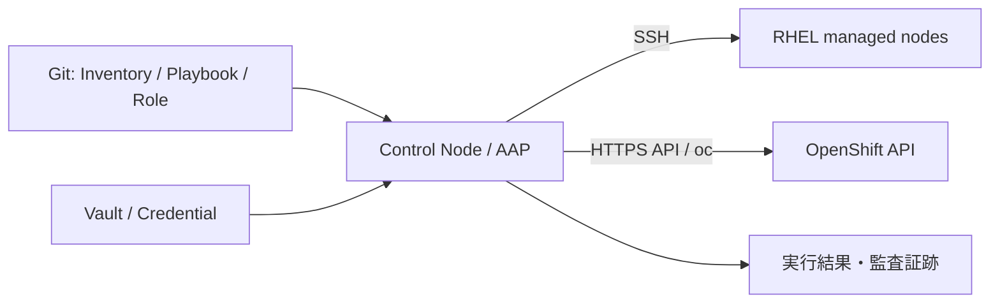

# Ansible / 自動化

> [!IMPORTANT]
> **資料状態（v0.1）**: 技術資料の初稿です。`docs/00`〜`docs/27` の初回通読は完了していますが、詳細レビューと本リポジトリの演習は未実施です。本章の存在や初回通読だけでは、習得・実機検証・商用経験を示しません。章末の説明例も、本人が内容を確認し、自分の言葉で説明できた範囲だけ使用します。実施状況は [証跡台帳](../evidence/README.md) で管理します。


Ansible は、SSH や API を通して複数環境へ同じ意図を再現する自動化ツールです。価値は「コマンドを遠隔実行すること」ではなく、設定をコードとしてレビューし、差分、再実行、証跡、標準化を可能にする点にあります。

> **経験境界**
>
> - Ansible による Linux 基本設定: **基礎理解との本人申告**。過去の実行内容は本人確認待ちで、本リポジトリのラボは未実施です。
> - 商用 OpenShift 案件での Ansible 設計・実装・運用: **経験なし**
> - Kubespray、Ansible Automation Platform（AAP）: **資料初稿・初回通読のみ（詳細レビュー前）**
> - 以下は学習用の実行可能な構文例ですが、このリポジトリ上や顧客環境で実行済みという意味ではありません。対象 OS、collection、権限、OCP 版は **要確認** です。

## Ansible とは

Ansible は YAML で「対象 host に、どの状態を実現するか」を Playbook として記述します。一般的な Linux 管理では control node から SSH で接続し、managed node に常駐 agent を必須としません。ネットワーク機器やクラウド、Kubernetes/OpenShift では各 API 用 collection を利用できます。



自動化前に手順の入力、期待状態、エラー処理、再実行、変更影響を定義します。誤った意図も高速・大量に反映できるため、レビュー、対象制限、check mode、非本番検証、承認が必要です。

## Inventory

Inventory は管理対象 host と group、および接続変数を定義します。静的な INI/YAML のほか、クラウド API 等から取得する dynamic inventory plugin があります。

```yaml
# inventory.yml
---
all:
  children:
    rhel_managed:
      hosts:
        lab-rhel-01:
          ansible_host: 192.0.2.10
        lab-rhel-02:
          ansible_host: 192.0.2.11
      vars:
        ansible_user: ansible
        ansible_become: true
```

```bash
ansible-inventory -i inventory.yml --graph
ansible-inventory -i inventory.yml --host lab-rhel-01
ansible rhel_managed -i inventory.yml -m ansible.builtin.ping
```

`192.0.2.0/24` は文書用アドレスです。実行時は検証環境の値へ置換します。password、private key、token を Inventory や Git に平文で保存しません。

## Playbook

Playbook は一つ以上の Play からなり、対象 `hosts`、権限昇格、変数、task、handler 等を定義します。task には可能な限り `command`／`shell` ではなく、期待状態を理解する専用 module を使います。

```yaml
---
- name: Configure web servers
  hosts: rhel_managed
  become: true
  tasks:
    - name: Ensure Apache is installed
      ansible.builtin.package:
        name: httpd
        state: present

    - name: Ensure Apache is enabled and started
      ansible.builtin.service:
        name: httpd
        enabled: true
        state: started
```

`name` を具体的にし、変数、失敗箇所、実行結果から意図を追えるようにします。

## Role

Role は task、handler、template、file、default、variable、metadata を再利用可能な単位に整理します。

```text
roles/
└── chrony_client/
    ├── defaults/main.yml
    ├── tasks/main.yml
    ├── handlers/main.yml
    └── templates/chrony.conf.j2
```

- `defaults`: 利用側が上書きしやすい既定値。
- `vars`: より強い優先度を持つ Role 内変数。安易に置くと上書きしにくい。
- `tasks`: 実現する処理。
- `handlers`: 変更時だけ行う restart 等。
- `templates`: Jinja2 template。

Role は小さな task の数合わせではなく、責任と変更ライフサイクルがまとまる単位にします。Galaxy collection／role の version と供給元を固定し、内容をレビューします。

## Variable

Variable は環境差、host 差、秘密でない設定値をコードから分離します。

```yaml
# group_vars/rhel_managed.yml
---
base_packages:
  - chrony
  - curl
  - firewalld
  - python3-firewall

managed_users:
  - name: opsuser
    groups:
      - wheel

ntp_servers:
  - ntp1.example.internal
  - ntp2.example.internal
```

Variable には優先順位があり、同名を複数箇所へ置くと意図しない上書きが起きます。環境ごとの Inventory と `group_vars`／`host_vars` の規則を決め、`-e` extra vars の乱用を避けます。

秘密情報は Ansible Vault または AAP Credential／外部 secret manager を使い、ログへ出る task では `no_log: true` を検討します。ただし `no_log` は保護範囲に限界があるため、実行 artifact と callback plugin も **要確認** です。

```bash
ansible-vault create group_vars/rhel_managed/vault.yml
ansible-vault edit group_vars/rhel_managed/vault.yml
ansible-vault view group_vars/rhel_managed/vault.yml
```

Vault password 自体を同じ Git repository に保存しません。

## Template

Template module は Jinja2 を評価し、host／環境ごとの設定 file を生成します。

```jinja2
# templates/chrony.conf.j2
# Managed by Ansible. Manual changes will be overwritten.

server {{ server }} iburst


driftfile /var/lib/chrony/drift
makestep 1.0 3
rtcsync
logdir /var/log/chrony
```

```yaml
- name: Deploy chrony configuration
  ansible.builtin.template:
    src: chrony.conf.j2
    dest: /etc/chrony.conf
    owner: root
    group: root
    mode: '0644'
    backup: true
  notify: Restart chronyd
```

`template` へ渡す値を信頼せず、型、必須値、allow list を `assert` で検証します。生成 file の syntax check が可能なら、対象 daemon の `validate` command を版に合わせて **要確認** します。

## Handler

Handler は task が `changed` になり通知されたときだけ、通常 Play の最後に実行されます。複数 task から同じ handler を通知しても通常1回にまとめられます。

```yaml
handlers:
  - name: Restart chronyd
    ansible.builtin.service:
      name: chronyd
      state: restarted
```

設定 file が変わらなければ service を再起動しないため、不要な停止を減らせます。ただし handler 実行前に後続 task が失敗する場合、設定と process が不一致になる可能性があります。必要に応じ `block/rescue`、`flush_handlers`、事前 validation、rolling execution を設計します。

## 冪等性

冪等性とは、同じ望ましい状態を繰り返し適用しても、2回目以降に不要な変更が発生しない性質です。

- `package: state=present` は、導入済みなら通常変更しない。
- `lineinfile` を shell の `echo >>` より優先し、同じ行の増殖を防ぐ。
- `command` を使う場合は `creates`、`removes`、`changed_when`、状態確認を加える。
- `latest` は毎回同じ結果を保証せず、意図しない更新を起こすため、更新 policy と version を明示する。

冪等性は「安全」の同義語ではありません。誤った desired state を再現性高く適用することもあるため、レビューと対象制限が必要です。

## Linux 設定自動化の流れ

1. 手作業手順を、入力・事前条件・期待状態・確認・戻し方に分ける。
2. 対応 module を調べ、shell command を最小化する。
3. Molecule／lint／syntax check、test VM で検証する。
4. `--check --diff` で予測差分を確認する。ただし module ごとの check mode 対応は **要確認**。
5. `--limit`、`serial`、保守枠を使い小さい対象から適用する。
6. handler、post-check、監視、application test を確認する。
7. 実行 version、Inventory、commit、結果、承認を保存する。

RHCOS Node は一般的な RHEL managed node と同じ Playbook で package／firewalld／chrony を直接変更しません。MachineConfig、NMState、Operator 等のサポートされた OpenShift API を使う設計にします。

## 完全な Linux 基本設定 Playbook 例

この例は、**検証用 RHEL 9 host** を対象に、package、user、firewalld、chrony を設定します。RHCOS Node を Inventory に入れないでください。

### ファイル構成

```text
ansible-linux-example/
├── inventory.yml
├── group_vars/
│   └── rhel_managed.yml
├── templates/
│   └── chrony.conf.j2
└── linux-baseline.yml
```

### `inventory.yml`

```yaml
---
all:
  children:
    rhel_managed:
      hosts:
        lab-rhel-01:
          ansible_host: 192.0.2.10
      vars:
        ansible_user: ansible
```

### `group_vars/rhel_managed.yml`

```yaml
---
base_packages:
  - chrony
  - curl
  - firewalld
  - python3-firewall
  - vim-enhanced

managed_users:
  - name: opsuser
    comment: Operations training account
    groups:
      - wheel

ntp_servers:
  - ntp1.example.internal
  - ntp2.example.internal

firewall_services:
  - ssh
  - https
```

### `templates/chrony.conf.j2`

```jinja2
# Managed by Ansible. Manual changes will be overwritten.

server {{ server }} iburst


driftfile /var/lib/chrony/drift
makestep 1.0 3
rtcsync
logdir /var/log/chrony
```

### `linux-baseline.yml`

```yaml
---
- name: Configure a RHEL training server baseline
  hosts: rhel_managed
  become: true
  gather_facts: true

  pre_tasks:
    - name: Verify the target is supported by this training playbook
      ansible.builtin.assert:
        that:
          - ansible_facts.os_family == 'RedHat'
          - ansible_facts.distribution_major_version == '9'
        fail_msg: This example is limited to a reviewed RHEL-compatible version 9 lab host.

    - name: Verify required variables are not empty
      ansible.builtin.assert:
        that:
          - base_packages | length > 0
          - managed_users | length > 0
          - ntp_servers | length >= 2
          - firewall_services | length > 0

  tasks:
    - name: Ensure baseline packages are installed
      ansible.builtin.package:
        name: "{{ base_packages }}"
        state: present

    - name: Ensure managed users exist
      ansible.builtin.user:
        name: "{{ item.name }}"
        comment: "{{ item.comment }}"
        groups: "{{ item.groups | join(',') }}"
        append: true
        create_home: true
        shell: /bin/bash
        state: present
      loop: "{{ managed_users }}"
      loop_control:
        label: "{{ item.name }}"

    - name: Ensure firewalld is enabled and started
      ansible.builtin.service:
        name: firewalld
        enabled: true
        state: started

    - name: Allow approved firewalld services in the public zone
      ansible.posix.firewalld:
        zone: public
        service: "{{ item }}"
        permanent: true
        immediate: true
        state: enabled
      loop: "{{ firewall_services }}"

    - name: Deploy chrony configuration
      ansible.builtin.template:
        src: chrony.conf.j2
        dest: /etc/chrony.conf
        owner: root
        group: root
        mode: '0644'
        backup: true
      notify: Restart chronyd

    - name: Ensure chronyd is enabled and started
      ansible.builtin.service:
        name: chronyd
        enabled: true
        state: started

  handlers:
    - name: Restart chronyd
      ansible.builtin.service:
        name: chronyd
        state: restarted
```

### 検証・実行コマンド

実環境値へ置換し、公開鍵・sudo・DNS/NTP を準備してから使います。

```bash
ansible-galaxy collection install ansible.posix
ansible-inventory -i inventory.yml --graph
ansible-playbook -i inventory.yml linux-baseline.yml --syntax-check
ansible-lint linux-baseline.yml
ansible-playbook -i inventory.yml linux-baseline.yml --check --diff --limit lab-rhel-01
ansible-playbook -i inventory.yml linux-baseline.yml --diff --limit lab-rhel-01
ansible-playbook -i inventory.yml linux-baseline.yml --check --diff --limit lab-rhel-01
```

最後の check で不要な `changed` が出ないかを確認します。実行例を示しただけで、この教材作成時に対象 host へ適用したわけではありません。

### 改善すべき実務項目

- `wheel` 付与、sudoers、SSH 公開鍵、account expiry を組織の認証標準に合わせる。
- firewalld の zone と source/interface を parameter 化し、既存管理経路を保護する。
- chrony configuration の syntax validation と `chronyc tracking/sources` による post-check を追加する。
- package version lock、repository、Satellite、再起動、CVE 対応を設計する。
- rolling 実行、`serial`、障害時 `rescue`、監視抑止、変更チケットを組み込む。

## Kubernetes / OpenShift YAML 適用

OpenShift resource を Ansible から管理する主な方法は二つです。

1. **`kubernetes.core.k8s` module:** API object を構造として扱い、check mode や認証 option を統合しやすい。
2. **`oc apply -f`:** 既存の運用手順や YAML をそのまま利用しやすいが、CLI version、context、stdout の判定、差分、error handling を自分で設計する。

継続的なアプリ配布は GitOps（Argo CD）に責任を持たせ、Ansible はクラスタ外の準備や一時 orchestration に使う設計もあります。同じ resource を Ansible、GitOps、手作業で同時管理しません。

## YAML 配置と `oc apply` の完全な Playbook 例

この例は control node の `/tmp/ansible-openshift-manifests` へ YAML を配置し、指定された kubeconfig で `oc apply` を呼びます。**実行済みの表明ではなく、検証環境用の学習例です。**

### ファイル構成

```text
ansible-openshift-example/
├── files/
│   └── demo-app.yml
└── openshift-apply.yml
```

### `files/demo-app.yml`

```yaml
---
apiVersion: v1
kind: Namespace
metadata:
  name: ansible-demo
  labels:
    app.kubernetes.io/managed-by: ansible-training
---
apiVersion: apps/v1
kind: Deployment
metadata:
  name: demo-web
  namespace: ansible-demo
  labels:
    app: demo-web
spec:
  replicas: 2
  selector:
    matchLabels:
      app: demo-web
  template:
    metadata:
      labels:
        app: demo-web
    spec:
      containers:
        - name: web
          image: registry.k8s.io/e2e-test-images/agnhost:2.53
          imagePullPolicy: IfNotPresent
          args:
            - netexec
            - --http-port=8080
          ports:
            - name: http
              containerPort: 8080
          resources:
            requests:
              cpu: 50m
              memory: 64Mi
            limits:
              cpu: 250m
              memory: 256Mi
          securityContext:
            allowPrivilegeEscalation: false
            capabilities:
              drop:
                - ALL
            runAsNonRoot: true
            seccompProfile:
              type: RuntimeDefault
          readinessProbe:
            httpGet:
              path: /readyz
              port: http
            initialDelaySeconds: 5
            periodSeconds: 10
---
apiVersion: v1
kind: Service
metadata:
  name: demo-web
  namespace: ansible-demo
spec:
  selector:
    app: demo-web
  ports:
    - name: http
      port: 8080
      targetPort: http
---
apiVersion: route.openshift.io/v1
kind: Route
metadata:
  name: demo-web
  namespace: ansible-demo
spec:
  to:
    kind: Service
    name: demo-web
    weight: 100
  port:
    targetPort: http
  tls:
    termination: edge
    insecureEdgeTerminationPolicy: Redirect
```

学習例では固定した版の HTTP テストイメージを使います。OpenShift の restricted SCC が Project 固有の非 0 UID を割り当てる前提で、Manifest に固定 UID は指定していません。商用では承認済み Registry の immutable digest へ固定し、mirror、署名、脆弱性、EOL、対象 SCC との互換性を確認します。外部 Registry に接続できない環境では内部 mirror へ書き換えます。

### `openshift-apply.yml`

```yaml
---
- name: Place and apply an OpenShift manifest from the control node
  hosts: localhost
  connection: local
  gather_facts: false

  vars:
    manifest_work_dir: /tmp/ansible-openshift-manifests
    manifest_name: demo-app.yml

  pre_tasks:
    - name: Require an explicit kubeconfig path
      ansible.builtin.assert:
        that:
          - kubeconfig_path is defined
          - kubeconfig_path | default('') | length > 0
          - expected_api_server is defined
          - expected_api_server | default('') | length > 0
        fail_msg: Pass kubeconfig_path and the approved expected_api_server for the target lab cluster.

    - name: Verify the kubeconfig file exists
      ansible.builtin.stat:
        path: "{{ kubeconfig_path }}"
      register: kubeconfig_stat

    - name: Stop when the kubeconfig file is missing
      ansible.builtin.assert:
        that:
          - kubeconfig_stat.stat.exists
          - kubeconfig_stat.stat.isreg
        fail_msg: "The kubeconfig file was not found: {{ kubeconfig_path }}"

    - name: Verify the oc client is available
      ansible.builtin.command:
        argv:
          - oc
          - version
          - --client
      changed_when: false

    - name: Read the API server selected by the kubeconfig
      ansible.builtin.command:
        argv:
          - oc
          - --kubeconfig
          - "{{ kubeconfig_path }}"
          - whoami
          - --show-server
      register: selected_api_server
      changed_when: false
      check_mode: false

    - name: Stop when the selected cluster is not the approved target
      ansible.builtin.assert:
        that:
          - selected_api_server.stdout | trim == expected_api_server
        fail_msg: >-
          Refusing to continue. kubeconfig selects
          {{ selected_api_server.stdout | trim }}, expected {{ expected_api_server }}.

  tasks:
    - name: Create a protected manifest work directory
      ansible.builtin.file:
        path: "{{ manifest_work_dir }}"
        state: directory
        mode: '0700'

    - name: Place the reviewed OpenShift YAML
      ansible.builtin.copy:
        src: "files/{{ manifest_name }}"
        dest: "{{ manifest_work_dir }}/{{ manifest_name }}"
        mode: '0600'

    - name: Apply the OpenShift YAML with oc
      ansible.builtin.command:
        argv:
          - oc
          - --kubeconfig
          - "{{ kubeconfig_path }}"
          - apply
          - --filename
          - "{{ manifest_work_dir }}/{{ manifest_name }}"
      register: oc_apply
      changed_when: oc_apply.stdout is search('created|configured')
      failed_when: oc_apply.rc != 0

    - name: Show non-secret apply results
      ansible.builtin.debug:
        var: oc_apply.stdout_lines

    - name: Read the deployed resources
      ansible.builtin.command:
        argv:
          - oc
          - --kubeconfig
          - "{{ kubeconfig_path }}"
          - get
          - deployment,service,route
          - --namespace
          - ansible-demo
          - --output
          - wide
      register: deployed_resources
      changed_when: false

    - name: Show the deployed resource status
      ansible.builtin.debug:
        var: deployed_resources.stdout_lines
```

### 構文確認・差分・適用

```bash
ansible-playbook openshift-apply.yml --syntax-check
oc --kubeconfig /secure/path/lab.kubeconfig apply --dry-run=server -f files/demo-app.yml
oc --kubeconfig /secure/path/lab.kubeconfig diff -f files/demo-app.yml
ansible-playbook openshift-apply.yml -e kubeconfig_path=/secure/path/lab.kubeconfig -e expected_api_server=https://api.lab.example.com:6443
ansible-playbook openshift-apply.yml -e kubeconfig_path=/secure/path/lab.kubeconfig -e expected_api_server=https://api.lab.example.com:6443
```

2回目の実行で `unchanged` となるかを確認します。`oc diff` は差分があると終了コード `1` を返す仕様なので、差分表示を即エラーと誤解しません。また、初回の server-side dry-run／diff では対象 Namespace がまだ永続作成されておらず、同じ複数 document 内の namespaced resource が `NotFound` になる場合があります。その場合は、承認済みの空 Project を先に用意してアプリケーション部分を検証するか、Namespace と namespaced resource の検証を段階分けします。

`ansible.builtin.command` 自体が Kubernetes object の意味を理解するわけではありません。`oc apply` の出力形式が変われば `changed_when` の見直しが必要です。また、`command` task は通常 check mode で適用を模擬できないため、事前に server-side dry-run と `oc diff` を行います。

Kubeconfig は機密情報です。権限を `0600` 相当にし、Git、実行ログ、チケット、個人 AI へ内容を貼り付けません。ファイルの存在だけでは対象クラスタを保証できないため、承認済み API Server と `oc whoami --show-server` の完全一致を変更前ゲートにします。実務では短命 credential、ServiceAccount の最小 RBAC、AAP Credential を検討します。

## `kubernetes.core.k8s` を使う代替例

```yaml
---
- name: Apply a reviewed manifest through the Kubernetes API module
  hosts: localhost
  connection: local
  gather_facts: false
  collections:
    - kubernetes.core

  tasks:
    - name: Apply all objects from the manifest
      kubernetes.core.k8s:
        kubeconfig: "{{ kubeconfig_path }}"
        state: present
        src: files/demo-app.yml
        apply: true
```

```bash
ansible-galaxy collection install kubernetes.core
ansible-playbook kubernetes-module-apply.yml --syntax-check
ansible-playbook kubernetes-module-apply.yml --check --diff -e kubeconfig_path=/secure/path/lab.kubeconfig
```

control node の Python client 依存、server-side apply、collection と Kubernetes/OCP の互換性は公式文書で **要確認** です。

## Kubespray 概要

Kubespray は Ansible を使って Kubernetes cluster を構築・管理する community project です。複数 OS、runtime、network plugin、HA 構成等の選択肢を Inventory と Role で自動化します。

- kubeadm ベースの Kubernetes 学習や、セルフマネージド Kubernetes の構築候補です。
- **OpenShift Container Platform を構築するツールではありません。** OCP は `openshift-install`、Assisted Installer、Agent-based Installer 等、対象環境でサポートされた方法を使います。
- Kubespray の tag／branch、対応 Kubernetes、OS、Ansible、upgrade path を固定し、sample Inventory をそのまま本番利用しません。
- 商用導入時は community support、脆弱性対応、fork 差分、テスト、運用責任を評価します。

本教材では **概要理解レベル** であり、Kubespray の商用構築経験はありません。

## Ansible Automation Platform 概要

Red Hat Ansible Automation Platform（AAP）は、組織で自動化を運用するための製品群です。版により構成・名称は変わりますが、主な考え方は次のとおりです。

- **automation controller:** Inventory、Credential、Project、Job Template、Workflow、RBAC、schedule、実行履歴を集中管理。
- **execution environment:** ansible-core、collection、Python dependency を container image として固定。
- **Private Automation Hub:** 承認済み collection／execution environment の配布。
- **Event-Driven Ansible:** event source と rulebook に基づき、承認された action を起動。

AAP を OpenShift 上へ Operator で配置する構成もありますが、対象 AAP/OCP 版、subscription、容量、PostgreSQL、backup、route、certificate、upgrade は **要確認** です。

本教材では **概要理解レベル** で、AAP の商用導入・運用経験はありません。

## OpenShift 案件で Ansible が求められる理由

- bastion、DNS、LB、Mirror Registry、NTP、証明書配布など、クラスタ外 Linux の標準化。
- 導入前 prerequisite、疎通確認、設定収集、証跡作成の反復。
- 複数クラスタ／環境への Project、RBAC、Quota、Operator 前提リソースの統一。
- 移行、バックアップ、保守での順序制御と、人手作業の漏れ削減。
- AAP による Credential、承認、RBAC、実行履歴、schedule の統制。

一方、OpenShift の reconciliation と GitOps が所有する resource を Ansible で上書きすると競合します。「誰が source of truth か」を resource 単位で決めます。

## 安全な実行チェックリスト

- [ ] Inventory graph と `--limit` で対象 host を二重確認した。
- [ ] commit、Playbook version、collection／execution environment を固定した。
- [ ] Vault／Credential を使用し、秘密を log と Git に出していない。
- [ ] syntax、lint、check、diff、非本番試験を行った。
- [ ] module の check mode 対応と、command/shell の挙動を確認した。
- [ ] rolling 数、冗長性、監視抑止、保守時間、連絡先を確認した。
- [ ] post-check と業務確認、失敗時の `block/rescue`／手動復旧を用意した。
- [ ] 実行 ID、開始／終了時刻、結果、変更、承認を保存した。

## よくある失敗と改善

| 失敗 | 問題 | 改善 |
| --- | --- | --- |
| `shell: echo ... >> file` | 再実行で重複する | template、copy、lineinfile を使う |
| `ignore_errors: true` | 重大な失敗を隠す | 期待する rc だけ `failed_when` で定義する |
| 全 host へ一括実行 | 誤りの blast radius が大きい | test、`--limit`、`serial`、段階承認 |
| Secret を vars に平文保存 | Git／log から漏えい | Vault、AAP Credential、外部 secret manager |
| `latest` を常用 | 変更時期が制御できない | 承認 version／digest を固定する |
| RHCOS を通常 RHEL として変更 | MCO と競合、更新で消失 | MachineConfig／Operator 等を使う |
| Ansible と GitOps が同じ YAML を管理 | 上書きループ、所有不明 | source of truth と責任を一つにする |

## 公式情報

- [Ansible Community Documentation](https://docs.ansible.com/ansible/latest/)
- [Ansible: Building an inventory](https://docs.ansible.com/ansible/latest/inventory_guide/intro_inventory.html)
- [Ansible: Playbooks](https://docs.ansible.com/ansible/latest/playbook_guide/playbooks_intro.html)
- [Ansible: Roles](https://docs.ansible.com/ansible/latest/playbook_guide/playbooks_reuse_roles.html)
- [Ansible: Variable precedence](https://docs.ansible.com/ansible/latest/reference_appendices/general_precedence.html)
- [Ansible: Vault](https://docs.ansible.com/ansible/latest/vault_guide/)
- [Red Hat Ansible Automation Platform documentation](https://docs.redhat.com/en/documentation/red_hat_ansible_automation_platform/)
- [Kubespray official repository](https://github.com/kubernetes-sigs/kubespray)
- [OpenShift CLI documentation](https://docs.redhat.com/en/documentation/openshift_container_platform/4.22/html/cli_tools/openshift-cli-oc)

> 参照日は **2026-08-13** です。`latest` 文書、collection、AAP、Kubespray、OCP の API と依存関係は更新されます。実案件では ansible-core、collection、execution environment、Python、対象 RHEL/OCP の version matrix と Red Hat サポート条件を **要確認** です。

## 面談での説明例

「Ansible は商用案件での実装・運用経験はありません。Linux の package、user、firewalld、chrony と、YAML 配置・`oc apply` の Playbook を教材・検証用に整理したレベルです。Inventory、Playbook、Role、variable、template、handler、冪等性の役割は理解しています。実務では秘密情報を Vault／Credential に分離し、syntax・lint・check・diff、`--limit`、段階適用、post-check、実行証跡を重視します。Kubespray と AAP は概要理解レベルであり、導入経験があるとは説明しません。」
