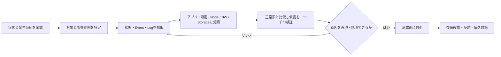

# Kubernetesトラブルシューティング

> [!IMPORTANT]
> **資料状態（v0.1）**: 技術資料の初稿です。`docs/00`〜`docs/27` の初回通読は完了していますが、詳細レビューと本リポジトリの演習は未実施です。本章の存在や初回通読だけでは、習得・実機検証・商用経験を示しません。章末の説明例も、本人が内容を確認し、自分の言葉で説明できた範囲だけ使用します。実施状況は [証跡台帳](../evidence/README.md) で管理します。


> 対象レベル: Kubernetesは教材・検証経験、商用クラスタの障害対応経験はなし。  
> 更新基準日: 2026-08-13。本章のコマンドは一般的なKubernetesを前提とする。API、CNI、CSI、メトリクス機能はクラスタのバージョンと実装により異なるため**要確認**。

## 調査の基本姿勢

障害調査は「推測した原因を直す作業」ではなく、「事実を時系列で集め、影響範囲と正常・異常の境界を狭める作業」である。最初に発生時刻、対象Namespace、直前変更、再現性、影響利用者を記録し、変更前に取得した出力を保存する。Pod削除、再起動、設定変更は証拠を消す可能性があるため、商用環境では承認・変更管理・ロールバック条件を**要確認**とする。



## 初動で保存する情報

```bash
kubectl version
kubectl cluster-info
kubectl get pods -A -o wide
kubectl get pods -A
kubectl get nodes -o wide
kubectl get nodes
kubectl get events -A --sort-by=.metadata.creationTimestamp
kubectl get deployments,statefulsets,daemonsets -A
kubectl top nodes
kubectl top pods -A
```

`kubectl top` はMetrics APIが利用できる場合だけ動作する。使えないこと自体をCPU不足と断定しない。時刻、コマンド、出力、判断、次の確認を調査メモに残す。

## Podが起動しない

### 典型的な症状

Podが `Pending`、`ContainerCreating`、`ImagePullBackOff`、`CrashLoopBackOff`、`Error` のままになる、READYが `0/1` になる、再起動回数が増える。これは障害名ではなく、スケジューリングからReadiness Probeまでのどこかで失敗しているという入口である。

### 最初に見るコマンド

```bash
kubectl get pod <pod名> -n <namespace> -o wide
kubectl describe pod <pod名> -n <namespace>
kubectl logs <pod名> -n <namespace> --all-containers=true --timestamps=true
kubectl logs <pod名> -n <namespace> --all-containers=true --previous --timestamps=true
kubectl get events -n <namespace> --sort-by=.lastTimestamp
kubectl get pod <pod名> -n <namespace> -o yaml
```

### 原因候補

- イメージ取得、コマンド、環境変数、Secret、ConfigMapの誤り
- Resource request、nodeSelector、Affinity、Taint/Toleration、Quotaの不整合
- Volume、CNI、Probe、SCC/Pod Security、Nodeの異常
- アプリケーション終了、OOMKill、外部依存先の不通

### 切り分け手順

1. `STATUS` だけでなく `describe` の `State`、`Last State`、`Reason`、`Exit Code`、末尾のEventsを読む。
2. PodがNodeへ割り当て済みか確認する。未割当ならScheduler、割当済みでコンテナ未作成ならImage・Volume・CNIを優先する。
3. Init Containerと各コンテナを分け、現行ログと `--previous` の直前ログを確認する。
4. 同じDeploymentの正常Pod、直前ReplicaSet、設定差分を比較する。
5. Node、外部サービス、DNSなど依存先へ範囲を広げる。

### よくある対処

原因となったイメージ名、設定、Probe、リソース量、Volume参照を修正する。Pod再作成だけで一時復旧しても根本原因としない。修正前後のManifest差分と再発防止策を残す。

### 面談での説明例

> 商用障害対応経験はありません。教材・検証では、まずPodの状態、describeのEvents、現行・直前ログを採取し、スケジューリング前か、コンテナ作成中か、起動後かに分けて原因候補を絞る型で確認しています。

## ImagePullBackOff

### 典型的な症状

`ErrImagePull` の後に待機時間を延ばしながら `ImagePullBackOff` となる。Eventsには `not found`、`unauthorized`、TLS、名前解決、接続タイムアウトなどが記録される。

### 最初に見るコマンド

```bash
kubectl describe pod <pod名> -n <namespace>
kubectl get pod <pod名> -n <namespace> -o jsonpath='{range .spec.containers[*]}{.name}{"\t"}{.image}{"\n"}{end}'
kubectl get pod <pod名> -n <namespace> -o jsonpath='{.spec.imagePullSecrets[*].name}{"\n"}'
kubectl get serviceaccount <serviceaccount名> -n <namespace> -o yaml
kubectl get events -n <namespace> --sort-by=.lastTimestamp
```

### 原因候補

リポジトリ名・タグ・Digestの誤り、非公開Registryの認証Secret不足、失効資格情報、NodeからRegistryへのDNS/Firewall/Proxy不通、Registry証明書の信頼不足、Rate Limit、Registry障害がある。

### 切り分け手順

1. EventのHTTPステータスやTLSエラーをそのまま記録する。
2. Deployment指定の完全なImage参照とRegistry上の実在を、承認された端末から確認する。
3. `imagePullSecrets` とServiceAccountの関連、Secretの種類を確認する。Secret値は表示・記録しない。
4. 失敗Nodeに偏るか比較し、Node経路・CA・Proxyの差を疑う。
5. 同Registryの既知の正常Imageで認証・経路と対象Image固有問題を分ける。

### よくある対処

正しいDigestへの修正、Registry資格情報の安全な更新、ServiceAccountへのSecret関連付け、DNS/Firewall/Proxy/CA設定の是正を行う。`:latest` 依存を避け、再現可能なDigest運用を検討する。

### 面談での説明例

> ImagePullBackOffでは、Eventのnot found、unauthorized、TLS、timeoutを起点に、Image名、認証Secret、NodeからRegistryへの経路の順で切り分けます。資格情報はログや資料へ残しません。

## CrashLoopBackOff

### 典型的な症状

コンテナが起動後すぐ終了し、再起動回数が増え、Kubeletが再起動間隔を延ばす。`OOMKilled`、Probe失敗、`Exit Code: 1` などが見える。

### 最初に見るコマンド

```bash
kubectl get pod <pod名> -n <namespace> -o wide
kubectl describe pod <pod名> -n <namespace>
kubectl logs <pod名> -n <namespace> -c <container名> --previous --timestamps=true
kubectl get pod <pod名> -n <namespace> -o jsonpath='{range .status.containerStatuses[*]}{.name}{"\t"}{.lastState.terminated.reason}{"\t"}{.lastState.terminated.exitCode}{"\n"}{end}'
kubectl get deployment <deployment名> -n <namespace> -o yaml
```

### 原因候補

起動コマンド・引数の誤り、必須設定やSecret不足、外部DB不通、ファイル権限、OOM、Liveness Probeの厳しすぎる設定、アプリケーション不具合がある。

### 切り分け手順

1. `--previous` ログと終了Reason/Exit Codeを対応付ける。
2. `137` や `OOMKilled` ならlimit、実使用量、Node圧迫を確認する。
3. Liveness、Readiness、Startup Probeのどれが失敗したかEventsで特定する。
4. ConfigMap/Secretのキー名、Volume mount、ServiceAccountを正常版と比較する。
5. 外部依存を、同Namespaceの診断用Podまたは既存Podから確認する。診断Podの利用可否は**要確認**。

### よくある対処

アプリ設定・起動引数の修正、適正なresources、Startup Probe追加やProbe閾値調整、依存先復旧を行う。単にLiveness Probeを削除すると故障検知を失うため、根拠なく実施しない。

### 面談での説明例

> CrashLoopBackOffでは直前コンテナのログ、終了コード、Last Stateを優先します。OOM、Probe、設定、外部依存に分類し、再起動で証拠が消える前に採取します。

## Pending

### 典型的な症状

PodがNodeへ割り当てられず `Pending` のまま、またはPVC待ちでPendingになる。Scheduler Eventに `Insufficient cpu`、taint不許容、Affinity不一致、未Bound PVCなどが出る。

### 最初に見るコマンド

```bash
kubectl describe pod <pod名> -n <namespace>
kubectl get nodes --show-labels
kubectl describe node <node名>
kubectl get resourcequota,limitrange -n <namespace>
kubectl get pvc -n <namespace>
kubectl get events -n <namespace> --sort-by=.lastTimestamp
```

### 原因候補

CPU/メモリ不足、request過大、Taint/Toleration不整合、nodeSelector/Affinity不一致、Topology制約、PVC未割当、ResourceQuota超過、スケジューラ異常がある。

### 切り分け手順

1. Podの `spec.nodeName` とScheduler Eventを確認する。
2. requestと各NodeのAllocatable/Allocated、Node conditionを比較する。
3. Label、Taint、Affinity、TopologySpreadConstraintsを照合する。
4. PVCを使う場合はStorageClassとVolumeBindingModeも確認する。
5. 複数Podで同時発生なら容量計画やSchedulerの健全性へ範囲を広げる。

### よくある対処

requestの適正化、Node増設、誤った配置制約の修正、必要なToleration、PVC/StorageClassの是正を行う。制約を外す場合は可用性・分離要件への影響をレビューする。

### 面談での説明例

> PendingはScheduler Eventを起点に、リソース不足、配置制約、taint、PVC待ちを順に確認します。requestを下げるだけでなく、設計上必要な配置条件を壊さないことも確認します。

## PVCがBoundにならない

### 典型的な症状

PVCが `Pending` のままで、利用Podも起動できない。EventにProvisioning失敗、StorageClassなし、容量・AccessMode不一致、Topology不一致などが出る。

### 最初に見るコマンド

```bash
kubectl get pvc,pv -n <namespace>
kubectl describe pvc <pvc名> -n <namespace>
kubectl get storageclass
kubectl describe storageclass <storageclass名>
kubectl get events -n <namespace> --sort-by=.lastTimestamp
kubectl get pods -A | grep -i csi
```

### 原因候補

既定StorageClassなし、StorageClass名誤り、CSI controller/node異常、容量不足、AccessMode/VolumeMode非対応、VolumeBindingModeとTopology、静的PVのselector・容量・claimRef不一致がある。

### 切り分け手順

1. PVC Eventから、Provisionerが呼ばれたか、待機中か、失敗したかを確認する。
2. 要求容量、AccessMode、VolumeMode、StorageClassを確認する。
3. StorageClassのProvisioner、BindingMode、reclaimPolicy、parametersを確認する。
4. CSI関連Podとログ、ストレージ装置側イベントを担当境界に沿って確認する。
5. `WaitForFirstConsumer` なら利用Podの配置条件とStorage Topologyを合わせて見る。

### よくある対処

正しいStorageClass指定、CSI復旧、容量確保、対応AccessModeへの修正、Topology整合を行う。PV/PVC削除はデータ消失につながるため、reclaimPolicy、バックアップ、承認を**要確認**。

### 面談での説明例

> PVC PendingではdescribeのEvent、要求条件、StorageClass、CSI、Topologyの順に確認します。PVやPVCの削除はデータ影響があるため、初動対処にはしません。

## Service疎通不可

### 典型的な症状

ServiceのClusterIPやDNS名へ接続できない、接続拒否・タイムアウトになる、一部Podだけ失敗する。Podへ直接は通るがService経由だけ通らない場合もある。

### 最初に見るコマンド

```bash
kubectl get service <service名> -n <namespace> -o wide
kubectl describe service <service名> -n <namespace>
kubectl get endpointslice -n <namespace> -l kubernetes.io/service-name=<service名> -o wide
kubectl get pods -n <namespace> --show-labels -o wide
kubectl get networkpolicy -n <namespace>
kubectl exec -n <namespace> <確認元pod名> -- curl -sv --connect-timeout 5 http://<service名>.<namespace>.svc:<port>/
```

### 原因候補

selectorとPod labelの不一致、Pod非Ready、`port`/`targetPort`/protocol誤り、アプリ未Listen、NetworkPolicy、DNS、kube-proxyまたはCNIの問題がある。

### 切り分け手順

1. ServiceにEndpointSliceがあり、ReadyなPod IPとPortが載るか確認する。
2. 同一Pod内、Pod IP、Service IP/DNSの順で試し、アプリとService層を分ける。
3. アプリのListen address/portとServiceのtargetPortを照合する。
4. 送信元・宛先双方のNetworkPolicyを確認する。
5. Nodeや送信元Podにより結果が違う場合、CNI/kube-proxy実装へ広げる。

### よくある対処

selector/label、targetPort、Readiness、Listen設定、NetworkPolicyを要件どおり修正する。直接Pod IPを恒久接続先にするのはPod再作成で変わるため避ける。

### 面談での説明例

> Service不通ではEndpointSliceを境界にします。EndpointがなければselectorやReadiness、あればPod直通、Service経由、DNSの順で比較して、アプリ・Service・ネットワークを分離します。

## Ingressでアクセスできない

### 典型的な症状

外部FQDNで名前解決できない、接続タイムアウト、TLSエラー、404/503となる。404はIngressルール不一致、503はBackend不健全など、応答主体を確認する手掛かりになる。

### 最初に見るコマンド

```bash
kubectl get ingress -A
kubectl describe ingress <ingress名> -n <namespace>
kubectl get service <service名> -n <namespace> -o yaml
kubectl get endpointslice -n <namespace> -l kubernetes.io/service-name=<service名> -o wide
kubectl get pods -A -o wide | grep -i ingress
dig <公開FQDN>
curl -vk --connect-timeout 5 https://<公開FQDN>/
```

### 原因候補

IngressClass/controller不一致、host/path誤り、Backend Service/Port誤り、Endpointなし、TLS Secret不備、DNS/LB/Firewall、Controller障害がある。

### 切り分け手順

1. `dig`、TCP/TLS、HTTPステータスの順に層を分ける。
2. IngressのAddress、Class、Events、host/path、Backendを確認する。
3. Backend ServiceのEndpointとPod直通を確認する。
4. Hostヘッダー/SNIを維持してLBまたはIngress入口を試す。
5. ControllerのPod、ログ、Service、LB health checkを運用権限の範囲で確認する。

### よくある対処

IngressClass、host/path、Service port、TLS Secret、DNS/LB設定を修正する。証明書検証を無効化した `curl -k` は診断限定であり、恒久対処にしない。

### 面談での説明例

> Ingress不通はDNS、LB/TCP、TLS、Ingress rule、Service、Podの順に確認し、404や503を含む応答元を特定します。外側から内側へ一段ずつ境界を狭めます。

## CoreDNS異常

### 典型的な症状

PodからService名や外部名を引けず `NXDOMAIN`、`SERVFAIL`、timeoutが発生する。CoreDNS Podの再起動、遅延、CPU上昇が見えることもある。

### 最初に見るコマンド

```bash
kubectl get pods -n kube-system -l k8s-app=kube-dns -o wide
kubectl logs -n kube-system -l k8s-app=kube-dns --all-containers=true --tail=200
kubectl get service -n kube-system kube-dns -o wide
kubectl get endpointslice -n kube-system -l kubernetes.io/service-name=kube-dns -o wide
kubectl exec -n <namespace> <確認元pod名> -- cat /etc/resolv.conf
kubectl exec -n <namespace> <確認元pod名> -- nslookup kubernetes.default.svc.cluster.local
```

### 原因候補

CoreDNS Pod/Service異常、Corefile誤り、上流DNS不通、NetworkPolicy、CNI、conntrack/Node問題、検索ドメインや `ndots` による遅延がある。

### 切り分け手順

1. クラスタ内Service名と外部FQDNを別々に問い合わせる。
2. `/etc/resolv.conf` のnameserver/search/optionsとDNS Service IPを照合する。
3. CoreDNS ServiceのEndpoint、Pod配置、ログ、リソース使用量を確認する。
4. 問題が特定Node/Namespaceだけか比較し、CNI/NetworkPolicyを分ける。
5. 外部名だけ失敗なら上流DNSへの到達性とCorefile forward設定を確認する。

### よくある対処

CoreDNS設定、上流DNS、NetworkPolicy、リソース量を是正する。CoreDNS再起動だけで復旧した場合も、負荷、上流遅延、Node偏りを調べる。

### 面談での説明例

> DNSはクラスタ内名と外部名を分け、Podのresolv.conf、DNS Service/Endpoint、CoreDNSログ、上流DNSの順で確認します。特定Nodeだけかも比較します。

## Node NotReady

### 典型的な症状

Nodeが `NotReady` または `Unknown` となり、Podが退避・Pendingになる。ConditionにMemoryPressure、DiskPressure、PIDPressure、NetworkUnavailable、Kubelet疎通断が出る。

### 最初に見るコマンド

```bash
kubectl get nodes
kubectl get node <node名> -o wide
kubectl describe node <node名>
kubectl get pods -A --field-selector spec.nodeName=<node名> -o wide
kubectl get events -A --field-selector involvedObject.kind=Node,involvedObject.name=<node名> --sort-by=.metadata.creationTimestamp
kubectl top node <node名>
```

### 原因候補

Kubelet停止、Node/API間ネットワーク断、証明書、OSハング、CPU/メモリ/ディスク/PID枯渇、container runtime、CNI、時刻ずれがある。

### 切り分け手順

1. `Ready` ConditionのReason、Message、LastHeartbeatTime、Lease更新を確認する。
2. 単一Nodeか全Nodeか、同一Zone/Rackだけかを確認する。
3. Node上のPod影響と重要ワークロードの冗長性を確認する。
4. SSH等が許可される環境ではKubelet、runtime、ディスク、時刻、OSログを確認する。管理方式は**要確認**。
5. API/LB/Firewall、証明書、CNIの共有障害を確認する。

### よくある対処

枯渇解消、Kubelet/runtime/ネットワーク復旧、Node交換を手順に従い実施する。安易な再起動・Node削除・force deleteはデータや可用性へ影響するため承認が必要である。

### 面談での説明例

> Node NotReadyではConditionとheartbeatを起点に、資源圧迫、Kubelet/runtime、API経路、CNIを確認し、単一Nodeか共通基盤障害かを分けます。

## CNI問題

### 典型的な症状

Pod sandbox作成失敗、Pod IP未付与、Pod間通信断、特定Nodeだけ疎通しない。Eventsに `FailedCreatePodSandBox` やCNI plugin errorが出る。

### 最初に見るコマンド

```bash
kubectl describe pod <pod名> -n <namespace>
kubectl get pods -A -o wide | grep -Ei 'cni|calico|cilium|flannel|ovn|weave'
kubectl get daemonset -A
kubectl get nodes -o wide
kubectl get networkpolicy -A
kubectl get events -A --sort-by=.metadata.creationTimestamp
```

### 原因候補

CNI DaemonSet異常、設定ファイル不整合、IPアドレスプール枯渇、MTU不一致、ルーティング/Overlay断、Node Firewall、NetworkPolicy、アップグレード不整合がある。

### 切り分け手順

1. Pod sandbox Eventと失敗Nodeを特定する。
2. CNI Podが全NodeでReadyか、失敗Nodeだけログが異なるか比較する。
3. 新規Podだけか既存Pod通信も影響するかで、IPAM/作成経路とデータプレーンを分ける。
4. 同一Node内、Node間、Service経由、外部宛ての疎通を比較する。
5. IPプール、MTU、経路、Firewallを採用CNIの公式手順で確認する。

### よくある対処

採用CNIのサポート手順に従い、IPAM、MTU、経路、DaemonSetを是正する。CNIの再導入や設定ディレクトリ削除はクラスタ全体へ影響するため、場当たり的に行わない。

### 面談での説明例

> CNI問題ではFailedCreatePodSandBox、発生Node、CNI DaemonSetを確認し、同一Node内・Node間・Service経由を比較します。実装依存の操作は採用CNIとバージョンを確認してから行います。

## 調査記録の最小項目

| 項目 | 記録例 |
|---|---|
| 事象 | `2026-08-13 10:05 JST、frontendが0/1` |
| 影響 | 対象Namespace、利用機能、件数 |
| 変更 | デプロイ、設定、証明書、Node作業 |
| 証跡 | 実行コマンド、出力ファイル、ログ時刻 |
| 仮説 | 事実と推測を分離して記載 |
| 対処 | 承認者、操作、ロールバック条件 |
| 結果 | 技術復旧と利用者視点の確認 |

## 公式リファレンス

- [Kubernetes: Monitoring, Logging, and Debugging](https://kubernetes.io/docs/tasks/debug/)
- [Kubernetes: Debug Pods](https://kubernetes.io/docs/tasks/debug/debug-application/debug-pods/)
- [Kubernetes: Debug Services](https://kubernetes.io/docs/tasks/debug/debug-application/debug-service/)
- [Kubernetes: Troubleshooting Clusters](https://kubernetes.io/docs/tasks/debug/debug-cluster/)
- [Kubernetes: DNS debugging](https://kubernetes.io/docs/tasks/administer-cluster/dns-debugging-resolution/)

参照先は継続的に更新される。案件ではKubernetes Distribution、Minor Version、CNI/CSI実装、サポートポリシーを先に特定し、該当版の資料で**要確認**。

## 面談での説明例

> Kubernetesの商用障害対応経験はありません。教材・検証レベルでは、状態、Events、現行・直前ログを採取し、Pod、Scheduler、Node、Network、Storageのどの層かを切り分ける手順を整理しています。対処を先にせず、影響範囲、直前変更、正常系との差を確認し、商用環境では承認と証跡を残す必要があると理解しています。
