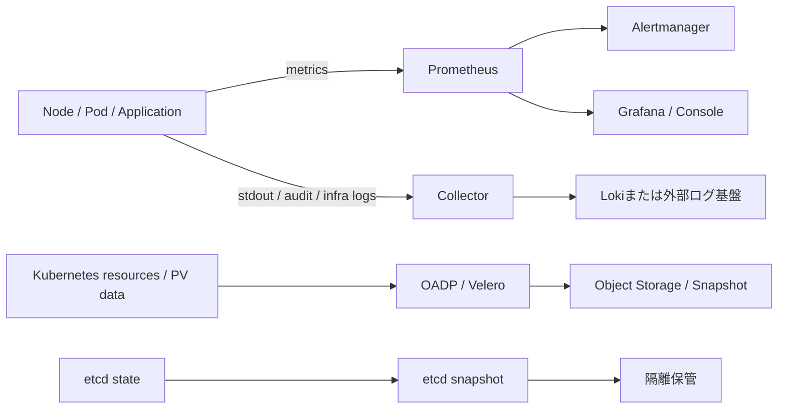

# 監視・ログ・バックアップ

> [!IMPORTANT]
> **資料状態（v0.1）**: 技術資料の初稿です。`docs/00`〜`docs/27` の初回通読は完了していますが、詳細レビューと本リポジトリの演習は未実施です。本章の存在や初回通読だけでは、習得・実機検証・商用経験を示しません。章末の説明例も、本人が内容を確認し、自分の言葉で説明できた範囲だけ使用します。実施状況は [証跡台帳](../evidence/README.md) で管理します。


> 経験境界: Prometheus、Grafana、OpenShift Monitoring / Logging、OADP の商用導入・運用設計経験はありません。現在は資料初稿のみで、過去の利用経験と概要理解の有無は本人確認待ちです。  
> 更新基準日: 2026-08-13。OpenShiftのObservability製品はOCP本体と異なるリリース周期を持つものがある。採用OCP、Operator、Channel、保存Backendの対応表は**要確認**。

## 三つの目的を混同しない

| 領域 | 主な問い | 代表例 | 設計値 |
|---|---|---|---|
| 監視 | 今、正常か。悪化の兆候はあるか | Prometheus、Alertmanager、Grafana | SLI/SLO、閾値、通知先、抑止 |
| ログ | 何が起きたか。誰が何をしたか | Loki、ログ転送、監査ログ | 収集範囲、保持、権限、マスキング |
| バックアップ | 消失・災害時にどこまで戻せるか | etcd backup、OADP/Velero、Storage snapshot | RPO、RTO、対象、保管、復元試験 |

メトリクスがあることはログがあることを、バックアップ成功表示は復元可能性を保証しない。三領域を個別に設計し、障害対応手順で結び付ける。



## Prometheus

Prometheusは、対象を定期的にscrapeし、時系列データを保存・PromQLで問い合わせる監視基盤である。値にはmetric名、label、timestampが付く。LabelにPod UID、URL、ユーザーIDなど高カーディナリティ値を無制限に入れると、メモリ・保存量が急増する。

実務では「収集できたか」より、何を正常と定義し、欠測、遅延、再起動、飽和をどう検知するかが重要である。アプリ独自メトリクスではServiceMonitor/PodMonitor、TLS/RBAC、scrape interval、保持を設計する（利用CRDは導入Operatorにより**要確認**）。

```bash
oc get pods -n openshift-monitoring -o wide
oc get servicemonitor,podmonitor -A
oc get prometheusrule -A
oc get --raw '/api/v1/nodes' >/dev/null
```

## Grafana

GrafanaはPrometheus等のData Sourceを可視化する。Dashboardは原因分析を助けるが、きれいなグラフ自体が監視設計ではない。対象、単位、集計区間、Timezone、欠測時表示、権限、Dashboardの版管理を決める。

OpenShift組み込みConsoleで表示する範囲と、別途Grafanaを導入する範囲はバージョン・サポート構成により異なるため**要確認**。平均値だけでなくp95/p99、飽和、エラー率、依存先を組み合わせる。

## Alertmanager

AlertmanagerはPrometheusから受けたAlertをgrouping、deduplication、routing、silenceし、メールやChatOps等へ通知する。設計項目はSeverity、担当、営業時間、再通知間隔、抑止、メンテナンスSilence、エスカレーションである。

良いAlertは「症状」「影響」「最初の確認」「Runbook」を伝える。CPU使用率が一瞬高いだけのAlertより、継続時間と利用者影響を条件にする。Silenceは障害を直さず通知だけを止めるため、期限と理由を残す。

```bash
oc get alertmanager -n openshift-monitoring
oc get prometheusrule -A
oc get alertingrule -A
oc get configmap -n openshift-monitoring
```

存在しないCRDを返す場合があるため、`alertingrule` 等の利用可否は採用版で**要確認**。

## OpenShift Monitoring

OpenShiftの標準監視はCluster Monitoring Operator（CMO）がプラットフォーム監視コンポーネントを管理する。プラットフォーム用とUser Workload Monitoringを分け、利用者が標準Namespaceの管理Resourceを直接変更しないことが基本である。

確認の入口は次のとおり。

```bash
oc get co monitoring
oc describe co monitoring
oc get pods -n openshift-monitoring -o wide
oc get pods -n openshift-user-workload-monitoring -o wide
oc adm top nodes
oc adm top pods -A
oc get events -n openshift-monitoring --sort-by=.lastTimestamp
```

設計では保持期間・容量、Remote Write、User Workload有効化、テナント権限、Alert通知、冗長性、外部監視との責任分界を決める。設定キーとサポート範囲はOCP Minor Versionで**要確認**。

## OpenShift Logging

ログは概ね次の三種類を分ける。

- Application log: 利用者アプリのstdout/stderr
- Infrastructure log: NodeやOpenShift基盤コンポーネント
- Audit log: APIやNode等で「誰が何を要求したか」

収集、転送、保存、検索、可視化は別機能である。すべて保存すると費用と漏えい影響が増えるため、必要性、保持、アクセス権、改ざん防止、削除、時刻同期、秘密情報の除外を設計する。

```bash
oc get co
oc get clusterlogforwarder -A
oc get lokistack -A
oc get pods -n openshift-logging -o wide
oc get events -n openshift-logging --sort-by=.lastTimestamp
oc logs <pod名> -n <namespace> --all-containers=true --since=30m --timestamps=true
```

CR名、Namespace、Operator構成は採用したOpenShift Logging/LokiのVersionで**要確認**。

## Loki

Lokiはログ本文全体を全文索引する設計とは異なり、主にlabelでストリームを索引し、LogQLで検索するログ基盤である。Namespace、Pod、container等の低～中カーディナリティlabelを使い、request IDやユーザーIDをlabelへ乱用しない。

設計項目はObject Storage、保持、Compactor、可用性、テナント分離、Query制限、ログ転送、暗号化である。LokiStackのsizeや対応Object StorageはOperator Versionごとに**要確認**。

## Fluentd / Fluent Bit / Vector

- Fluentd: Pluginが豊富なログ収集・加工・転送基盤。柔軟だが設定とリソース量を管理する。
- Fluent Bit: 軽量なCollectorとしてNode上で使われることが多い。
- Vector: OpenShift Loggingの一部VersionでCollectorとして使われる。採用・移行状況は公式サポート表で**要確認**。

どれも「保存Backend」そのものではない。Buffer、Backpressure、再送、重複、欠損、TLS、資格情報、出力先停止時のNodeディスク影響を試験する。旧構成のFluentdを現在の推奨と断定しない。

## OADP

OpenShift API for Data Protection（OADP）は、OpenShift上のアプリケーション関連Kubernetes Resource、Persistent Volume、内部Image等を保護するためのOperatorで、対応するVeleroを利用する。OADPはetcd災害復旧の代替でも、無条件のFull Cluster backupでもない。

主な設計項目は次のとおり。

- 対象Namespace/Resourceと除外対象
- BackupStorageLocation（S3互換等）と資格情報
- CSI snapshotまたはFile System Backupの方式
- Schedule、保持、暗号化、別障害ドメイン保管
- Application quiesce用hookと整合性
- 復元先、名前衝突、依存Operator/CRD、復元順序

```bash
oc get dataprotectionapplication -A
oc get backupstoragelocation -A
oc get backup,restore,schedule -A
oc describe backup <backup名> -n <oadp-namespace>
oc logs deployment/oadp-operator-controller-manager -n openshift-adp --all-containers=true --tail=200
oc logs deployment/velero -n openshift-adp --all-containers=true --tail=200
```

上記は標準的なOperator導入例のNamespace/Deployment名である。採用OADP Versionと導入設定で名前、CRD、OCP対応表を**要確認**。

## Velero

VeleroはKubernetes ResourceとVolume dataのBackup/Restoreを実装するオープンソースプロジェクトで、OADPが製品として対応Versionや統合機能を提供する。単体Veleroの最新手順をOADP環境へそのまま適用せず、OADP Support Matrixを確認する。

```bash
velero version
velero backup get
velero backup describe <backup名> --details
velero backup logs <backup名>
velero restore get
velero restore describe <restore名> --details
```

Backupが `Completed` でも、Application整合性、Volume内容、Secret/外部DB、復元先依存が正しいとは限らない。隔離環境で定期Restore Testを行う。

## etcd backup

etcdにはOpenShift API Resource等のControl Plane stateが保存される。etcd snapshotはクラスタ災害復旧に重要だが、PV上のApplication dataや外部サービスまで保護しない。OADPと役割が異なる。

OpenShiftでは、サポートされるNodeと公式スクリプトを使う。例は概念確認用で、実行場所・権限・保存先を採用Versionで**要確認**。

```bash
oc get nodes -l node-role.kubernetes.io/master=
oc debug node/<control-plane-node名>
chroot /host
/usr/local/bin/cluster-backup.sh /home/core/assets/backup
exit
exit
```

Snapshotとstatic pod resourceをNode外の隔離保管へコピーし、暗号化、アクセス制御、世代、復旧手順、定期試験を管理する。復元はクラスタ全体へ大きく影響するため、障害判定とRed Hat手順を厳守する。

## RPO / RTOと復元試験

- RPO（Recovery Point Objective）: どこまでのデータ損失を許容するか。例: 最大15分。
- RTO（Recovery Time Objective）: どれだけの時間でサービスを戻すか。例: 4時間。

「毎日Backupする」だけでは要件にならない。対象、頻度、保持、転送時間、復元時間、依存順序、復元後の業務確認を試験する。

```text
事前条件 → Backup取得 → 成功/警告確認 → 隔離環境へRestore
→ Resource/PV/Secret/外部接続を確認 → 業務試験 → 所要時間と課題を記録
```

## RHACS概要

Red Hat Advanced Cluster Security for Kubernetes（RHACS）は、Image/Deploymentのリスク、設定、Runtime activity、Network等を扱うKubernetes向けセキュリティ製品である。Prometheusの可用性・性能監視やLokiの汎用ログ検索とは目的が違う。導入構成はCentral servicesと各Clusterのsecured cluster servicesを基本として理解するが、製品VersionとHosted構成は**要確認**。

## Sysdigとの違い

| 観点 | OpenShift Monitoring / Logging | RHACS | Sysdig Secure |
|---|---|---|---|
| 主目的 | Metrics・Alert・Log | Kubernetes Security | CNAPP、Runtime Threat、脆弱性等 |
| 主なデータ | Metrics、Log、Event | Image/Deployment/Runtime/Network | Agent/Cluster連携、Falco rule、脆弱性、Audit |
| 選定 | OCP標準との統合 | Red Hat製品統合 | Multi-cloudや既存運用を含む製品選定 |

機能はVersion/契約で重なる。単純な優劣ではなく、要件、既存SOC/SIEM、サポート、Data Residency、Agent負荷、費用で比較する。

## 運用設計チェックリスト

- [ ] SLI/SLO、Severity、通知先、Runbook ownerを定義した
- [ ] Metrics/Logsの保持容量を見積もった
- [ ] Audit logとApplication logの閲覧権限を分離した
- [ ] Secret/Token/個人情報をログに出さない実装を確認した
- [ ] etcdとApplication backupの対象差を説明できる
- [ ] RPO/RTOに基づくRestore Testを行う
- [ ] Backup保管先を本番障害ドメインから分離した
- [ ] Operator/OCP/StorageのCompatibilityを確認した

## 公式リファレンス

- [OpenShift Container Platform 4.22: Observability overview](https://docs.redhat.com/en/documentation/openshift_container_platform/4.22/html/observability_overview/index)
- [Monitoring stack for Red Hat OpenShift 4.22](https://docs.redhat.com/en/documentation/monitoring_stack_for_red_hat_openshift/4.22)
- [OpenShift Container Platform 4.22: Logging](https://docs.redhat.com/en/documentation/openshift_container_platform/4.22/html/logging/index)
- [OpenShift Container Platform 4.22: Backup and restore](https://docs.redhat.com/en/documentation/openshift_container_platform/4.22/html/backup_and_restore/index)
- [Velero documentation](https://velero.io/docs/)

## 面談での説明例

> 監視・ログ・バックアップの商用導入経験はありません。教材・概要整理レベルです。Prometheus、Alertmanager、Grafanaは状態把握と通知、OpenShift Logging/Lokiはログ収集・検索、OADP/Veleroはアプリケーション保護、etcd backupはControl Plane災害復旧という役割の違いを理解しています。案件ではRPO/RTO、保持、権限、復元試験、製品Versionの対応を確認します。
