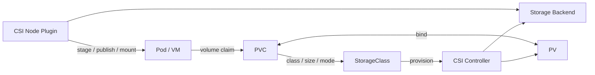

# Storage / CSI / ODF

> [!IMPORTANT]
> **資料状態（v0.1）**: 技術資料の初稿です。`docs/00`〜`docs/27` の初回通読は完了していますが、詳細レビューと本リポジトリの演習は未実施です。本章の存在や初回通読だけでは、習得・実機検証・商用経験を示しません。章末の説明例も、本人が内容を確認し、自分の言葉で説明できた範囲だけ使用します。実施状況は [証跡台帳](../evidence/README.md) で管理します。


> 経験境界: Kubernetes の教材・学習環境経験はありますが、PV / PVC / StorageClass の具体的な実施範囲は本人確認待ちです。CSI Driver、ODF、OpenShift Virtualization 向け Storage の商用導入経験はなく、現在は資料初稿のみです。  
> 更新基準日: 2026-08-13。対応AccessMode、Snapshot、Encryption、Topology、Live MigrationはStorage製品・CSI・OCP/OCP Virtualizationの組合せで異なるため**要確認**。

## 全体像



ApplicationはBackend固有のLUNやFile Shareを直接指定せず、PVCで必要条件を要求する。StorageClassとCSI Driverがその要求を実装へ変換する。問題調査では「要求」「割当」「Nodeへの接続・Mount」「Application I/O」の四段階に分ける。

## PV

PersistentVolume（PV）はCluster scopeのStorage Resourceである。容量、AccessMode、VolumeMode、Reclaim Policy、StorageClass、Backend情報を持つ。PV Objectを削除してもBackend dataの扱いはReclaim PolicyやCSI実装に依存するため、削除前に**要確認**。

```bash
kubectl get pv -o wide
kubectl describe pv <pv名>
kubectl get pv <pv名> -o jsonpath='{.spec.capacity.storage}{"\t"}{.spec.accessModes}{"\t"}{.spec.persistentVolumeReclaimPolicy}{"\t"}{.status.phase}{"\n"}'
```

## PVC

PersistentVolumeClaim（PVC）はNamespace scopeの「Storage要求」である。Application側は容量、AccessMode、VolumeMode、StorageClassを指定し、条件に合うPVと1対1でbindする。PVCが `Bound` でも、Mount、Filesystem、権限、Application整合性まで正常とは限らない。

```bash
kubectl get pvc -n <namespace> -o wide
kubectl describe pvc <pvc名> -n <namespace>
kubectl get pvc <pvc名> -n <namespace> -o yaml
```

## StorageClass

StorageClassは「どのProvisionerで、どのParameter、Reclaim Policy、VolumeBindingMode、拡張可否を使うか」を表す。`Immediate` はPVC作成時、`WaitForFirstConsumer` は利用Podの配置を考慮してProvisioning/Bindingする。後者ではPodのZone/Topologyと合わせて調査する。

```bash
kubectl get storageclass
kubectl describe storageclass <storageclass名>
kubectl get storageclass <storageclass名> -o yaml
```

既定StorageClassはannotationで示される。複数を無計画にdefaultにしない。Parameter名や拡張動作はDriver固有である。

## CSI Driver

Container Storage Interface（CSI）は、KubernetesとStorage製品の接続を標準化するInterfaceである。一般にController PluginはProvision/Delete/Attach/Snapshot等、Node PluginはNode上でStage/Publish/Mount等を担う。実装可能な機能はDriverのCapabilityに依存する。

確認対象は次のとおり。

```bash
kubectl get csidriver
kubectl describe csidriver <driver名>
kubectl get csinode
kubectl get volumeattachment
kubectl get pods -A -o wide | grep -i csi
kubectl get events -A --sort-by=.metadata.creationTimestamp
```

CSI PodのNamespace、Label、Container名は製品ごとに異なる。ログを取得する場合は、対象を先に特定する。

```bash
kubectl logs <csi-controller-pod名> -n <csi-namespace> --all-containers=true --since=30m --timestamps=true
kubectl logs <csi-node-pod名> -n <csi-namespace> --all-containers=true --since=30m --timestamps=true
```

## Dynamic Provisioning

Dynamic Provisioningでは、PVC作成を契機にStorageClassのProvisionerがPVとBackend Volumeを作る。静的Provisioningでは管理者がPV/Backendを先に用意する。

流れは次のとおり。

1. PVCを作成する。
2. External ProvisionerがPVCとStorageClassを監視する。
3. CSI ControllerがBackend Volumeを作る。
4. PVが作成されPVCとbindする。
5. Pod配置時にAttachし、Node PluginがMount/Publishする。

失敗時はPVC Eventを起点に、Provisioning前、Provisioning中、Attach、Mountのどこかを特定する。Backend容量、Quota、認証、Topologyも確認する。

## RWO / RWX

| AccessMode | 意味の要点 | 代表的な利用 | 注意 |
|---|---|---|---|
| RWO (`ReadWriteOnce`) | 一つのNodeからread-writeでmount | Block Volume、単一Replica DB | 一つのPodだけという意味ではない |
| ROX (`ReadOnlyMany`) | 複数Nodeからread-only | 配布データ | Driver対応が必要 |
| RWX (`ReadWriteMany`) | 複数Nodeからread-write | Shared File | 同時書込のApplication整合性が必要 |
| RWOP (`ReadWriteOncePod`) | Cluster内の単一Podからread-write | 厳密な単一writer | CSI/Version対応を要確認 |

AccessModeはDriverのMount capabilityとSchedulingに関わる宣言であり、ApplicationのFile LockやDatabase整合性を自動保証しない。

## VolumeMode

- `Filesystem`: NodeでFilesystemとしてmountし、一般的なApplicationがDirectoryとして使う。
- `Block`: Raw Block deviceとしてContainer/VMに見せる。Filesystem層をApplication側が管理する。

性能、Snapshot、拡張、暗号化、Backup tool対応が異なる。VM diskではBlockが適する場合があるが、要件とStorage製品の推奨を**要確認**。

## StatefulSet

StatefulSetはPod名、順序、VolumeClaimTemplate等により安定したIdentityを提供する。ReplicaごとにPVCを作れるが、Data replication、Backup、Failover、DB整合性を自動で実現するものではない。

```bash
kubectl get statefulset <statefulset名> -n <namespace> -o wide
kubectl describe statefulset <statefulset名> -n <namespace>
kubectl get pods,pvc -n <namespace> -l app=<app-label値> -o wide
kubectl rollout status statefulset/<statefulset名> -n <namespace> --timeout=5m
```

## ODF

Red Hat OpenShift Data Foundation（ODF）はOpenShift向けSoftware-defined Storageで、一般にCephを基盤としてBlock、File、Objectの機能を提供する。利用機能、Internal/External mode、Node/Device要件、障害ドメイン、容量、Network、暗号化、DRは採用Versionで設計する。

主な設計観点は次のとおり。

- Raw Deviceの本数・容量・性能・故障ドメイン
- Storage NodeのCPU/Memory、専用性、Placement
- Public/Cluster Networkと帯域・遅延
- usable capacityとreplication/erasure codingのOverhead
- Ceph health、容量閾値、交換、拡張、監視
- KMS、Data at Rest/In Transit、鍵のBackup
- Regional DR/Metro DR等の要件と対応構成

```bash
oc get storagecluster -A
oc get cephcluster -A
oc get pods -n openshift-storage -o wide
oc get storageclass
oc get events -n openshift-storage --sort-by=.lastTimestamp
```

CR名やNamespaceは導入方法により異なるため**要確認**。Ceph内部コマンドを直接実行・変更する前にODFのサポート手順を確認する。

## OpenShift VirtualizationにおけるVMディスク

OpenShift VirtualizationではVM diskをPVC/DataVolume等で扱う。DataVolumeはContainerized Data Importer（CDI）を通してblank disk作成、Image import、clone等を管理する。OS disk、Data disk、cloud-init、Installation mediaの用途を分ける。

```bash
oc get virtualmachine,virtualmachineinstance -n <project名>
oc get datavolume,pvc -n <project名>
oc describe datavolume <datavolume名> -n <project名>
oc describe pvc <pvc名> -n <project名>
oc get events -n <project名> --sort-by=.lastTimestamp
```

設計項目はIOPS/throughput/latency、容量、Thin Provisioning、Snapshot/Clone、Discard、Backup、暗号化、AccessMode、VolumeMode、StorageClass、障害ドメインである。

## Live MigrationとStorage

Live Migrationでは移動元と移動先NodeがVM diskへ到達できることが重要で、共有RWX Storageが一般的な前提になる。RWO diskやGPU passthrough等は通常のLive Migrationを制約する。近年のVersionにはStorage Live Migration関連機能もあるが、対応OCP Virtualization、StorageClass、VolumeMode、制約、Technology Preview/GA状態を案件版で**要確認**。

確認する試験観点は次のとおり。

- VM稼働中のMigration成功と業務通信への影響
- 移行帯域、所要時間、同時Migration数
- Node drain時のevictionStrategy
- Storage障害・Network遅延時の挙動
- RWO/RWX、VolumeMode、Snapshot/BackupとのCompatibility

```bash
oc get virtualmachineinstance <vmi名> -n <project名> -o yaml
oc get virtualmachineinstancemigration -n <project名>
oc get pvc -n <project名> -o wide
oc get storageclass
```

## 障害調査の型

### PVC Pending

```bash
kubectl describe pvc <pvc名> -n <namespace>
kubectl get storageclass <storageclass名> -o yaml
kubectl get events -n <namespace> --sort-by=.lastTimestamp
```

EventからStorageClass、Provisioner、Capacity、Topology、CSIへ進む。

### Attach / Mount失敗

```bash
kubectl describe pod <pod名> -n <namespace>
kubectl get volumeattachment
kubectl describe node <node名>
kubectl get pods -A -o wide | grep -i csi
```

Multi-Attach、Node Plugin、Device、Filesystem、Secret、Backend reachabilityを分ける。

### I/O遅延

Application latency、Node、Network、Storage Backendを同じ時刻で比較する。平均値だけでなくp95/p99、Queue、IOPS、throughput、容量閾値を確認する。性能試験は本番I/Oへ影響するため、無断で負荷toolを実行しない。

## 設計・試験チェックリスト

- [ ] 容量だけでなくIOPS、throughput、latencyを定義した
- [ ] RWO/RWX、Filesystem/Blockの理由を説明できる
- [ ] Failure domainとTopologyをNode配置に合わせた
- [ ] Reclaim PolicyとPVC削除時のData扱いを決めた
- [ ] Volume expansionと縮小不可等の制約を確認した
- [ ] SnapshotはBackup/遠隔保管の代替かを評価した
- [ ] Backup/RestoreとApplication整合性を試験した
- [ ] Encryptionと鍵のLife Cycleを決めた
- [ ] CSI/OCP/Storage firmwareのSupport Matrixを確認した
- [ ] VM Live Migration要件を実機で試験した

## 公式リファレンス

- [Kubernetes: Persistent Volumes](https://kubernetes.io/docs/concepts/storage/persistent-volumes/)
- [Kubernetes: Storage Classes](https://kubernetes.io/docs/concepts/storage/storage-classes/)
- [Kubernetes: CSI Volume Cloning and Snapshots](https://kubernetes.io/docs/concepts/storage/volume-snapshots/)
- [OpenShift Container Platform 4.22: Storage overview](https://docs.redhat.com/en/documentation/openshift_container_platform/4.22/html/storage/storage-overview)
- [Red Hat OpenShift Data Foundation documentation](https://docs.redhat.com/en/documentation/red_hat_openshift_data_foundation/)
- [OpenShift Virtualization 4.22: Live migration](https://docs.redhat.com/en/documentation/openshift_container_platform/4.22/html/virtualization/live-migration)

## 面談での説明例

> CSIやODFの商用導入経験はありません。概要理解レベルです。KubernetesではPVCが要求、StorageClassがProvisioning方針、PVが割り当てられたStorage、CSIがStorage製品との操作Interfaceという関係を理解しています。設計時は容量だけでなくAccessMode、VolumeMode、Topology、性能、Backup、暗号化、Reclaim Policyを確認します。OpenShift VirtualizationのLive Migrationは共有Storage等の前提と製品Versionの対応を実機で確認すべきだと認識しています。
