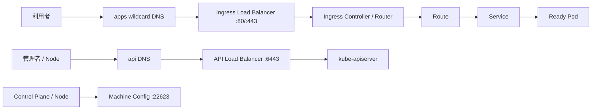

# Network / DNS / Load Balancer / Firewall

> [!IMPORTANT]
> **資料状態（v0.1）**: 技術資料の初稿です。`docs/00`〜`docs/27` の初回通読は完了していますが、詳細レビューと本リポジトリの演習は未実施です。本章の存在や初回通読だけでは、習得・実機検証・商用経験を示しません。章末の説明例も、本人が内容を確認し、自分の言葉で説明できた範囲だけ使用します。実施状況は [証跡台帳](../evidence/README.md) で管理します。


> 経験境界: Linux / Network の講師・教材経験はありますが、AWS / Kubernetes / HAProxy の具体的な実施範囲は本人確認待ちです。OpenShift の商用 Network / LB 設計経験はありません。MetalLB を含む本章は資料初稿・初回通読のみ（詳細レビュー前）です。  
> 更新基準日: 2026-08-13。OpenShiftのNetwork plugin、IP family、Platform、Hosted/Managed方式によりEndpoint、必要Port、変更可否が異なる。採用VersionのInstallation/Networking資料で**要確認**。

## 通信経路を一枚で理解する



不通時は「DNS → TCP → TLS → HTTP → LB health → Router/API → Service → EndpointSlice → Pod」の順に、各境界の入力と出力を比較する。

## OpenShiftにおけるDNS

DNSは二種類に分ける。

1. **外部/基盤DNS**: `api.<cluster>.<baseDomain>`、`api-int...`、`*.apps...`、Node名、Load Balancer VIP等を解決する。
2. **Cluster DNS**: Podから`service.namespace.svc.cluster.local`や外部FQDNを解決する。OpenShift DNS Operatorが管理する。

設計では正引き/逆引き、権威Zone、委任、TTL、A/AAAA、Split DNS、上流Resolver、更新責任者、災害時切替を決める。`*.apps` はWildcard recordでIngress入口へ向ける。個々のRouteごとにrecordを作る設計との違いを明確にする。

```bash
dig api.<cluster名>.<baseDomain> A
dig api-int.<cluster名>.<baseDomain> A
dig test.apps.<cluster名>.<baseDomain> A
dig -x <node-ip-address>
oc get co dns
oc get dns.operator/default -o yaml
oc get pods -n openshift-dns -o wide
```

## APIエンドポイント

OpenShift/Kubernetes APIの代表的な入口は `api.<cluster>.<baseDomain>:6443` である。管理CLI、Console Backend、Controller、Node等が利用する。外部APIと内部APIのDNS/LB構成、公開範囲、証明書、Source restriction、Proxy/no_proxyを設計する。

```bash
dig api.<cluster名>.<baseDomain>
curl -vk --connect-timeout 5 https://api.<cluster名>.<baseDomain>:6443/readyz
openssl s_client -connect api.<cluster名>.<baseDomain>:6443 -servername api.<cluster名>.<baseDomain> </dev/null
oc whoami --show-server
oc get --raw='/readyz?verbose'
```

`-k` は証明書エラーも含めて接続層を観察する診断用であり、通常運用でTLS検証を無効化しない。

## Ingressエンドポイント

Ingressは通常 `*.apps.<cluster>.<baseDomain>` がIngress Load Balancerを経由し、Router Podへ到達する。Public/Internal scope、80/443、TLS termination、複数IngressController、Dedicated Node、Shard、Replica、Client source IPの要件を決める。

```bash
oc get ingresscontroller -n openshift-ingress-operator
oc describe ingresscontroller default -n openshift-ingress-operator
oc get service -n openshift-ingress
oc get pods -n openshift-ingress -o wide
oc get route -A
```

## wildcard DNS

`*.apps.<cluster>.<baseDomain>` は任意のRoute hostを同じIngress入口へ解決する。DNS recordが正しくても、Route未作成、未Admit、証明書、Router shard、Backend不良なら通信できない。

確認例:

```bash
dig example.apps.<cluster名>.<baseDomain>
dig +trace example.apps.<cluster名>.<baseDomain>
oc get route <route名> -n <project名> -o jsonpath='{.spec.host}{"\t"}{.status.ingress[*].conditions[*].status}{"\n"}'
```

TTLを短くすれば常に良いわけではない。切替速度、Query負荷、Cache、DNS提供者の下限を考慮する。

## Load Balancer

OpenShiftの代表的なLB用途はAPIとIngressである。設計項目は次のとおり。

| 項目 | API LB | Ingress LB |
|---|---|---|
| 主なPort | 6443（Install時に22623も関係） | 80 / 443 |
| Backend | Control Plane | Routerを実行するNode/Service |
| Health check | API readiness等 | Router health endpoint等 |
| TLS | 通常API側で終端 | Route方式によりRouter/Backend |
| 公開範囲 | 管理要件に限定 | Public/Internal要件 |

上表は概念であり、Installer-provisioned/User-provisioned Infrastructure、Cloud LB、Bare Metal、Hosted Control Planeでは構成が異なるため**要確認**。

設計時にはVIP/FQDN、Listener、Pool、Algorithm、health check、SNAT/DSR、timeout、Proxy Protocol、Source IP保持、Connection drain、冗長化、監視、証明書終端位置を決める。

## Firewall

「必要Portを開ける」だけでなく、通信要件表として管理する。

| 送信元 | 宛先 | Protocol/Port | 用途 | 方向 | 名前解決 | Owner | 根拠Version |
|---|---|---|---|---|---|---|---|
| 管理端末 | API VIP | TCP/6443 | `oc` / API | outbound | API FQDN | 基盤 | 要確認 |
| 利用者 | Ingress VIP | TCP/443 | Application | inbound | apps FQDN | NW | 要確認 |
| Node | Registry | TCP/443 | Image pull | outbound | Registry FQDN | 基盤 | 要確認 |

ほかにDNS、NTP、Proxy、Identity Provider、Object Storage、Monitoring、Support、Mirror Registry、Storage等がある。固定IPだけでなくFQDN、Service tag、Proxy経由、戻り通信を確認する。製品のPort一覧はVersionで変わり得るので公式Installation資料を正とする。

## Pod Network

Pod NetworkはPod IPを割り当て、Node間Pod通信を実現する。OpenShiftではOVN-Kubernetesが一般的だが、既存ClusterやVersionにより**要確認**。Cluster Network CIDR、Host Prefix、IP family、MTU、Encapsulation、Egress、External routingを設計する。

重要な確認:

- 既存LAN/VPN/VPC、Service Network、Node NetworkとのCIDR重複を避ける
- 最大Node数とNode当たりPod数からPrefixを設計する
- Overlay overheadを含むMTUをEnd-to-Endで確認する
- Install後に変更しにくい項目を先に合意する

```bash
oc get network.config.openshift.io cluster -o yaml
oc get network.operator.openshift.io cluster -o yaml
oc get pods -n openshift-ovn-kubernetes -o wide
oc get co network
```

Resource/Namespaceは採用Network pluginにより異なる。

## Service Network

Service NetworkはClusterIP等に使う仮想CIDRで、通常外部Networkへ直接routeしない。Pod/Node/既存Networkと重複しない範囲を選ぶ。Service IPはBackend Podへ転送されるため、Service不通ではEndpointSliceとPod readinessを確認する。

```bash
oc get network.config.openshift.io cluster -o jsonpath='{.spec.serviceNetwork}{"\n"}'
oc get service -A -o wide
oc get endpointslice -A
```

## NetworkPolicy

NetworkPolicyはNamespace/Pod selectorとIngress/Egress ruleでPod通信を制御する。Policyが一つもないPodは通常非隔離だが、対象方向のPolicyに選択されると許可ruleだけになる。送信元Egressと宛先Ingressの両方を確認する。

```bash
oc get networkpolicy -A
oc describe networkpolicy <policy名> -n <project名>
oc get pods -n <project名> --show-labels
oc exec -n <送信元project名> <送信元pod名> -- curl -sv --connect-timeout 5 http://<service名>.<宛先project名>.svc:<port>/
```

Default denyを導入する場合、DNS、Monitoring、Ingress、Operator、外部依存を含めた許可を段階的に試験する。PolicyのLogging/評価順等はNetwork pluginで**要確認**。

## Route

RouteはOpenShift固有の外部公開Resourceで、host/pathとServiceを結び、TLS terminationを指定できる。

- edge: Client→RouterでTLS、Router→Backendは通常平文
- reencrypt: Routerで受信TLSを終端し、Backendへ再度TLS
- passthrough: RouterはTLSを終端せず、SNIでBackendへ転送

```bash
oc get route <route名> -n <project名> -o yaml
oc describe route <route名> -n <project名>
oc get service <service名> -n <project名> -o yaml
oc get endpointslice -n <project名> -l kubernetes.io/service-name=<service名> -o wide
curl -vk --resolve <route-host名>:443:<ingress-vip> https://<route-host名>/
```

`--resolve` はDNSを迂回しつつHost/SNIを維持する診断に使える。VIPを正しい値へ置換する。

## Ingress Controller

IngressController Operator ResourceはRouter Deployment、公開方式、Replica、Domain、Node placement、TLS、Logging等を管理する。複数ControllerでPublic/InternalやApplication groupを分ける場合、Domain、routeSelector/namespaceSelector、LB、DNSを一体で設計する。

```bash
oc get co ingress
oc get ingresscontroller -n openshift-ingress-operator
oc get ingresscontroller default -n openshift-ingress-operator -o yaml
oc get deployment,pod,service -n openshift-ingress -o wide
```

Operator管理Resourceを直接編集するとReconcileで戻る、またはSupport外となる可能性がある。

## HAProxy

HAProxyはL4/L7 Load Balancer/Reverse Proxyとして使える。OpenShiftではRouter実装やUser-provisioned環境の外部LB設計で関係することがある。ただしCloud PlatformではManaged LBを使うなど、必須製品ではない。

外部LBとして見る点:

- `frontend` / `backend`、TCP/HTTP mode
- health check、timeout、balance algorithm
- SNI/TLS終端、証明書、Client IP
- Stats/Log、設定validation、Reload手順
- Active/Standbyまたは複数台とVIP管理

```bash
haproxy -c -f /etc/haproxy/haproxy.cfg
systemctl status haproxy
journalctl -u haproxy --since "30 minutes ago" --no-pager
ss -lntp
```

RHCOS Nodeへ任意にPackageを入れて直接管理する想定ではない。配置場所と管理方式は基本設計で決める。

## MetalLB概要

MetalLBは、Cloud ProviderのLoadBalancer実装がないBare Metal等でKubernetes `Service type=LoadBalancer` に外部IPを提供する仕組みである。Layer 2 modeまたはBGP modeで広告する。OpenShiftではMetalLB Operatorによる管理があり、OCP Versionとの対応を**要確認**。

設計項目:

- 重複しないIPAddressPoolと予約管理
- L2/BGP、Router peer、ASN、BFD等
- Failure/Failover時の収束
- Network Segment/VLAN、ARP/NDP、Firewall
- 複数Serviceの共有/専用IP方針

```bash
oc get ipaddresspool -A
oc get l2advertisement -A
oc get bgpadvertisement,bgppeer -A
oc get service -A -o jsonpath='{range .items[?(@.spec.type=="LoadBalancer")]}{.metadata.namespace}{"\t"}{.metadata.name}{"\t"}{.status.loadBalancer.ingress[*].ip}{"\t"}{.status.loadBalancer.ingress[*].hostname}{"\n"}{end}'
oc get pods -A -o wide | grep -i metallb
```

CRD名と利用可能機能はOperator Versionで**要確認**。

## オンプレ構築時のNetwork確認項目

- [ ] Node、BMC、API VIP、Ingress VIP、Mirror Registry等のIP/VLANを予約した
- [ ] Node/Pod/Service/既存NetworkのCIDR重複がない
- [ ] API、api-int、apps wildcard、Nodeの正引き/逆引きとTTLを確認した
- [ ] API/Ingress LBのBackend、health check、failure試験を決めた
- [ ] Firewall通信要件に方向・用途・Owner・根拠Versionがある
- [ ] Proxy/no_proxyにCluster domainとCIDRを反映した
- [ ] MTU、Bond/VLAN、Gateway、非対称Routeを確認した
- [ ] NTP/DNS/Registry/Identity/Storage/Backupの外部依存を確認した
- [ ] NetworkPolicyのDefault deny導入順とDNS許可を試験した
- [ ] Packet captureやFW logを扱う承認・保管ルールがある

## 公式リファレンス

- [OpenShift Container Platform 4.22: Networking overview](https://docs.redhat.com/en/documentation/openshift_container_platform/4.22/html/networking_overview/index)
- [OpenShift Container Platform 4.22: Ingress and load balancing](https://docs.redhat.com/en/documentation/openshift_container_platform/4.22/html/ingress_and_load_balancing/index)
- [OpenShift Container Platform 4.22: Installing on bare metal](https://docs.redhat.com/en/documentation/openshift_container_platform/4.22/html/installing_on_bare_metal/index)
- [Kubernetes: Services, Load Balancing, and Networking](https://kubernetes.io/docs/concepts/services-networking/)
- [Kubernetes: Network Policies](https://kubernetes.io/docs/concepts/services-networking/network-policies/)

## 面談での説明例

> OpenShiftの商用Network設計経験はありません。教材・検証と概要整理レベルです。API用DNS/LB、apps wildcard DNSとIngress LB、Pod/Service Network、NetworkPolicy、Firewall通信要件を分けて理解しています。不通時はDNS、TCP、TLS、HTTP、LB、Router、Service、Endpoint、Podの順で境界を切り分けます。オンプレではCIDR重複、MTU、戻り経路、health check、Proxy/no_proxyを事前に確認します。
