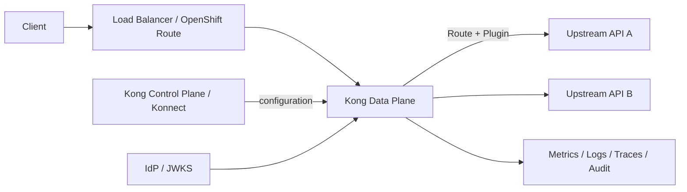
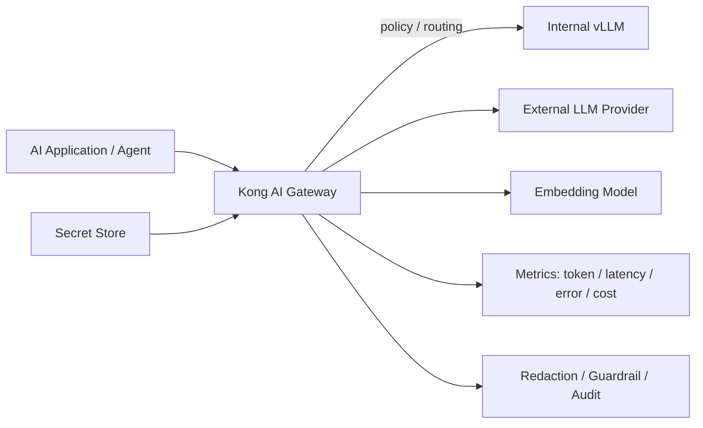

# Kong / API Gateway / AI Gateway

> [!IMPORTANT]
> **資料状態（v0.1）**: 技術資料の初稿です。`docs/00`〜`docs/27` の初回通読は完了していますが、詳細レビューと本リポジトリの演習は未実施です。本章の存在や初回通読だけでは、習得・実機検証・商用経験を示しません。章末の説明例も、本人が内容を確認し、自分の言葉で説明できた範囲だけ使用します。実施状況は [証跡台帳](../evidence/README.md) で管理します。


> 経験境界: Kong Gateway / Kong Ingress Controller / AI Gateway の商用導入・検証経験はありません。概念、主要 Resource、設計・確認観点は資料初稿・初回通読のみ（詳細レビュー前）で、概要理解の有無も未判定です。  
> 更新基準日: 2026-08-13。Plugin、Konnect、Enterprise、OSS、Kong Gateway/KICの機能とLicenseはVersionで異なる。利用Edition、Gateway Version、Plugin tierを公式Compatibilityで**要確認**。

## Kongとは

Kong GatewayはClientとUpstream APIの間でRequestを受け、Route判定、認証、Rate Limit、変換、観測等をPluginで適用して転送するAPI Gatewayである。代表的な論理Entityは次のとおり。

- Gateway Service: 転送先APIを表す
- Route: host、path、method、header等でRequestをServiceへ対応付ける
- Consumer / Consumer Group: API利用主体を表す
- Plugin: 認証、制御、変換、Logging等を適用する
- Upstream / Target: 複数BackendへのLoad Balanceを表す

Kubernetes/OpenShiftではKong Ingress Controller（KIC）がIngressやGateway API、Kong CR等を監視し、Kong Gatewayへ設定を反映する構成がある。

## API Gatewayとは

API Gatewayは多数のAPIへ共通Policyを適用する入口である。Applicationごとに認証や制限を重複実装する負担を減らし、API利用状況を集約できる。一方、Gatewayが単一障害点や性能上のbottleneckにならないよう、Replica、LB、timeout、接続数、Control/Data Plane、設定配布を設計する。



TopologyはDB-backed、DB-less、Hybrid、Konnect等で異なるため、製品Editionと要件で**要確認**。

## リバースプロキシとの違い

リバースプロキシはClientの代わりにBackendへRequestを転送する基本機能である。API Gatewayはその上にAPI Consumer管理、認証、Quota、Analytics、Developer workflow等を加えた利用形態と考えるとよい。ただし境界は製品により重なり、名称だけで機能を断定しない。

## 認証・認可

- 認証（Authentication）: 「誰/どのClientか」を確認する。API Key、Basic、JWT、OIDC、mTLS等。
- 認可（Authorization）: 認証された主体が「どのAPI/操作を許されるか」を判断する。Scope、Role、ACL等。

Gatewayで認証しても、業務Object単位の認可はApplication側に残ることが多い。CredentialをKubernetes Secretや外部Secret Managerで管理し、LogへTokenやAuthorization headerを出さない。OIDC等のPlugin availabilityはEditionで**要確認**。

## Rate Limit

Rate LimitはConsumer、Credential、Route、Service等を基準にRequest数を制限し、Backend保護と公平利用に使う。単位時間、burst、識別子、超過応答（通常429）、分散Counter、fail-open/closedを設計する。

KIC環境の学習例:

```yaml
apiVersion: configuration.konghq.com/v1
kind: KongPlugin
metadata:
  name: api-rate-limit
  namespace: demo
plugin: rate-limiting
config:
  minute: 60
  policy: local
```

```yaml
apiVersion: networking.k8s.io/v1
kind: Ingress
metadata:
  name: demo-api
  namespace: demo
  annotations:
    konghq.com/plugins: api-rate-limit
spec:
  ingressClassName: kong
  rules:
    - host: demo-api.apps.example.com
      http:
        paths:
          - path: /
            pathType: Prefix
            backend:
              service:
                name: demo-api
                port:
                  number: 8080
```

`local` counterはData Plane replicaごとになる等の制約があり、厳密な全体QuotaにはRedis等が必要になる場合がある。Plugin/Versionの整合性を**要確認**。

## Request / Response変換

Header、path、query、bodyを追加・削除・変更し、Backend差異を吸収できる。ただし次のリスクがある。

- Signature対象やContent-Lengthを壊す
- PII/SecretをHeaderへ複製する
- Schema差異を隠し、Client/BackendのVersion管理を難しくする
- 大きなbody変換でLatency/Memoryが増える

変換前後のContract test、Size上限、Encoding、Streaming、Error時挙動を確認する。変換Pluginの機能・Editionは**要確認**。

## ログ・メトリクス・監査

Access logにはRequest ID、Consumer、Route、Status、Latency、Upstream、転送量等を記録し、Payload/Authorization/Token/Personal dataは原則記録しないかmaskする。Audit logは「誰がGateway設定をいつ変更したか」を追うもので、Traffic access logとは異なる。

監視指標:

- Request rate、4xx/5xx、Upstream failure
- Gateway/Upstream latency（p50/p95/p99）
- Active connection、Retry、Timeout
- Rate-limit rejection、認証失敗
- Config sync/Control Plane connectivity

```bash
oc get pods -n <kong-namespace> -o wide
oc get service,ingress -n <kong-namespace>
oc get kongplugin -A
oc logs deployment/<kong-gateway-deployment名> -n <kong-namespace> --all-containers=true --since=30m --timestamps=true
curl -sv --connect-timeout 5 https://<gateway-fqdn>/<api-path>
```

## AI Gatewayとは

AI GatewayはLLM/Embedding等のAI APIにAPI Gateway機能を適用し、Provider/Model routing、Credential集中管理、Usage/Token観測、Guardrail、Caching等を扱う。通常のAPIと異なり、Token数、Time to First Token、Streaming、Prompt/Responseの機密性、ModelごとのCost/Quotaを考慮する。



AI Gatewayを置くだけで入力Dataの利用許可やModel出力の正しさが保証されるわけではない。Data classification、Application側認可、人の承認、Model評価と合わせる。

## LLM APIのルーティング

AI Proxy/AI Proxy Advanced等により、Provider固有APIを共通入口へ寄せ、Model/Providerへroutingできる。設計例:

- 用途・Risk tierでInternal/External Modelを分ける
- 低Cost Modelを通常利用し、高難度のみ高性能Modelへ送る
- Region/Data Residencyに基づきProviderを限定する
- Timeout、Retry、fallback時に二重課金や重複処理を避ける
- Session/Cacheの一貫性とModel Versionを記録する

Advanced load balancing algorithmやfallbackはKong Version/Pluginで**要確認**。

## トークン使用量

入力Token、出力Token、Total TokenをConsumer/Route/Modelごとに集計すると、QuotaとCost配賦に使える。ただしProviderの報告値、Tokenizer、Cached Token、Tool Call、Image/Audioの課金単位は異なる。

確認項目:

- Token countの取得元と欠測時の扱い
- Request/Response本文を保存せずに集計できるか
- Consumer/ProjectへのAttribution
- Budget alertとHard limitのどちらか
- Streaming中断、Retry、Cache hit時のCost計上

## レイテンシ

通常のTotal latencyに加え、LLMではTime to First Token、Time per output token、Streaming durationを見る。Gateway overhead、Queue、Model inference、Provider Networkを分離する。p95/p99とError/Token数を同じDimensionで確認する。

## コスト管理

Model単価を設定しToken数から推定Costを計算できる場合があるが、請求書の正値とは限らない。Provider pricing、割引、Batch/Cache、Tool API、Currencyの更新日を管理する。

実務ではBudget、Project tag、Quota、Alert、Chargeback/Showback、Model allowlist、Context上限を組み合わせる。安価なModelへのroutingでQuality/Safetyが下がらないよう評価する。

## ガードレール

Guardrailは入力/出力のPolicy checkで、PII detection/redaction、allow/deny、Prompt injection対策、Content safety、Schema validation等を含む。限界も理解する。

- False positive / false negativeがある
- 暗号化・難読化・画像内文字を見落とし得る
- Redaction前のLog/traceへ元Dataが残る可能性がある
- Model outputの事実性やCommand安全性を完全保証しない

したがってGatewayだけに依存せず、送信前Data minimization、Application認可、sandbox、Tool allowlist、人の承認を組み合わせる。

## OpenShiftとの関係

Kong Data Plane/KICをOpenShift上で動かす場合の基盤観点:

- Operator/Helm/Manifestの導入方式とSupport
- SCC、ServiceAccount、RBAC、NetworkPolicy
- RouteまたはService LoadBalancerによる公開
- Control Plane/Database/Secret Managerへの接続
- Replica、PodDisruptionBudget、Topology spread、Autoscale
- Persistent Storageが必要なModeのBackup
- Prometheus/OpenTelemetry/Log転送
- Certificate、mTLS、FIPS、Image署名、Disconnected mirror

OpenShift RouteとKong Routeは別概念である。外側のOpenShift RouteがKong Proxy Serviceへ接続し、その内側でKong RouteがUpstream APIを選ぶ構成があり得る。

## 基本切り分け

1. Client→OpenShift Route/LBのDNS/TLS/HTTPを確認する。
2. Kongが返したStatusかUpstreamが返したStatusかRequest ID/Logで判断する。
3. Kong Route match、Service、Plugin、Consumer/Credentialを確認する。
4. Kong PodからUpstreamへ名前解決・接続できるか確認する。
5. AI APIではModel、Provider、Token/Quota、TTFT、Streaming、fallbackを確認する。

```bash
oc get route <route名> -n <project名> -o yaml
oc get service,endpointslice -n <project名>
oc get pods -n <project名> -o wide
oc get events -n <project名> --sort-by=.lastTimestamp
curl -sv --connect-timeout 5 -H 'X-Request-ID: interview-lab-001' https://<gateway-fqdn>/<api-path>
```

CredentialをCommand historyや資料へ直書きしない。

## 公式リファレンス

- [Kong Gateway documentation](https://developer.konghq.com/index/gateway/)
- [Kong Gateway: Routes](https://developer.konghq.com/gateway/entities/route/)
- [Kong Gateway: Authentication](https://developer.konghq.com/gateway/authentication/)
- [Kong Gateway: Rate limiting](https://developer.konghq.com/gateway/rate-limiting/)
- [Kong AI Gateway](https://developer.konghq.com/ai-gateway/)
- [Kong AI Gateway: LLM metrics](https://developer.konghq.com/ai-gateway/monitor-ai-llm-metrics/)
- [Kong Ingress Controller documentation](https://developer.konghq.com/kubernetes-ingress-controller/)

## 面談での説明例

> Kongの商用導入経験はありません。概要理解レベルです。Kong GatewayはAPIの入口でRoute、認証・認可、Rate Limit、変換、ログ等を共通化する製品と理解しています。AI GatewayではさらにLLM Providerへのrouting、Token使用量、Latency、Cost、Guardrailを扱います。OpenShift上ではKIC、Route/LB、SCC/RBAC、NetworkPolicy、可用性、Observabilityを設計し、PluginとEditionの対応を確認する必要があると認識しています。
