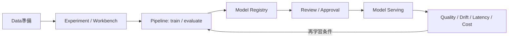
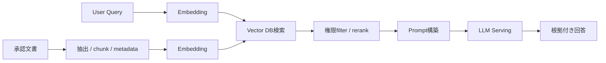
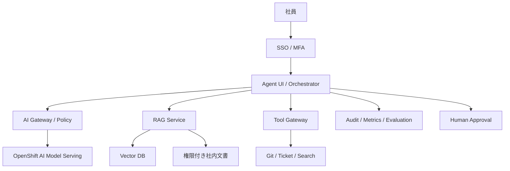

# OpenShift AI概要

> [!IMPORTANT]
> **資料状態（v0.1）**: 技術資料の初稿です。`docs/00`〜`docs/27` の初回通読は完了していますが、詳細レビューと本リポジトリの演習は未実施です。本章の存在や初回通読だけでは、習得・実機検証・商用経験を示しません。章末の説明例も、本人が内容を確認し、自分の言葉で説明できた範囲だけ使用します。実施状況は [証跡台帳](../evidence/README.md) で管理します。


> 経験境界: OpenShift AI、GPU Operator、vLLM、Dify の商用構築・検証経験はありません。概念と Architecture / 基盤設計観点は資料初稿・初回通読のみ（詳細レビュー前）で、概要理解の有無も未判定です。  
> 更新基準日: 2026-08-13。公式製品トップはOpenShift AI Self-Managed 3.5を表示するが、一部はEarly Accessであり、対応OCPのSupport MatrixはOCP本体と別Life Cycleである。本RepositoryのOCP学習基準4.22と組み合わせ可能とは限らない。ComponentのGA/Technology Preview、対応OCP/GPU/Acceleratorを導入前に**要確認**。

## OpenShift AIとは

Red Hat OpenShift AIは、Data scientistやML engineerがModelの開発、Pipeline実行、管理、Serving、監視を行うためのOpenShift上のAI/ML Platformである。OpenShiftがContainer、Storage、Network、Security、Operator等の基盤を提供し、その上にAI向けComponentを統合する。

重要な捉え方は次のとおり。

- OpenShift AIは**AI ApplicationやAI Modelを企業基盤として動かすための土台**である。
- Modelを一つdeployすれば、業務Agent、RAG、権限、監査が自動で完成するわけではない。
- GPU、Object Storage、Model license、Data governance、Serving SLO、Costを基盤設計に含める。

## MLOpsとは

MLOpsは、Data/Model/Codeの変更を追跡し、実験から本番Serving、Monitoring、再学習、廃止までを再現可能かつ統制された手順にする考え方である。



GitだけではDataや大容量Modelを十分に版管理できない。Code commit、Container image digest、Dataset version、Parameter、Model artifact、Evaluation resultを紐付ける。

## Workbench / Jupyter

WorkbenchはProject内に開発環境を提供し、JupyterLab等のIDE、Notebook image、CPU/Memory/GPU、PVC、Environment/Secretを組み合わせる。Notebookは探索に便利だが、手操作だけでは再現性が低い。依存Packageをimage/lock fileへ固定し、重要処理はPipelineやSource codeへ移す。

基盤観点:

- 利用者Group/RBACとProject分離
- 承認済みWorkbench imageと脆弱性scan
- CPU/Memory/GPU quota、idle culling、Cost
- PVC、Object Storage、Data access、Encryption
- Internet/Package repositoryのEgress
- SecretをNotebook本文/outputへ残さない

```bash
oc get project
oc get pods -n <data-science-project名> -o wide
oc get pvc -n <data-science-project名>
oc get resourcequota,limitrange -n <data-science-project名>
oc get events -n <data-science-project名> --sort-by=.lastTimestamp
```

Workbenchを表すCRDはRelease/UI構成で異なるため、`oc api-resources` で**要確認**。

## Data Science Pipelines

Data Science PipelinesはData前処理、Training、Evaluation、登録等をStep化し、再実行・追跡する。各StepをContainerとして分離し、Input/Output artifactとParameterを明示する。

設計項目:

- Pipeline definitionのGit版管理とReview
- Artifact/Object Storage、Credential、Retention
- 実行用ServiceAccount/RBAC/NetworkPolicy
- Resource/GPU scheduling、Concurrency、Retry/Timeout
- Data/Model lineage、Experiment metadata
- Step imageのDigest、SBOM、Vulnerability
- Failure通知と再実行時の冪等性

Pipeline成功はModel品質の合格を意味しない。Evaluation gateと人の承認を別に設ける。

## Model Serving

Model Servingは学習済みModelをNetwork経由のInference APIとして提供する。OpenShift AIではKServe等のComponentとServingRuntimeを利用する構成がある。Single-model/Multi-model等の方式やServerless/RawDeployment相当の選択肢はReleaseで異なるため**要確認**。

確認するSLO:

- Availability、Request rate、Error rate
- Time to First Token、p95/p99 latency、Tokens/sec
- Model load time、Cold start、Queue、Timeout
- CPU/GPU/VRAM、Batch、Context length、Concurrency
- Model version、Canary、Rollback、Fallback
- Authentication、mTLS、NetworkPolicy、Rate limit

```bash
oc api-resources | grep -Ei 'inferenceservice|servingruntime|modelmesh'
oc get inferenceservice -A
oc get servingruntime -A
oc get pods -n <model-project名> -o wide
oc get events -n <model-project名> --sort-by=.lastTimestamp
oc logs <model-serving-pod名> -n <model-project名> --all-containers=true --since=30m --timestamps=true
```

CRDがない構成もあるため、最初に`oc api-resources`で確認する。

## Model Registry

Model Registryは、承認候補ModelのMetadata、Version、Artifact location、説明等を中央で登録・管理し、Life cycleとGovernanceを支える。単なるObject Storage directoryとは異なり、「どのModelを、どの評価結果で、誰が本番候補にしたか」を追跡する。

登録すべきMetadata例:

- Model名/Version、Owner、Use Case、Risk tier
- Training code commit、Dataset/version、Parameter
- Artifact URIとHash、Container image digest
- License、利用制限、評価指標、Bias/Safety test
- Approval、Serving endpoint、廃止日

Model RegistryがArtifact本体をどこへ保存するか、HA/Backup、認証方式は導入Versionで**要確認**。

## Model Catalog

Model Catalogは、組織が利用候補のGenerative AI Modelを検索・評価する入口である。Registryとの違い:

| 項目 | Model Catalog | Model Registry |
|---|---|---|
| 主目的 | 利用候補Modelを発見・比較 | 組織内Model versionとLife cycleを管理 |
| 主な利用時点 | 採用前 | 登録、承認、Deploy前後 |
| 主な情報 | Provider、Task、説明、評価材料 | Artifact、Version、lineage、status |

Catalog掲載は自社Use Caseへの適合、License、Security、安全性を保証しない。採用評価を別途行う。

## TrustyAI

TrustyAIはResponsible AIを支援するComponent群で、ModelのExplainability、Fairness/Bias、Drift等の評価・監視に関係する。利用可能なMetric、Serving Platform統合、CRD/API、GA/Preview状態はReleaseで変わるため**要確認**。

実務では「説明可能性toolを入れた」だけで公平性を保証しない。対象Group、許容threshold、Ground truth、Review担当、Alert後の対応を業務Ownerと定義する。

## GPU Operator

NVIDIA GPU Operatorは、GPU driver、Container toolkit、Kubernetes device plugin、Node label、DCGM monitoring等のNVIDIA Software componentをKubernetes/OpenShift上で自動管理する。OpenShift AI自体がGPU driverを直接管理するわけではない。

設計観点:

- GPU model、VRAM、Node数、PCIe/NVLink、NUMA
- GPU Operator/OCP/RHCOS/driver/CUDAのCompatibility
- Node Feature Discovery、Node label/taint、Machine pool
- Full GPU、MIG、time slicing、vGPU等の分割方式
- DCGM metrics、温度、ECC、Xid error
- Driver upgrade、Node drain、Rollback、Disconnected image
- Subscription/License、電力・冷却、Cost allocation

```bash
oc get clusterpolicy -A
oc get pods -n nvidia-gpu-operator -o wide
oc get nodes -o custom-columns=NAME:.metadata.name,GPU:.status.allocatable.nvidia\.com/gpu
oc describe node <gpu-node名>
oc get events -n nvidia-gpu-operator --sort-by=.lastTimestamp
```

Namespace/CRはOperator Releaseで**要確認**。GPU Operatorの権限やNodeへのDriver導入は基盤全体に影響する。

## vLLM

vLLMはLLM Inference/Serving engineで、効率的なMemory管理、Batching、OpenAI互換API等を提供する。OpenShift AIではServingRuntimeとして使う構成がある。対応Model/Quantization/Accelerator、Tensor/Pipeline parallel、Multi-node inferenceのGA/Preview状態を確認する。

調整項目:

- Model weightの容量とload方法（PVC/Object/OCI等）
- GPU/VRAM、tensor parallel size、dtype/quantization
- max model length、max concurrent sequence、batch
- Tokenizer/model revision、trust remote codeのRisk
- TTFT、Tokens/sec、OOM、Queue、Timeout
- API認証、TLS、Rate limit、Request size

性能値はModel、Prompt長、Hardware、Concurrencyで大きく変わるため、Vendor値だけでCapacityを決めず実機で負荷試験する。

## RAG

Retrieval-Augmented Generation（RAG）は、質問に関連する文書を検索し、そのContextをLLMへ渡して回答させるArchitectureである。



必要な設計:

- Source文書のOwner、更新、削除、Access Control
- Parser/OCR、Chunk、Embedding model/version
- Vector DB、Metadata filter、Tenant分離、Backup
- Retrieval評価、Rerank、Context上限、Citation
- Prompt injection/poisoning、機密Dataの流出対策
- Answer quality、Groundedness、拒否条件

RAGはHallucinationを減らし得るが、完全にはなくさない。取得文書の誤りや古さも回答へ反映される。

## Difyとの違い

DifyはAI Application、RAG、Workflow、Agentを構築する上位Application Platformである。OpenShift AIとの関係は競合だけではなく、Layerの違いとして整理できる。

| 観点 | OpenShift AI | Dify |
|---|---|---|
| 主な役割 | Model開発・Pipeline・Registry・Servingの企業基盤 | AI Application、Workflow、RAG、Agent構築 |
| 主利用者 | Data scientist、ML/Platform engineer | Application developer、業務builder |
| 実行対象 | Workbench、Pipeline、Model server | Prompt/Workflow/Tool/Knowledge app |
| 組合せ | LLM/Embedding APIを提供 | そのAPIをModel Providerとして呼び出す |

**OpenShift AI上でLLMやEmbedding ModelをServingし、Dify等のAI Applicationから呼び出す構成も可能**である。ただしDifyのSupport、License、Database/Object Storage、Upgrade、OpenShift上での認証/SCCは別途設計する。

## 社内Agentを作る場合の構成



最低限必要な要素:

- SSO/MFA、User/Group、Project/Document単位の認可
- Agent orchestrator、Session/MemoryのRetention
- LLM/Embedding Servingまたは承認済みExternal API
- RAG ingestion、Vector DB、権限filter、引用
- Tool registry、allowlist、Schema validation、timeout
- Secret manager、Network egress、TLS
- Prompt/output/Tool callの監査とMasking
- Quality/Safety/Security評価、Red team、Incident response
- Destructive action前の人の承認

## 企業内Codex風Agentに追加で必要な要素

Coding/Infrastructure Agentは「回答」だけでなくfile、Git、Shell、Clusterへ作用し得る。OpenShift AIだけで完成しない。

1. **Git連携**: Repository/branch/PR権限、署名、Review、CODEOWNERS。
2. **実行Sandbox**: Job/Podごとの隔離、Read-only base、Resource/時間制限、Egress deny。
3. **Tool Gateway**: Shell、`oc`、CI、Ticket等をallowlistし、引数をValidationする。
4. **権限管理**: User identityをToolへ委譲し、共有cluster-admin Tokenを使わない。
5. **Secret管理**: Vault等から短命Credentialを渡し、Prompt/Logへ出さない。
6. **RAG/Vector DB**: 社内標準、Runbook、CodeをAccess Control付きで検索する。
7. **承認Flow**: Apply、Merge、Deploy、Delete等を人がDiff確認して承認する。
8. **監査Log**: Prompt、Model/version、Retrieved source、Tool call、Diff、Approver、Result。
9. **評価**: Unit/Policy/Security test、Citation、Hallucination、Prompt injection、Regression。
10. **Rollback/Kill switch**: Token失効、Job停止、変更取消、Incident response。

## Platform担当の確認コマンド

```bash
oc get datasciencecluster -A
oc get dscinitialization -A
oc get pods -A -o wide | grep -Ei 'rhods|opendatahub|kserve|modelmesh|trustyai'
oc get clusteroperator
oc get storageclass
oc get resourcequota -A
oc get networkpolicy -A
```

CRD/Namespace/Operator名はOpenShift AI Releaseで異なる。次で実在を確認する。

```bash
oc api-resources | grep -Ei 'datascience|inferenceservice|servingruntime|notebook|pipeline|trusty'
oc get csv -A | grep -Ei 'rhods|opendatahub|nvidia'
```

## 公式リファレンス

- [Red Hat OpenShift AI Self-Managed 3.5 documentation](https://docs.redhat.com/en/documentation/red_hat_openshift_ai_self-managed/3.5/)
- [OpenShift AI 3.5: Working with model registries](https://docs.redhat.com/en/documentation/red_hat_openshift_ai_self-managed/3.5/html/working_with_model_registries/index)
- [OpenShift AI 3.5: Deploying models](https://docs.redhat.com/en/documentation/red_hat_openshift_ai_self-managed/3.5/html/deploying_models/index)
- [OpenShift AI 3.5: Working with AI pipelines](https://docs.redhat.com/en/documentation/red_hat_openshift_ai_self-managed/3.5/html/working_with_ai_pipelines/index)
- [OpenShift AI 3.5: Monitoring AI systems / TrustyAI](https://docs.redhat.com/en/documentation/red_hat_openshift_ai_self-managed/3.5/html/monitoring_your_ai_systems/index)
- [NVIDIA GPU Operator documentation](https://docs.nvidia.com/datacenter/cloud-native/gpu-operator/latest/)
- [vLLM documentation](https://docs.vllm.ai/)
- [Dify documentation](https://docs.dify.ai/)

## 面談での説明例

> OpenShift AIの商用構築経験はありません。概要理解レベルです。OpenShift AIはWorkbench、Pipeline、Model Registry、Model Serving等をOpenShift上で提供し、AI ModelやAI Applicationを企業基盤として動かす土台だと理解しています。DifyはRAG、Workflow、Agentを作る上位Layerで、OpenShift AI上のLLMやEmbedding APIをDifyから呼ぶ構成も考えられます。ただしOpenShift AIだけでCodex風Agentが完成するわけではなく、RAG、Vector DB、Git連携、Sandbox、権限、監査、承認Flowが必要です。
