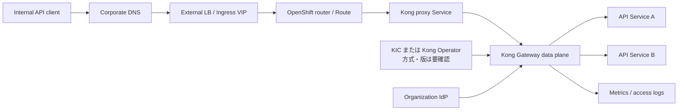
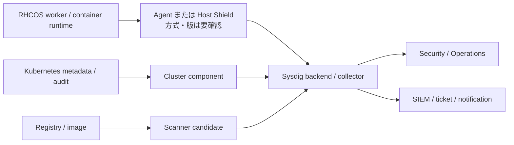

# 12. Kong・Sysdig 連携設計書

> [!IMPORTANT]
> 本書は完全に架空の学習用設計です。Kong と Sysdig は **設計のみ** で、製品選定、契約、導入、接続、試験を行っていません。製品版、提供方式、license、OpenShift 4.22.z との互換性はすべて要確認です。

## 1. 文書情報

| 項目 | 値 |
| --- | --- |
| 文書 ID | DES-INT-001 |
| 対象案件 | Example Enterprise OpenShift 基盤導入 |
| 版 | 0.1 Draft |
| 基準日 | 2026-08-17 |
| ステータス | 本人レビュー前・未承認 |
| 実施状態 | Architecture candidate の記述のみ。未構築・未試験 |

共通条件は [SCENARIO](../SCENARIO.md)、security は [Security・Identity 設計](08-security-identity-design.md)、network は [Network・DNS・LB 設計](07-network-dns-lb-design.md)、運用責任は [責任分界図](../diagrams/responsibility-boundary.mmd) を参照します。

関連要件は Kong が `REQ-INT-001`、Sysdig が `REQ-INT-002` です。両製品は current build / test scope 外であり、本書の `KONG-T*` と `SYSDIG-T*` は選定後の試験設計に使う **local planned-check ID** です。[試験仕様書](16-test-specification.md)の中央72 IDには含めず、[試験結果記録](17-test-results.md)にも結果行を設けません。

## 2. 目的

| 製品領域 | 目的 | Request path 上の位置 |
| --- | --- | --- |
| Kong | API routing、authentication、traffic control、access log を共通化する候補 | API request の同期経路上。障害が API availability に直結 |
| Sysdig | cluster / workload の observability、vulnerability、runtime threat、audit を補完する候補 | 原則として観測経路。Agent 障害が workload traffic を止めない設計を基本 |

本書は integration point と選定条件を整理するものです。「Kong / Sysdig を使えば要件を満たす」とは判断しません。

## 3. 選定前 Gate

| Gate | Kong | Sysdig | 状態 |
| --- | --- | --- | --- |
| PROD-01 | Gateway / Enterprise / Konnect、KIC / Operator の候補版 | Secure / Monitor、SaaS / on-prem、Agent / Shield の候補版 | 要確認 |
| PROD-02 | OCP 4.22.z、RHCOS、Gateway API / CRD 互換性 | OCP 4.22.z、RHCOS kernel、CRI-O、eBPF driver 互換性 | 要確認 |
| PROD-03 | Plugin、OIDC、analytics、support の edition | Runtime、scan、admission、audit、retention の edition | 要確認 |
| PROD-04 | Subscription、instance / node / usage 課金 | Host / workload / module / ingest 課金 | 要確認 |
| PROD-05 | Data residency、telemetry、support access | SaaS region、capture / audit / metadata の国外転送 | 要確認 |
| PROD-06 | Proxy、Firewall、CA、mTLS endpoint | Collector / API endpoint、Proxy、CA、buffer | 要確認 |
| PROD-07 | Upgrade / rollback / end-of-support | Agent / backend / chart lifecycle と deprecation | 要確認 |

Go 条件は、Product owner、Platform、Security、Procurement が上記を確認し、[Architecture Decision](23-architecture-decisions.md) と [Change register](22-change-register.md) を承認することです。

## 4. Kong integration candidate

### 4.1 Logical flow

### 4.2 Topology candidate

| 項目 | 暫定方針 | 未確定点 |
| --- | --- | --- |
| Namespace | dedicated namespace `kong-system` 候補 | 組織命名標準 |
| Deployment | 2 replica 以上、worker failure domain 分散 | sizing、HPA、PDB、topology rule |
| Configuration | Kubernetes resource を source of truth とする DB-less candidate | KIC / Kong Operator / Konnect の採否 |
| Public entry | OpenShift Route から Kong proxy Service へ接続 | edge / re-encrypt / passthrough、certificate ownership |
| API model | Gateway API `HTTPRoute` を第一候補、compatibility 不成立時は Ingress/Kong CRD | API version、Controller feature |
| North-south TLS | 組織 CA certificate。TLS 1.2+ を候補 | cipher、termination point、FIPS |
| Upstream TLS | re-encrypt / mTLS を API classification ごとに決定 | certificate issuance / rotation |
| Management | Admin API を public に公開しない | Konnect / in-cluster control plane、break-glass |
| Persistence | DB-less candidate | Enterprise features、audit、backup needs |

Kong 公式の KIC installation guide は Gateway Discovery mode の DB-less topology を推奨候補として示しています。一方、Kong Operator へ新機能が集約される方針も公開されています。本設計ではどちらも **未選定** とし、対象版・support・機能差を比較して決めます。

### 4.3 Policy baseline

| Policy | 設計内容 | License / version 注意 |
| --- | --- | --- |
| Route ownership | API owner が PR、Platform が schema/route review | resource / annotation の対応版を確認 |
| Authentication | 組織 IdP の OIDC または mTLS candidate | OIDC plugin の edition を確認 |
| Authorization | coarse policy は Gateway、resource-level は application | plugin だけで業務認可を代替しない |
| Rate limit | consumer / route ごとの初期値を負荷試験後に確定 | local / Redis / advanced plugin 差を確認 |
| Timeout / retry | idempotency を確認した API のみ retry | 二重更新を避ける |
| Request ID | client 受領または gateway 生成し upstream/log へ伝播 | header spoofing と format を確認 |
| Body / header | `Authorization`、cookie、token、PII を log しない | logging plugin の mask 能力を確認 |
| Change | declarative resource を Git review、admission、promotion | Konnect UI との drift 防止 |

### 4.4 Availability and failure behavior

- Kong data plane は 2 台以上へ分散し、single node / pod failure で全 API を失わないようにする。
- readiness は process alive だけでなく、configuration load と proxy readiness を確認する。
- OpenShift router、Kong、upstream を同時に再起動しない maintenance sequence を作る。
- Control plane / Konnect が一時到達不能でも既知の proxy configuration を継続できるか、対象 topology で試験する。
- rate limit backend、IdP、certificate、DNS の failure を分離し、fail-open / fail-closed を policy ごとに承認する。
- Kong 自体を bypass する emergency route は、認証・監査を弱めるため原則作らない。必要時は期限付き change とする。

### 4.5 Planned checks（未実施）

次の `KONG-T*` は中央 `TST-*` ではなく、`REQ-INT-001` の将来候補を具体化する local ID です。製品・版・license・topologyを選定し、承認済み変更で [要件トレーサビリティ](04-requirements-traceability.md)、試験仕様書、試験結果記録を改訂するまで、current acceptance baseline に使用しません。

| ID | 確認 | 期待結果 |
| --- | --- | --- |
| KONG-T01 | 2 replica の readiness と node placement | 単一 worker 停止時も approved API health が成功 |
| KONG-T02 | unknown host/path | defined 4xx、upstream へ転送されない |
| KONG-T03 | credential なし / 無効 / 有効 | 401/403 と成功が policy どおり |
| KONG-T04 | rate limit exceed | 合意した status/header、正常 request への影響なし |
| KONG-T05 | upstream timeout / 5xx | retry 条件、timeout、log、alert が設計どおり |
| KONG-T06 | certificate rotation | overlap 期間中に接続断がなく、old cert 失効を確認 |
| KONG-T07 | config rollback | previous declarative revision へ戻り、drift がない |

すべて `Not Run` です。

## 5. Sysdig integration candidate

### 5.1 Logical flow

### 5.2 Deployment candidate

| 項目 | 暫定方針 | 未確定点 |
| --- | --- | --- |
| Offering | SaaS candidate | SaaS 可否、region、on-prem 要件、契約 |
| Node component | current Agent / Host Shield / Cluster Shield を比較 | Sysdig release と移行方針 |
| Driver | Universal eBPF candidate | RHCOS kernel と agent compatibility、性能 |
| Namespace | dedicated `sysdig-agent` candidate | vendor chart と組織標準 |
| Install | vendor-supported Helm chart / documented method | chart version、image registry、upgrade path |
| Secret | access key を既存 Secret / vault 参照 | exact secret key と rotation method |
| Privilege | dedicated ServiceAccount、必要最小 SCC | privileged/hostPath/capability の実要件 |
| Egress | approved collector / API FQDN:port のみ | SaaS region、Proxy、TLS inspection |
| Retention | security / operation の分類別 | 契約期間、法令、cost、deletion |

Sysdig の Agent / Shield 構成は更新されるため、過去の chart 名や command を固定しません。公式 compatibility、release notes、deprecation notes と契約済み portal の install wizard を実施時に照合します。

### 5.3 Collection and control scope

| Data / function | Phase 1 candidate | Guardrail |
| --- | --- | --- |
| Kubernetes metadata | collect | Secret body を収集・外部提示しない |
| Host/container runtime event | detect only | 自動 kill / pause は無効 |
| Vulnerability / SBOM | non-production image から開始 | digest 追跡、false positive triage |
| Kubernetes audit | read / detect candidate | payload、retention、PII、API load を確認 |
| Admission | monitor-only pilot | tuning 前に production block しない |
| Response action | manual and approved | evidence preservation と業務影響評価後 |
| Packet / capture | default disabled candidate | explicit incident approval と保存期限 |

### 5.4 Security design

- privileged SCC を namespace の `default` ServiceAccount へ付与しない。
- vendor manifest が要求する hostPath、capability、hostPID/Network、SCC を行単位でレビューする。
- access key は Git、shell history、screen capture、support bundle に残さない。
- SaaS 送信 data の field、region、encryption、support access、subprocessor を Security team が確認する。
- runtime policy は default rule のまま本番 block せず、owner、exception、expiry、test case を定義する。
- detection と response を分け、true positive 判断前の自動隔離は PoC 対象外とする。

### 5.5 Resource and reliability

- Agent / Shield の CPU、memory、network、event drop を canary worker で測定してから拡大する。
- collector unreachable 時の local buffer、drop、retry、workload 影響を試験する。
- kernel / RHCOS update の前に driver compatibility を確認する。
- monitoring component 自身の health、coverage、last-seen、version drift を alert 対象にする。
- Sysdig backend outage は application traffic を止めない。Admission blocking を将来有効化する場合だけ fail-open / closed を明示する。

### 5.6 Planned checks（未実施）

次の `SYSDIG-T*` は中央 `TST-*` ではなく、`REQ-INT-002` の将来候補を具体化する local ID です。製品・版・license・data handling・agent方式を選定し、承認済み変更で中央試験baselineへ組み込むまで、current acceptance baseline に使用しません。

| ID | 確認 | 期待結果 |
| --- | --- | --- |
| SYSDIG-T01 | Linux worker 全台の coverage | expected node count と last-seen が一致 |
| SYSDIG-T02 | approved synthetic runtime event | 一意 ID、cluster/namespace/workload context 付きで検知 |
| SYSDIG-T03 | non-production vulnerable image | digest に対する finding と owner workflow を確認 |
| SYSDIG-T04 | collector network block | application は継続し、agent degradation と loss/buffer を確認 |
| SYSDIG-T05 | resource overhead | agreed CPU/memory/network threshold 以内 |
| SYSDIG-T06 | access key rotation | telemetry gap を測定し、old key を失効 |
| SYSDIG-T07 | false-positive exception expiry | owner、reason、期限、再通知を追跡できる |

すべて `Not Run` です。閾値は baseline 取得後に承認します。

## 6. Cross-product observability

共通 correlation key は `request_id`、時刻は NTP 同期済み UTC とします。

| Layer | 主な evidence | Owner |
| --- | --- | --- |
| Client / LB / router | DNS result、TLS、HTTP status、router access log | Network + Platform |
| Kong | route、consumer、plugin result、gateway/upstream latency | Product owner + Platform |
| Application | request ID、business result、dependency error | Application |
| OpenShift | event、pod/node/operator、audit | Platform |
| Sysdig | runtime event、finding、agent health | Security + Platform |

Payload、authorization header、token、personal data を correlation のために保存しません。

## 7. RACI

凡例: `A` 最終責任、`R` 実行、`C` 協議、`I` 報告。

| Activity | Product owner | Platform | Security | Network | Application | Change manager |
| --- | --- | --- | --- | --- | --- | --- |
| 製品・license 選定 | A/R | C | C | I | C | I |
| Kong route / policy 設計 | A | R | C | C | R | I |
| Kong platform 運用 | A | R | C | C | I | I |
| Sysdig collection / rule 設計 | C | R | A/R | C | C | I |
| SCC / RBAC / Secret review | I | R | A | I | I | I |
| SaaS egress / data residency | A | C | R | R | I | I |
| Production change approval | C | R | C | C | C | A |
| Incident decision | C | R | A/R | C | R | I |

組織の正式 RACI が本表に優先します。

## 8. Rollback boundary

### Kong

- configuration: approved previous Git revision / declarative config へ戻す。
- workload: failed revision を scale down し、previous image/chart を対象版の supported method で restore する。
- route cutover: DNS / OpenShift Route を previous endpoint へ戻す。ただし TTL と connection drain を考慮する。
- database / Konnect topology の不可逆変更は、vendor procedure と backup test がない限り実施しない。

### Sysdig

- admission blocking: monitor-only へ戻す、または approved webhook failure policy に従う。
- Agent / Shield: canary を先に previous supported chart へ戻す。coverage gap を記録する。
- detection rule: previous rule pack へ戻し、alert suppression 期間を記録する。
- uninstall は evidence、Secret rotation、webhook cleanup、SCC/RBAC cleanup の計画なしに実施しない。

詳細は [切り戻し計画](19-rollback-plan.md) を参照します。

## 9. Open questions

| ID | Question | Impact | Owner | Due |
| --- | --- | --- | --- | --- |
| Q-INT-01 | Kong deployment / product / exact version | topology、support、cost | Product owner | Selection Gate 前 |
| Q-INT-02 | KIC と Kong Operator の採否 | API、upgrade、support | Platform + Product owner | Basic design approval 前 |
| Q-INT-03 | OIDC / analytics / rate-limit plugin license | security と requirement | Product owner | Procurement 前 |
| Q-INT-04 | Sysdig offering / module / exact version | agent、data、cost | Product owner + Security | Selection Gate 前 |
| Q-INT-05 | OCP 4.22.z / RHCOS compatibility | install 可否 | Platform + vendor | Build 前 |
| Q-INT-06 | SaaS region と送信 data | compliance | Security | Contract 前 |
| Q-INT-07 | SCC / eBPF / overhead | node risk | Platform + Security | PoC 前 |

## 10. Official primary sources

実施時は対象版に固定した文書と release notes を再確認します。

### Kong

- [Kong Ingress Controller: Install](https://developer.konghq.com/kubernetes-ingress-controller/install/)
- [Kong Operator overview](https://developer.konghq.com/operator/)
- [Kong Ingress Controller annotation reference](https://developer.konghq.com/kubernetes-ingress-controller/reference/annotations/)
- [Kong Gateway documentation](https://developer.konghq.com/gateway/)
- [Kong Gateway authentication](https://developer.konghq.com/gateway/authentication/)
- [Kong Gateway rate limiting](https://developer.konghq.com/gateway/rate-limiting/)

### Sysdig

- [Sysdig: Install Agent on Kubernetes](https://docs.sysdig.com/en/sysdig-monitor/classic-install-kubernetes/)
- [Sysdig: Install Shield on Linux Kubernetes nodes](https://docs.sysdig.com/en/sysdig-secure/install-shield-linux-kubernetes/)
- [Sysdig: Understand Agent Drivers](https://docs.sysdig.com/en/sysdig-secure/classic-agent-drivers/)
- [Sysdig: Kubernetes Audit Integration](https://docs.sysdig.com/en/sysdig-secure/kube-audit)
- [Sysdig: Vulnerability Management](https://docs.sysdig.com/en/sysdig-secure/vulnerability-management/)
- [Sysdig deprecation notes](https://docs.sysdig.com/en/deprecation/)

## 11. Review status

| Review | Status | Note |
| --- | --- | --- |
| 本人による理解確認 | 未実施 | [学習ガイド](24-learning-guide.md) に沿って実施予定 |
| Kong Product owner review | 未実施 | owner・契約なし |
| Sysdig Product owner review | 未実施 | owner・契約なし |
| Platform / Security review | 未実施 | compatibility と data flow 未確認 |
| 接続・負荷・障害試験 | 未実施 | 検証環境なし |
