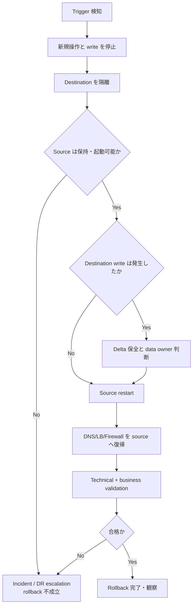

# 19. 切り戻し計画書

> [!IMPORTANT]
> 本書は架空案件の学習用計画です。切り戻し試験を含むすべての操作は **未実施** です。ここでいう rollback は MTV の変換を逆変換する機能ではなく、destination を停止・隔離して retained source を再び authoritative にする運用手順です。

## 1. 文書情報

| 項目 | 値 |
| --- | --- |
| 文書 ID | RB-PLAN-001 |
| 対象 | Wave 0 および VM PoC Wave 1〜3 |
| 版 | 0.1 Draft |
| 基準日 | 2026-08-17 |
| ステータス | 本人レビュー前・未承認 |
| Decision owner | Change manager（氏名未定） |
| 実施状態 | Rehearsal / rollback とも Not Run |

[移行計画](18-migration-plan.md)の各 wave と一体で承認します。事象別の定常運用は [運用引き継ぎ](20-operations-handover.md) を参照します。

## 2. Objective and invariants

切り戻しの目的は、障害を隠して migration を継続することではなく、承認済み時間内に既知の source state へ安全に戻し、影響と data loss を明確にすることです。

必ず守る条件:

1. Source と destination を同時に writeable / routable にしない。
2. Destination を fence してから source を起動する。
3. DNS / LB / Firewall / scheduler / batch を一つの切替単位として管理する。
4. source へ存在しない destination 側 write を黙って破棄しない。
5. DB consistency と business acceptance は Application owner が判定する。
6. RPO 1 時間 / RTO 4 時間は目標であり、rehearsal 実測まで達成扱いにしない。
7. rollback 中も timestamp、actor、command / UI action、result を記録する。

## 3. Authority and RACI

| Activity | Change manager | Migration manager | Platform | VMware | Network | Storage | Security | Application |
| --- | --- | --- | --- | --- | --- | --- | --- | --- |
| Trigger detection | I | A/R | R | R | R | R | R | R |
| Rollback declaration | A | R | C | C | C | C | C | C |
| Destination fencing | I | A | R | I | R | C | C | C |
| Source restart | I | C | C | A/R | C | C | I | C |
| Data reconciliation decision | I | C | C | C | I | C | C | A/R |
| DNS/LB restoration | I | C | C | I | A/R | I | C | C |
| Technical validation | I | A | R | R | R | R | C | R |
| Service acceptance | I | C | C | I | C | C | I | A/R |
| User communication | A | R | I | I | I | I | I | C |

緊急時でも decision owner、executor、checker を可能な限り分離します。

## 4. Decision deadline

Rollback deadline は固定時刻を仮置きせず、rehearsal 実測から次式で求めます。

```text
Rollback decision deadline
= maintenance window end
- measured source recovery duration
- measured validation duration
- DNS/LB convergence duration
- safety buffer
```

説明例: rollback 90 分、validation 30 分、network convergence 15 分、安全余裕 30 分なら、window end の 165 分前が decision deadline です。この数値は説明用であり本案件の実測値ではありません。

RTO は「rollback 開始」ではなく、業務影響検知から利用再開までの end-to-end で測ります。

## 5. Trigger matrix

| ID | Trigger | Immediate action | Default decision |
| --- | --- | --- | --- |
| RB-T01 | backup / checkpoint 不成立 | migration を開始しない | No-Go |
| RB-T02 | unsupported guest/device、preflight Error | plan を開始・継続しない | No-Go |
| RB-T03 | transfer / conversion が deadline を超過見込み | new action を停止 | Rollback review |
| RB-T04 | destination boot loop / kernel panic | destination を隔離 | Rollback unless fix is pre-approved and within deadline |
| RB-T05 | disk count/size/filesystem mismatch | write を許可しない | Rollback |
| RB-T06 | network、DNS、TLS、dependency 不成立 | traffic を切り替えない／戻す | Rollback |
| RB-T07 | application smoke / DB integrity Fail | destination write を停止 | Rollback |
| RB-T08 | source と destination の同時 active 疑い | 両側への新規 write を停止し evidence 保全 | Incident + Rollback decision |
| RB-T09 | OCP / CSI / network Severity 1/2 | migration を停止 | Rollback if source recovery feasible |
| RB-T10 | evidence、required approver、communication bridge 喪失 | 操作を止める | No-Go / Rollback |

## 6. Rollback levels

| Level | State | Data concern | Main action |
| --- | --- | --- | --- |
| L0 | migration 未開始 | なし | change を中止し source を継続 |
| L1 | transfer 中、source authoritative | source に最新 data | MTV plan を cancel、temporary resource を後日調査 |
| L2 | source 停止、destination 未公開 | source の final state が最新 | destination fence、source restart |
| L3 | destination 公開、write 未許可 | source の final state が最新 | route を戻し source restart |
| L4 | destination に write 発生 | delta / transaction の扱いが必要 | write 停止、evidence、Application owner が reconciliation を決定 |
| L5 | source retention 終了後 | simple rollback 不可 | DR / restore / new migration plan。別計画 |

PoC は synthetic data のみを使用し、L4 で発生した synthetic write は Application owner の承認を得て破棄できます。実データを扱う本番では、reverse synchronization が設計・試験されていない限り同じ手順を適用しません。

## 7. Decision flow



## 8. Common rollback runbook

以下は planned procedure であり、実行結果ではありません。

### 8.1 Declare and contain

1. Change manager が `ROLLBACK DECLARED`、Change ID、wave、timestamp、理由を通知する。
2. Migration manager が新しい migration / cutover action を停止する。
3. Application team が client、batch、scheduler、write entry point を停止する。
4. Platform team が destination VM / workload を scale down または network isolation する。
5. Network team が destination LB member を disable し、route change を凍結する。
6. Source と destination の power、network、disk、application state を二者確認する。

### 8.2 Preserve evidence and data

1. MTV status、events、controller/pod logs、VM manifest、PVC/DataVolume を保存する。
2. destination に write があれば時刻範囲、transaction、file、request ID を特定する。
3. data export が必要な場合は read-only / isolated 状態で取得し、checksum を記録する。
4. 失敗原因の調査より先に、rollback deadline と service recovery を優先する。

### 8.3 Restore source authority

1. Destination が停止・isolated であることを Platform と Application が確認する。
2. VMware owner が retained source の disk / snapshot / NIC を照合する。
3. Source VM を approved start order で起動する。
4. Application team が filesystem / DB recovery、service start、scheduler state を確認する。
5. Network team が DNS/LB/Firewall を source endpoint へ戻す。
6. DNS TTL と existing connection を考慮し、両経路から health を確認する。

### 8.4 Validate and close

1. infrastructure、guest OS、application、dependency、business smoke を実行する。
2. duplicate IP/MAC/hostname、split-brain、stale cache がないことを確認する。
3. acceptance owner が `Rollback Pass / Fail / Blocked` を記録する。
4. monitoring maintenance を解除し、alert を確認する。
5. next update time、known data loss、user impact、follow-up owner を通知する。
6. destination と temporary MTV resources は RCA / evidence review 完了まで削除しない。

## 9. Wave-specific rollback

### 9.1 Wave 0: sample container workload

- failed deployment revision を公開対象から外す。
- previous known-good manifest revision がある場合だけ再適用する。
- namespace 全削除を default rollback にしない。PVC、evidence、shared resource への影響を先に確認する。
- sample 初回導入で previous revision がない場合は Route を停止し、workload を isolated state に戻す。

### 9.2 Wave 1: `poc-web-01`

1. Destination Web VM / route を停止する。
2. Source Web VM を起動する。
3. static content checksum、HTTP health、TLS、DNS/LB を検証する。
4. Destination は forensic 用に network disconnected で保持する。

### 9.3 Wave 2: `poc-app-01`

1. Warm plan の precopy 中で source が稼働中なら、公式手順で migration を cancel し source を継続する。
2. Cutover 後なら destination service、scheduler、batch を停止して network を隔離する。
3. Source を起動し、external DB/API connection、certificate trust、service、job state を確認する。
4. Destination で処理済み request があれば request ID で二重処理を確認する。

### 9.4 Wave 3: `poc-db-01`

1. Client connection と destination DB write を停止する。
2. Destination transaction log と last committed transaction を保全する。
3. Source DB の last checkpoint / backup と destination delta を Data owner が比較する。
4. PoC synthetic data の破棄または適用を Application owner が文書承認する。
5. DB owner が、DB製品・major version・replication / backup構成に対応する承認済み起動・復旧手順を選択する。Sourceが正常停止され、restoreやPITRが不要と判断された場合は通常起動し、startup log、WAL処理、read/write整合性を確認する。
6. Restore、PITR、standby昇格等が必要な場合だけ、Data ownerが承認したrecovery pointと版別runbookに従って実行する。汎用的な「recovery mode」を前提にしない。
7. DB service acceptance 後に application connection を段階的に戻す。

DB を単に VM power on して rollback 完了としません。

## 10. Product-integration rollback boundary

Kong / Sysdig は設計のみで未導入のため、本 PoC では rollback 対象ではありません。将来導入する場合の minimum controls を以下とします。

| Product | Planned rollback unit | Required prerequisite |
| --- | --- | --- |
| Kong | previous declarative config / chart revision / Route endpoint | config export、certificate、data-plane compatibility、smoke test |
| Sysdig | monitor-only policy / previous supported chart / access key rotation | canary、coverage baseline、webhook cleanup、SCC/RBAC inventory |

## 11. Validation criteria

| ID | Criterion | State |
| --- | --- | --- |
| RB-V01 | destination への traffic と write が停止している | Not Run |
| RB-V02 | source VM / workload が expected power and health state | Not Run |
| RB-V03 | source IP/MAC/DNS/LB が一意で duplicate がない | Not Run |
| RB-V04 | required port、TLS、dependency が source 経路で正常 | Not Run |
| RB-V05 | application / DB acceptance が Pass | Not Run |
| RB-V06 | data loss window を計算し RPO との差を記録 | Not Run |
| RB-V07 | impact detection から service recovery までを測定し RTO との差を記録 | Not Run |
| RB-V08 | evidence、ticket、issue、risk、change log を更新 | Not Run |

### 11.1 RB-V と既存試験 ID の対応

`RB-V*` は本書内の切り戻し判定観点です。新しい中央試験 ID ではなく、結果は次の既存 ID へ登録します。対応表を作成しただけでは rehearsal 実施または `Pass` を意味しません。

| RB-V ID | 対応する既存試験・管理記録 | 対応内容 |
| --- | --- | --- |
| RB-V01 | `TST-MTV-003` | destination traffic / write の停止とfencing |
| RB-V02 | `TST-MTV-003` | retained source の起動・health・authoritative state |
| RB-V03 | `TST-MTV-003` | source / destination の二重起動、IP、MAC、DNS競合防止 |
| RB-V04 | `TST-MTV-003` | source経路のnetwork、TLS、dependency確認 |
| RB-V05 | `TST-MTV-003`、DB/PV復元時は `TST-RST-003` | application / DB acceptance |
| RB-V06 | `TST-MTV-003`、`TST-RST-003` | data loss window とRPO差分 |
| RB-V07 | `TST-MTV-003`、`TST-RST-004` | impact検知から業務復旧までのRTO |
| RB-V08 | `TST-MTV-003`、`TST-CHG-001` | evidenceと変更・課題・リスク記録の完結 |

中央の判定・証跡記録先は [試験仕様書](16-test-specification.md) と [試験結果記録](17-test-results.md) です。

## 12. Rollback failure and escalation

Source が起動しない、data consistency を判断できない、または RTO を超過する場合、rollback 自体を `Fail` とし重大 incident へ移行します。

- incident commander を指名し、migration bridge を incident bridge へ切り替える。
- source と destination の追加変更を停止する。
- Storage / VMware / Red Hat / application vendor の support case 条件を確認する。
- sanitized `must-gather`、MTV logs、VM/guest evidence、storage logs を保全する。
- recovery option は backup restore、alternate VM、service degradation を影響評価して選ぶ。
- 推測で source disk と destination disk を attach / merge しない。

## 13. Source retirement gate

Source を削除できるのは、次を別 change で承認した後だけです。

- observation period 完了
- all mandatory tests Pass
- backup と isolated restore Pass
- no unresolved critical/high issue requiring source
- asset/license/data-retention review 完了
- rollback closure と DR plan 更新
- Application owner、Security、Platform、Change manager の承認

## 14. Evidence to retain

- rollback declaration と decision rationale
- source/destination state before and after
- network route before and after
- data delta / checksum / DB consistency result
- exact timestamps and actors
- validation results and user impact
- incident / vendor case ID（存在する場合）
- corrective action and next migration gate

Secret、token、private key、personal data は保存対象から除外または approved redaction を行います。

## 15. Primary references

- [MTV 2.12: Migrating VMs from VMware vSphere](https://docs.redhat.com/en/documentation/migration_toolkit_for_virtualization/2.12/html/migrating_your_virtual_machines_to_red_hat_openshift_virtualization/assembly_migrating-from-vmware_mtv)
- [MTV 2.12: Cold and warm migration](https://docs.redhat.com/en/documentation/migration_toolkit_for_virtualization/2.12/html/planning_your_migration_to_red_hat_openshift_virtualization/assembly_cold-warm-migration_mtv)
- [OpenShift Virtualization 4.22: Backup and restore](https://docs.redhat.com/en/documentation/openshift_container_platform/4.22/html/virtualization/backup-and-restore)
- [OpenShift Container Platform 4.22: Backup and restore](https://docs.redhat.com/en/documentation/openshift_container_platform/4.22/html/backup_and_restore/)
