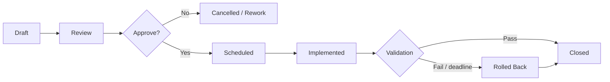

# 22. 変更管理台帳

> [!IMPORTANT]
> 本台帳は架空案件の変更候補です。すべて Draft / Proposed で、承認、schedule、実施、検証は行っていません。表に記載された change は実環境変更の証跡ではありません。

## 1. 文書情報

| 項目 | 値 |
| --- | --- |
| 文書 ID | PM-CHG-001 |
| 版 | 0.1 Draft |
| 基準日 | 2026-08-17 |
| ステータス | Draft・未レビュー・未承認 |
| Change manager | 未定 |
| CAB / approval authority | 未定 |

## 2. Change lifecycle



`Implemented` は成功を意味しません。`Validation`でexpected resultとevidenceを確認し、Passの場合だけ`Closed`とします。本台帳では`Validated`を独立statusとして使用しません。

## 3. Required fields

- Change ID、title、requester、owner、type、priority
- business / technical reason、affected requirement / design / CI
- exact target、current state、desired state、revision / version
- impact、risk IDs、dependency、conflict check
- implementation steps、executor、checker、window
- pre-check、backup、stop condition、decision deadline、rollback
- test IDs、evidence path、acceptance owner
- communication、approval、actual start/end、result
- as-built / parameter / runbook / issue / ADR update

Credential と Secret の値は change record に書きません。

## 4. Initial change register

| ID | Title | Type | Scope | Related risk | Planned validation | Rollback reference | Owner | Status |
| --- | --- | --- | --- | --- | --- | --- | --- | --- |
| CHG-001 | Project document baseline 0.1 | Documentation | `projects/enterprise-openshift-platform/` | RSK-015, RSK-017 | link/schema/Mermaid/technical review | previous Git revision | Documentation owner | Draft |
| CHG-002 | External DNS/LB/NTP/Proxy preparation | Normal | cluster prerequisites | RSK-007, RSK-013 | DNS, port, health, HA tests | approved previous config | Network | Draft |
| CHG-003 | Agent-based OCP 4.22.z cluster install | Major | 3 Control Plane + 3 Worker | RSK-001, RSK-002, RSK-007 | install + cluster health test | reinstall/recovery decision; destructive rollback separately approved | Platform | Draft |
| CHG-004 | Post-install identity/storage/Registry/backup baseline | Major | IdP、RBAC、CSI、Internal Image Registry `Removed`→`Managed`、OADP candidate | RSK-003, RSK-008, RSK-009 | `TST-IAM-001〜004`、`TST-REG-001`、`TST-STG-001〜006`、`TST-BKP-001〜004`、`TST-RST-001〜004` | feature-specific prior state。Registryを`Removed`へ戻すことは本番成功扱いしない | Platform + Security + Storage | Draft |
| CHG-005 | OpenShift Virtualization OLM install | Major | `openshift-cnv` | RSK-002, RSK-003, RSK-012 | `TST-VIR-001`、Operator/HCO/VM/storage確認 | vendor-supported uninstall/restore plan required | Platform | Draft |
| CHG-006 | MTV Operator and provider PoC setup | Major | source VMware + target OCP | RSK-004, RSK-006, RSK-009 | `TST-VIR-001`、`TST-MTV-001`のcompatibility/preflight/provider確認 | disable/delete only after evidence and vendor procedure review | Migration manager | Draft |
| CHG-007 | VM PoC Wave 1 `poc-web-01` | Normal | one cold-migrated VM | RSK-004, RSK-005, RSK-007 | `TST-MTV-001〜003`（[PAC対応表](11-virtualization-mtv-design.md)） | [Rollback plan](19-rollback-plan.md) L1-L3 | Migration manager | Draft |
| CHG-008 | VM PoC Wave 2 `poc-app-01` | Normal | one warm candidate VM | RSK-004, RSK-005, RSK-006 | `TST-MTV-001〜003`、`TST-PER-001`（PAC対応表） | [Rollback plan](19-rollback-plan.md) L1-L4 | Migration manager | Draft |
| CHG-009 | VM PoC Wave 3 `poc-db-01` | Major | database VM cold migration | RSK-004, RSK-005, RSK-008 | `TST-MTV-001〜003`、`TST-BKP-004`、`TST-RST-003`、`TST-RST-004`（PAC対応表） | [Rollback plan](19-rollback-plan.md) L1-L4 | Migration manager + App | Draft |
| CHG-010 | Kong integration PoC | Major | API gateway candidate | RSK-009, RSK-011 | 現行72試験baseline外。`KONG-T01〜07`はlocal planned check | prior config/chart/Route | Product owner | Draft |
| CHG-011 | Sysdig integration PoC | Major | agent/security candidate | RSK-009, RSK-010, RSK-014 | 現行72試験baseline外。`SYSDIG-T01〜07`はlocal planned check | monitor-only / previous chart / key rotation | Product owner + Security | Draft |
| CHG-012 | OCP and Operator update cycle | Major | platform lifecycle | RSK-012, RSK-015 | pre/post health + workload regression | supported rollback/recovery varies by component | Platform | Draft |

Kong / Sysdig changes are future candidates onlyです。製品・version・license・supportが決まるまでReviewへ進めず、local planned checkをcurrent acceptanceのPass/Failへ使用しません。採用時は承認済みchangeで [要件トレーサビリティ](04-requirements-traceability.md)、[試験仕様書](16-test-specification.md)、[試験結果記録](17-test-results.md)を同時改訂します。

CHG-004はinstaller完了とは別のpost-install changeです。Internal Image Registryがproduction向け永続storageで`Managed`となり、`TST-REG-001`がPassするまで`Closed`にせず、本番受入へ進めません。

## 5. Change record template

```text
Change ID:
Title:
Status: Draft
Requester / Owner:
Approver:
Window:

Reason and expected benefit:
Affected service / CI / namespace / node:
Current state:
Desired state:
Exact revision / version:

Dependencies:
Related requirements / design / ADR:
Related issue / risk:
Impact and outage:

Pre-check:
Backup / recovery point:
Implementation steps:
Expected result for each step:
Stop conditions:
Rollback decision deadline:
Rollback steps:

Test IDs and acceptance owner:
Evidence location:
Communication:

Actual start/end: NOT RUN
Actual result: NOT RUN
Deviation / incident: NONE RECORDED
Closure approval: NOT APPROVED
```

## 6. Standard review questions

### Scope and conflict

- exact resource / node / namespace / endpoint が限定されている。
- parallel change、backup、batch、migration、certificate rotation と競合しない。
- generated files と actual deployed revision が一致する。

### Risk and recovery

- high risk に treatment / acceptance がある。
- backup は対象 data を本当に復元できる。
- rollback の開始条件、authority、所要時間、不可逆点がある。
- migration では source / destination の write authority が一意である。

### Test and evidence

- before/after、normal/error/recovery test が定量的である。
- `Blocked` を Pass と扱わない。
- Secret、token、private key、組織固有データをevidenceから除外する。

## 7. Emergency change

Emergency は review を省略する仕組みではありません。最低限、次を記録します。

1. active incident / business impact
2. authorized decision owner
3. exact target and minimal action
4. known risk and stop condition
5. recovery / rollback possibility
6. actor、timestamp、result、evidence
7. next-business-day candidate の retrospective / documentation update

未検証 command を重大 incident 中に試すことを emergency change と正当化しません。

## 8. Closure criteria

- exact implemented revision と actual start/end が記録されている。
- required tests と acceptance が Pass。
- Fail / Blocked / deviation に issue と owner がある。
- rollback の要否と結果が記録されている。
- parameter/as-built/runbook/ADR/risk が更新されている。
- monitoring、backup、temporary credential/resource の後処理が完了している。
- approver が evidence を確認している。

現在 Closed の change はありません。
