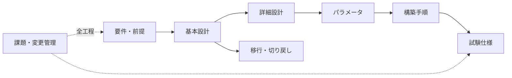

# 設計・管理文書テンプレートガイド（補助資料）

> [!NOTE]
> 本書は [基盤案件の進め方](infra-project-process.md) と [OpenShift 基本設計](openshift-basic-design.md) を、レビュー可能な実務成果物へ落とすためのガイドです。記入済み成果物例と空テンプレートの役割を分け、組織の正式様式と承認プロセスを優先してください。

## 目的

`templates/` は、空欄を埋めるだけの書式ではなく、設計判断をレビュー可能にするためのチェックポイントです。記入済み成果物例から必要な判断と粒度を確認し、案件固有情報を組織の正式様式へ転記する際の確認表として使います。

## テンプレート対応表

| テンプレート | いつ使うか | 中心となる問い |
| --- | --- | --- |
| `basic-design-template.md` | 要件から方式を決める | 何を、なぜこの方式にするか |
| `detailed-design-template.md` | 方式を具体的な構成へ落とす | どのリソースをどう設定するか |
| `parameter-sheet-template.md` | 設定値を一元管理する | 値、単位、根拠、設定先は何か |
| `build-procedure-template.md` | 承認済み変更を再現可能にする | 誰が何を実行し、何をもって成功とするか |
| `issue-management-template.md` | 未解決事項を追跡する | 影響、次の行動、担当、期限は何か |
| `change-management-template.md` | 変更を審査・記録する | 効果に対してリスクと復旧策は妥当か |
| `migration-plan-template.md` | 移行の順序・体制を決める | いつ何を移し、どう受け入れるか |
| `rollback-plan-template.md` | 移行・変更失敗に備える | いつ誰が判断し、どこまで戻せるか |
| `troubleshooting-report-template.md` | 障害調査を共有する | 事実、仮説、処置、結果を分けているか |

試験仕様・結果は [試験文書テンプレートガイド](test-document-guide.md) で扱います。

## 推奨する記入順序



1. 架空案件の目的、利用者、SLA、制約を 1 ページで定義する。
2. 基本設計で方式と責任分界を決める。
3. 詳細設計とパラメータシートで、設定先と値へ落とす。
4. 構築手順へ、変更前確認、コマンド、期待結果、中断基準を記す。
5. 試験仕様で設計項目を検証可能な期待結果へ変換する。
6. 移行・切り戻しと運用を含め、実施後の状態まで確認する。

## 文書共通の記入ルール

### 文書情報

- 文書 ID、版、作成者、作成日、レビュー者、承認者
- 変更履歴と変更理由
- ステータス: Draft / Review / Approved / Obsolete

### 曖昧さを残さない書き方

| 曖昧な記述 | 改善例 |
| --- | --- |
| 十分な容量を確保する | 初期要求 600 GiB、1 年成長率 30%、障害退避 20% を含め 1 TiB。算定根拠は CAP-01 |
| 必要なポートを許可する | `source`, `destination`, `TCP/6443`, 方向、用途、申請 ID を通信要件表に記載 |
| 障害時は切り戻す | 22:00 までに TC-05 が不合格なら変更責任者が判定し、RB-01 の手順で戻す |
| 適切な権限を付与する | 運用グループに対象 Project の `edit`、監査グループに `view`。クラスタ権限は付与しない |

### 要確認の書き方

```text
要確認 ID: Q-012
確認事項: 本番 Ingress の TLS 証明書を誰が発行するか
影響: 発行主体が決まらないと CSR、更新手順、監視設計が確定しない
確認先: セキュリティ基盤担当
期限: YYYY-MM-DD
暫定方針: 未確定。自己署名証明書で本番設計を確定しない
```

## OpenShift 設計で追跡する横断項目

| 横断項目 | 基本設計 | 詳細・パラメータ | 手順・試験 |
| --- | --- | --- | --- |
| DNS / LB | API と Ingress の公開方式 | FQDN、VIP、health check、TTL | 解決、到達、切替、異常系 |
| Network | CIDR、外部接続、分離方式 | port、NetworkPolicy、MTU | 疎通と拒否、return path |
| Identity | IdP、MFA、責任分界 | group、role、binding | 正常・拒否・監査ログ |
| Storage | class、性能、可用性 | provisioner、access mode、容量 | 作成、再接続、障害・復旧 |
| Operator | 導入方針、保守責任 | channel、source、namespace | InstallPlan、更新、rollback 制約 |
| Observability | 監視・ログ・通知方針 | rule、保持、転送、連絡先 | 発報、一次対応、証跡 |
| Backup | 対象、RPO / RTO | schedule、保管、暗号化 | restore と業務受入 |

## 成果物例とテンプレートの使い分け

[架空のエンタープライズ OpenShift 基盤導入プロジェクト](../../projects/enterprise-openshift-platform/README.md) は、3 Control Plane + 3 Worker の OCP 4.22 基盤を想定した記入済み成果物例です。Virtualization / MTV の PoC 設計を含み、要件、基本設計、詳細設計、パラメータ、構築、試験、移行、運用を同じシナリオと ID で追跡します。

`templates/` は空テンプレートです。成果物例から案件に必要な章立て、判断粒度、追跡方法を読み取り、組織の正式様式へ必要事項を転記します。架空案件の値や判断を、そのまま実案件へ流用しません。

## 完成レビュー

- すべての要件に、設計・設定・試験の対応先がある。
- 図と表で名称、CIDR、ノード数が一致する。
- 設定値に根拠と単位がある。
- Secret の実値が含まれない。
- 変更前後の確認と中断基準がある。
- 未確定事項に確認先と期限がある。
- 「この製品なら自動で大丈夫」など、未検証の保証表現がない。

## 実務での説明要点

- 要件を基本設計、詳細設計、パラメータ、構築、試験へ ID で追跡し、決定理由と未決事項を残す。
- 設計書は組織の標準様式を優先し、対象、前提、責任、根拠、影響、レビュー担当を明記する。
- 記入済み成果物例は内容と粒度の参考、空テンプレートは案件固有情報を組織様式へ転記するために使い分ける。
