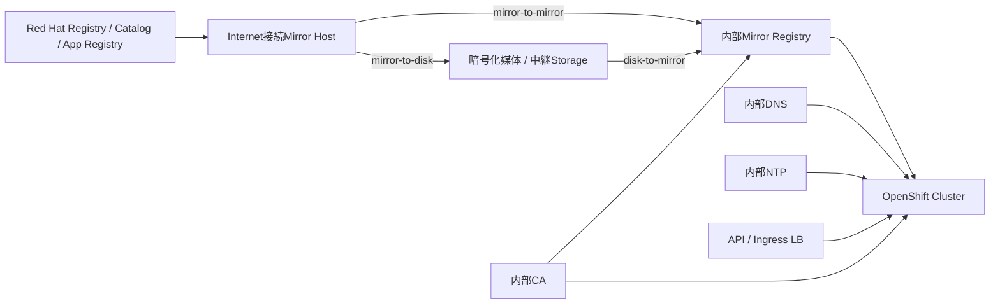

# Airgap / Disconnected Install

> [!NOTE]
> 本資料は、インフラ経験者が実務成果物を読み解くための技術リファレンスです。OpenShift に関する構成とコマンドは OpenShift Container Platform 4.22 を具体例とします。実環境へ適用する前に、対象 z-stream、プラットフォーム、権限、変更手順、製品間の互換性、サポート条件を公式資料と組織標準で確認してください。

> 更新基準日: 2026-08-13。以下はOpenShift Container Platform 4.22系資料を具体例とする。`oc-mirror` v1/v2、ImageSetConfiguration API、Operator Catalog形式、対応Upgrade Pathは変化するため、案件採用Versionで**要確認**。

## Airgap / Disconnectedとは

- Connected: Cluster Nodeが必要な外部RegistryやServiceへ直接到達できる。
- Partially disconnected: Proxyや限定された宛先だけを経由できる。
- Fully disconnected / Air-gapped: 接続可能ZoneとCluster Zoneの間に直接Network経路がなく、媒体や中継Zoneで資材を搬送する。

実案件では呼び方だけで判断せず、「どの端末から、どの宛先へ、どのProtocolで、いつ接続可能か」「媒体搬送は可能か」を通信要件として確認する。

## 全体構成



Mirror Host、Mirror Registry、Installation Host、Cluster Nodeは同じServerとは限らない。接続Zoneと機密Zoneの責任分界、資材検査、Checksum、Malware scan、媒体台帳を設計する。

## なぜMirror Registryが必要か

OpenShiftのRelease Payload、Operator Bundle、Operand Image、Application ImageはContainer Imageとして配布される。Clusterが外部Registryへ到達できないため、許可された内部Registryへ同期し、Clusterが内部参照へ置き換える必要がある。

注意点:

- **Mirror Registry for Red Hat OpenShift**等の外部Mirrorと、Cluster内のOpenShift Internal Image Registryは役割が違う。
- Cluster稼働・更新中も内部Mirrorが必要になるため、一時的なInstaller用HTTP Serverでは足りない。
- 可用性、容量、Backup、証明書、認証、GC、監視、脆弱性scanを設計する。

## 三種類のImageを棚卸しする

### OpenShift Release Image

OCPの各Componentを構成するRelease Payloadである。導入Versionだけでなく、計画するUpdate先、Architecture、Channelを決める。Digest単位で追跡し、取得元・取得日・Checksum/Signatureの検証記録を残す。

### Operator CatalogとOperator Image

Catalog ImageはOperator package、Channel、BundleのMetadataを提供し、Bundle/Operand Imageも必要になる。Catalog全体をMirrorすると容量と更新時間が膨らむため、採用OperatorとChannel、Version範囲を選定する。ただし依存packageの漏れに注意する。

### Application Image

業務Application、Base Image、Init/Sidecar、診断tool、CI/CD、Monitoring、Backup agent等を棚卸しする。ManifestやHelm chart内のImage参照も対象とし、floating tagではなくDigest等で再現性を持たせる。

## oc-mirror

`oc-mirror` はOCP Release、Operator Catalog、追加ImageをImageSetConfigurationに基づきMirrorするCLI pluginである。v2はv1とMetadata/Workflow/機能が異なるため混在させず、該当OCPとpluginの互換性を確認する。

参照用の最小例:

```yaml
apiVersion: mirror.openshift.io/v2alpha1
kind: ImageSetConfiguration
mirror:
  platform:
    channels:
      - name: stable-4.22
        minVersion: <mirror対象の4.22.z>
        maxVersion: <mirror対象の4.22.z>
  operators:
    - catalog: registry.redhat.io/redhat/redhat-operator-index:v4.22
      packages:
        - name: <operator-package名>
          channels:
            - name: <operator-channel名>
  additionalImages:
    - name: registry.redhat.io/ubi9/ubi-minimal:latest
```

API VersionとChannelは4.22系の具体例である。`<mirror対象の4.22.z>`は、Supported Update Pathで確認した完全なz-streamへ置き換える。実在・対応・推奨Patchを実行前に**要確認**。`latest` は本資料での追加Image例にすぎず、本番資材はDigest固定を検討する。

接続Hostから内部Registryへ直接同期する例:

```bash
oc-mirror --config ./imageset-config.yaml --workspace file://./oc-mirror-workspace docker://mirror-registry.example.internal:8443 --v2
```

完全分離でDiskへ出力し、分離側からRegistryへ投入する例:

```bash
oc-mirror --v2 --config ./imageset-config.yaml file://./oc-mirror-workspace
oc-mirror --v2 --config ./imageset-config.yaml --from file://./oc-mirror-workspace docker://mirror-registry.example.internal:8443
```

正確な引数は利用する`oc-mirror` buildで次を確認する。

```bash
oc-mirror version
oc-mirror --help
```

Workspace/Metadataは差分Mirrorや削除計画に必要となるため、単なる一時fileとして扱わずBackupとAccess Controlを行う。

## Mirror実行の標準フロー

1. 採用OCP/Operator/ApplicationとUpdate horizonを棚卸しする。
2. 対応する`oc`、`oc-mirror`、pull secret、CAを接続Zoneへ用意する。
3. ImageSetConfigurationをReviewし、容量を見積もる。
4. Staging RegistryまたはDiskへMirrorする。
5. Digest、Mapping、生成Manifest、実行Logを保存する。
6. 資材を承認された経路で分離Zoneへ搬送する。
7. 内部Registryへ投入し、Catalog/Image pullを検証する。
8. Cluster導入/Updateへ使い、使用Imageの追跡記録を残す。

## pull secret

pull secretにはRegistry認証情報が含まれる。Red Hat提供Secretと内部Registry認証を必要に応じて統合するが、平文のGit commit、Ticket、Chat、AI promptへ貼らない。

内容を表示せずJSON妥当性を確認する例:

```bash
jq -e '.auths | type == "object"' ./pull-secret.json >/dev/null
chmod 600 ./pull-secret.json
```

実作業ではSecret Store、保管期限、Rotation、個人Account依存回避、退職/異動時失効を決める。

## 証明書

Mirror RegistryのServer証明書は、Mirror Host、Installation Host、Cluster Node/CRI-Oが信頼できる必要がある。SANに実際のRegistry FQDNを含め、中間CAを含むChainを配布する。期限、更新、秘密鍵保管、失効を設計する。

```bash
openssl s_client -connect mirror-registry.example.internal:8443 -servername mirror-registry.example.internal -showcerts </dev/null
echo | openssl s_client -connect mirror-registry.example.internal:8443 -servername mirror-registry.example.internal 2>/dev/null | openssl x509 -noout -subject -issuer -dates -ext subjectAltName
curl -v --connect-timeout 5 https://mirror-registry.example.internal:8443/v2/
```

`401 Unauthorized` はTLSとRegistry APIまで到達した手掛かりになる。Self-signed証明書を理由に恒久的なinsecure Registryへせず、追加Trust Bundleを設計する。

## DNS

最低限、API、api-int、apps wildcard、Node、Mirror Registry、NTP、LB Backend等を内部から解決できるようにする。接続Zoneと分離Zoneで同じFQDNが異なるIPを返す場合はSplit DNSと証明書SANを確認する。

```bash
dig mirror-registry.example.internal A
dig api.<cluster名>.<baseDomain> A
dig test.apps.<cluster名>.<baseDomain> A
dig -x <mirror-registry-ip-address>
```

## Firewall許可

「Internet不可」でも内部通信は必要である。代表例は以下だが、完全なPort一覧はPlatformとOCP Versionの公式資料で**要確認**。

- Mirror Host → Red Hat/採用Registry（接続Zoneのみ）
- Mirror Host/Cluster Node → 内部Mirror Registry
- Node ↔ API/Control Plane、Node間Cluster Network
- Client → API/Ingress LB
- Node → 内部DNS/NTP、Identity Provider、Storage、Backup先
- Support data搬送経路（承認された場合のみ）

通信要件表にはSource、Destination、Protocol/Port、Direction、FQDN/IP、Proxy、用途、期間、Ownerを記載する。

## NTP

Disconnected環境でも正確な時刻はTLS、etcd、Log相関、認証に必要である。内部NTP source、上位同期、冗長化、Stratum、許容offset、監視を決める。

```bash
chronyc sources -v
chronyc tracking
timedatectl status
```

## Load Balancer

APIとIngressのLBが必要な点はConnected環境と同じである。Airgap特有なのは、LB製品のImage/package/License/Updateも外部依存し得ることである。Health check、Backend、DNS、証明書、firmwareやsignature更新の搬送方法まで確認する。

```bash
curl -vk --connect-timeout 5 https://api.<cluster名>.<baseDomain>:6443/readyz
curl -vk --connect-timeout 5 https://test.apps.<cluster名>.<baseDomain>/
openssl s_client -connect api.<cluster名>.<baseDomain>:6443 -servername api.<cluster名>.<baseDomain> </dev/null
```

## ClusterへのMirror設定

`oc-mirror` が生成するImageDigestMirrorSet、ImageTagMirrorSet、CatalogSource等のResourceをReviewして適用する。生成物の種類はv1/v2やOCP Versionで異なるため、file名を推測せずWorkspaceの結果と公式手順を確認する。

```bash
oc get imagedigestmirrorset
oc get imagetagmirrorset
oc get catalogsource -A
oc get clusteroperator image-registry
oc get pods -n openshift-marketplace -o wide
```

Installation前は`install-config.yaml`へ追加TrustやMirror情報を反映する場合がある。Field名・生成手順は採用Versionで**要確認**。

## Operator Catalogの確認

```bash
oc get catalogsource -n openshift-marketplace
oc describe catalogsource <catalogsource名> -n openshift-marketplace
oc get packagemanifest | grep <operator-package名>
oc get pods -n openshift-marketplace -o wide
oc get events -n openshift-marketplace --sort-by=.lastTimestamp
```

Packageが見えない場合は、CatalogSource status、Image pull、Registry CA/認証、Catalogに含めたPackage/Channelを確認する。

## Update時の注意

Disconnected Clusterでは「Updateボタンを押す前」の準備が多い。

- 現在VersionからTarget VersionまでのSupported Upgrade Pathを確認する
- Target Releaseと必要な中間VersionをMirrorする
- Installed OperatorすべてのChannel/Compatibilityを確認する
- Application/Image、Driver、CSI、ODF、Virtualization、GPU等の対応を確認する
- Mirror容量、差分Metadata、GC、Backup、Rollback条件を確認する
- Update Service/Graphを使わない構成の手順を確認する
- StagingでImage pull、Catalog、更新、業務回帰を試験する

Release ImageをMirrorしただけでOperatorとApplicationが更新可能になるわけではない。Update失敗時に古いReleaseへ単純downgradeできるとは限らないため、公式の回復手順とBackupを準備する。

## よくある失敗と切り分け

| 症状 | 最初の確認 | 主な仮説 |
|---|---|---|
| ImagePullBackOff | Pod Event、Image参照 | Mirror漏れ、認証、CA、DNS、Firewall |
| CatalogにOperatorが出ない | CatalogSource status | Catalog Image/Package/Channel漏れ |
| Install中に外部へ接続 | LogのFQDN | Mirror設定漏れ、Manifest内Image、Telemetry/IdP等 |
| Update候補が出ない | ClusterVersion、Release mirror | Upgrade path、Graph、Channel、Release不足 |
| Registry容量不足 | Registry metrics/Storage | 過大Catalog、古いBlob、GC計画不足 |

## 実構築前チェックリスト

- [ ] Disconnectedの範囲と資材搬送方式を合意した
- [ ] OCP/Operator/App/補助toolをBOM化した
- [ ] Mirror RegistryのHA、Backup、容量、監視を設計した
- [ ] pull secretと秘密鍵をSecret管理した
- [ ] 内部CAのTrust配布と更新試験を行った
- [ ] DNS/NTP/LB/Firewallを分離Zone内だけで試験した
- [ ] oc-mirror Metadataと生成Manifestを版管理した
- [ ] Update pathと少なくとも次回分の容量を見積もった
- [ ] 媒体・Staging Zoneで改ざん/マルウェア検査を行う
- [ ] Supportへ情報を渡す手順とマスキングを決めた

## 公式リファレンス

- [OpenShift Container Platform 4.22: Disconnected environments](https://docs.redhat.com/en/documentation/openshift_container_platform/4.22/html/disconnected_environments/index)
- [OpenShift Container Platform 4.22: Mirroring with oc-mirror](https://docs.redhat.com/en/documentation/openshift_container_platform/4.22/html/disconnected_environments/installing-mirroring-disconnected)
- [Red Hat Quay documentation](https://docs.redhat.com/en/documentation/red_hat_quay/)
- [OpenShift Container Platform 4.22: Updating clusters](https://docs.redhat.com/en/documentation/openshift_container_platform/4.22/html/updating_clusters/index)

## 実務での説明要点

- Disconnected 環境では、リリース、Operator、アプリケーションの各イメージを承認済み経路で Mirror Registry へ搬送する。
- pull secret、信頼 CA、DNS、Firewall、NTP、Load Balancer、カタログ、更新用イメージを一つの依存関係として設計する。
- OCP 4.22 で利用する oc-mirror の世代、ImageSetConfiguration API、更新経路、Operator カタログ形式を実施前に固定する。
