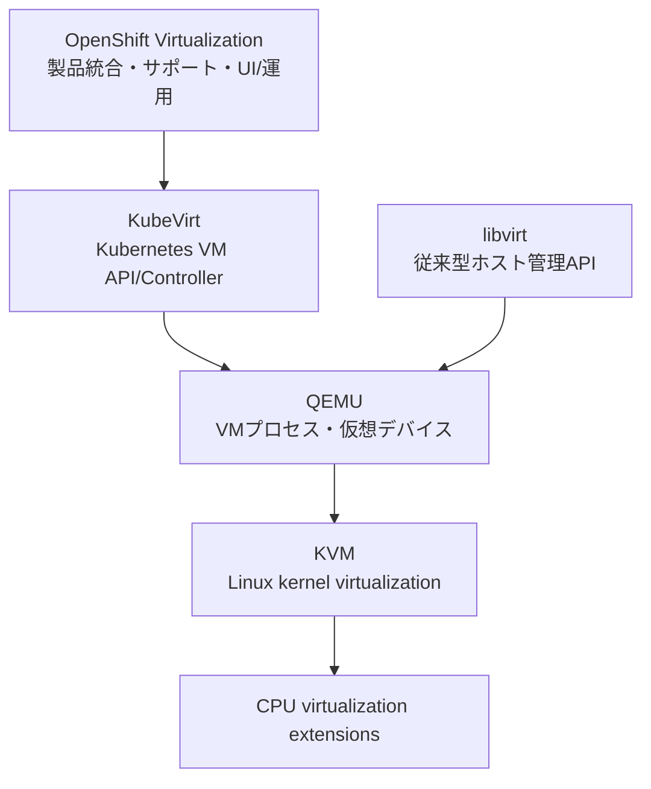
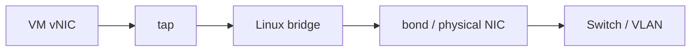

# KVM / QEMU / libvirt / KubeVirt

> [!NOTE]
> 本資料は、インフラ経験者が実務成果物を読み解くための技術リファレンスです。OpenShift に関する構成とコマンドは OpenShift Container Platform 4.22 を具体例とします。実環境へ適用する前に、対象 z-stream、プラットフォーム、権限、変更手順、製品間の互換性、サポート条件を公式資料と組織標準で確認してください。

OpenShift Virtualization を理解するには、Linux ホスト仮想化と Kubernetes 上の VM 管理を分けて捉える必要があります。この章では各層の責務、従来型 KVM ホストで見るポイント、OpenShift 上で直接操作しない理由を整理します。

## 四つの層を分ける



KubeVirt と libvirt はどちらも QEMU/KVM に関係しますが、同じ管理面ではありません。従来型 KVM ホストでは libvirt／`virsh` が管理入口になり、OpenShift Virtualization では Kubernetes API とコントローラーが管理入口になります。

## KVM とは

KVM（Kernel-based Virtual Machine）は Linux カーネルの仮想化機能です。Intel VT-x、AMD-V などの CPU 仮想化支援を利用し、Linux をハイパーバイザーとして機能させます。

KVM だけで VM の画面、ディスク形式、仮想 NIC、管理 API がすべて完成するわけではありません。通常は QEMU、libvirt、管理ツール、ストレージ、ネットワークと組み合わせます。

確認例:

```bash
lscpu | grep -E 'Virtualization|Hypervisor'
grep -E --count '(vmx|svm)' /proc/cpuinfo
lsmod | grep -E '^kvm(_intel|_amd)?'
test -e /dev/kvm && ls -l /dev/kvm
```

出力がない場合も即座に「非対応」と断定しません。BIOS/UEFI で無効、ネスト仮想化の非公開、権限、異なる CPU アーキテクチャなどを確認します。

## QEMU とは

QEMU は CPU、メモリ、ディスク、NIC、チップセット等を提供するユーザー空間の仮想マシンモニター／エミュレーターです。KVM acceleration を使うと、対応命令を物理 CPU で効率よく実行できます。

実務上は、次を確認します。

- machine type、CPU model、仮想デバイス（virtio 等）、firmware（BIOS/UEFI）。
- qcow2/raw 等のディスク形式、cache／I/O モード、discard。
- QEMU プロセスのユーザー、cgroup、SELinux、seccomp、ソケット権限。
- バージョン互換性と migration compatibility。直接 QEMU 引数を追加できるかは管理製品のサポート範囲で **要確認**。

```bash
qemu-system-x86_64 --version
qemu-img info /var/lib/libvirt/images/example.qcow2
qemu-img check /var/lib/libvirt/images/example.qcow2
```

`qemu-img check` は対象ファイルへのアクセスと業務影響を確認し、稼働中ディスクへ無計画に実行しません。

## libvirt とは

libvirt は KVM/QEMU を含む仮想化基盤を共通 API で管理するソフトウェアです。`libvirtd` またはモジュール化デーモン、XML 定義、仮想ネットワーク、storage pool を扱い、`virsh` はその CLI です。

従来型ホストでは VM 定義、起動停止、console、snapshot、migration などを libvirt 経由で管理します。ただしデーモン構成とコマンドは RHEL 版で変わるため **要確認** です。

```bash
systemctl status libvirtd
virsh version
virsh list --all
virsh dominfo <vm-name>
virsh domiflist <vm-name>
virsh domblklist <vm-name> --details
virsh net-list --all
virsh pool-list --all
```

## KubeVirt とは

KubeVirt は、Kubernetes に VM 用 Custom Resource とコントローラーを追加する上流プロジェクトです。VM を Kubernetes スケジューラ、RBAC、namespace、Pod ネットワーク、PVC と連携させます。

主要概念は次のとおりです。

- `VirtualMachine`: VM の希望構成と実行方針。
- `VirtualMachineInstance`: 稼働中の VM インスタンス。
- `virt-launcher`: VMI ごとの実行 Pod。
- `virt-controller`／`virt-handler`: 状態調整とノード側処理を担うコンポーネント。
- `virtctl`: start、stop、console、migrate などの利用者 CLI。

これは概念モデルです。内部コンポーネントと配置は版により変わるため、障害調査では実クラスタの Deployment／DaemonSet と公式資料を確認します。

## OpenShift Virtualization との関係

OpenShift Virtualization は KubeVirt を中心に、CDI、ネットワーク、ストレージ、Web コンソール、監視、更新、Red Hat のテストとサポートを OCP へ統合します。

KubeVirt の概念だけで OpenShift Virtualization の構成を確定せず、製品として対応 OCP 版、Operator の Channel、ノード要件、CSI/CNI、バックアップ、アップグレード、ゲスト OS サポートまで確認します。

## KVM ホスト構築で見るポイント

### ハードウェアとファームウェア

- CPU 仮想化支援、IOMMU、NUMA、Huge Pages、メモリ容量、ECC。
- BIOS/UEFI の virtualization、VT-d／AMD-Vi、電源・性能プロファイル。
- NIC、HBA、RAID、NVMe、firmware と RHEL の互換性。

### OS とセキュリティ

- RHEL の対象版、サブスクリプション、更新、カーネル、qemu-kvm/libvirt パッケージ。
- SELinux enforcing、firewalld、SSH、管理者権限、監査ログ。
- 時刻同期、DNS、証明書、バックアップ、監視エージェント。

### 可用性と運用

- 単一ホスト障害時の VM 再起動先、共有ストレージ、fencing、クラスタ管理。
- Live Migration の CPU 互換性、ネットワーク帯域、ストレージ共有。
- 容量、オーバーコミット、メンテナンス、パッチ、ファームウェア更新。

RHEL の仮想化サポート、廃止機能、ゲスト OS 認定は対象版の Red Hat 文書で **要確認** です。

## CPU 仮想化支援

Intel の `vmx`、AMD の `svm` フラグは代表的な確認点です。ただしフラグが見えるだけでは、製品サポート、IOMMU、nested virtualization、migration 互換性は保証されません。

```bash
lscpu
grep -E -m 5 'flags.*(vmx|svm)' /proc/cpuinfo
cat /sys/module/kvm_intel/parameters/nested 2>/dev/null || true
cat /sys/module/kvm_amd/parameters/nested 2>/dev/null || true
journalctl -k -b | grep -Ei 'kvm|iommu|dmar'
```

OpenShift Virtualization の VM 用ノードでは、Node Feature Discovery／Node labels、HyperConverged CR、Node 状態など、製品の管理面からも確認します。

## ネットワークブリッジ

従来型 KVM ホストでは、Linux bridge や Open vSwitch を物理 NIC／bond／VLAN と接続し、tap デバイス経由で VM を外部ネットワークへ出す構成があります。



確認例:

```bash
ip -br link
ip -br addr
bridge link
bridge vlan show
nmcli connection show
nmcli device status
ip route
```

管理 IP を持つ NIC の bridge 化は接続断を起こし得ます。リモート作業では console、ロールバック、保守枠を確保し、手順を検証してから変更します。

OpenShift Virtualization では Multus、NAD、Kubernetes NMState Operator 等のサポートされた API を使い、ノードで場当たり的に bridge を作らないのが基本です。採用 CNI と構成方式は **要確認** です。

## ストレージ

従来型 KVM では次の選択肢があります。

- ローカル raw/qcow2 ファイル、LVM logical volume。
- NFS、iSCSI、Fibre Channel、Ceph RBD などの共有ストレージ。
- libvirt storage pool と volume。

確認する観点:

- 容量だけでなく IOPS、throughput、latency、queue、cache、discard、thin provisioning。
- 単一ホスト障害、共有ストレージ冗長性、fencing、バックアップ、snapshot 整合性。
- ディスク形式の変換、sparse、拡張、暗号化、所有権、SELinux label。
- Live Migration が必要なら両ホストからのアクセスと整合性。

```bash
lsblk -o NAME,TYPE,SIZE,FSTYPE,MOUNTPOINTS,MODEL
df -hT
pvs
vgs
lvs
virsh pool-info <pool-name>
virsh vol-list <pool-name>
```

OpenShift Virtualization では PVC／StorageClass／CSI を入口にします。ホスト上のディスクファイルを直接作る設計とは管理モデルが異なります。

## VM 作成

### 従来型 KVM の具体例

以下はコマンド形を理解する例です。ISO パス、ネットワーク、OS variant、容量は環境に合わせて **要確認** です。

```bash
sudo virt-install \
  --name demo-rhel \
  --memory 4096 \
  --vcpus 2 \
  --disk path=/var/lib/libvirt/images/demo-rhel.qcow2,size=40,format=qcow2,bus=virtio \
  --cdrom /var/lib/libvirt/images/rhel-install.iso \
  --network bridge=br0,model=virtio \
  --graphics spice \
  --os-variant <supported-os-variant>
```

実行前に `virt-install --dry-run --print-xml` の対応可否を確認し、生成 XML、ディスク、IP、MAC の重複、console 経路をレビューします。

### OpenShift Virtualization の具体例

```bash
oc get virtualmachine <vm-name> -n <project-name> -o yaml
virtctl start <vm-name> -n <project-name>
virtctl console <vm-name> -n <project-name>
virtctl stop <vm-name> -n <project-name>
```

ここで示すのは手順例です。コマンド出力や VM 状態は実測結果ではないため、対象環境で取得した結果と置き換えます。

## virsh 基礎

読み取り系:

```bash
virsh list --all
virsh dominfo <vm-name>
virsh domstate <vm-name> --reason
virsh domifaddr <vm-name> --source agent
virsh domiflist <vm-name>
virsh domblklist <vm-name> --details
virsh dumpxml <vm-name>
virsh console <vm-name>
```

変更系（対象と影響を確認して実行）:

```bash
virsh start <vm-name>
virsh shutdown <vm-name>
virsh reboot <vm-name>
virsh autostart <vm-name>
virsh undefine <vm-name> --nvram
```

`destroy` はゲスト OS に通知せず停止する操作、`undefine` は定義を削除する操作です。データ損失や復旧不能につながるため、この章では安易な実行例に含めません。必要時はバックアップ、対象、ディスク保持、承認を確認します。

## OpenShift Virtualization で KVM を直接操作しない理由

OpenShift Virtualization では、Kubernetes API に宣言された状態を Operator／controller が維持します。Node 上で `virsh` や QEMU を直接操作すると、次の問題が起こります。

- API 上の希望状態と実状態がずれ、controller に戻される、または管理不能になる。
- スケジューリング、Live Migration、RBAC、監査、イベント、バックアップの整合が崩れる。
- 一時的な Pod／コンテナ内部の libvirt に対し、従来型ホストと同じ前提で操作してしまう。
- Red Hat のサポート範囲外となる可能性がある。

通常は Web コンソール、`oc`、`virtctl`、VirtualMachine API を使います。サポート担当の指示で低レイヤーを調査する場合も、must-gather 等で証拠を保全し、変更操作は承認・公式手順の下で行います。

## 障害調査の層

```text
VirtualMachine の希望状態
  ↓
VirtualMachineInstance の状態・Condition
  ↓
virt-launcher Pod・イベント・Node
  ↓
PVC/DataVolume/CSI または NAD/CNI
  ↓
QEMU/KVM・CPU・デバイス・カーネル
  ↓
ゲスト OS・アプリケーション
```

上から事実を確認し、どの層まで正常かを明らかにします。VM のアプリ停止が、KVM 障害とは限りません。

```bash
oc get virtualmachine,virtualmachineinstance -n <project-name>
oc describe virtualmachineinstance <vm-name> -n <project-name>
oc get pods -n <project-name> -o wide
oc get events -n <project-name> --sort-by=.lastTimestamp
oc get datavolume,pvc -n <project-name>
oc get network-attachment-definitions.k8s.cni.cncf.io -n <project-name>
oc get nodes
```

## 公式情報

- [Red Hat Enterprise Linux virtualization documentation](https://docs.redhat.com/en/documentation/red_hat_enterprise_linux/9/html/configuring_and_managing_virtualization/)
- [libvirt documentation](https://libvirt.org/docs.html)
- [QEMU documentation](https://www.qemu.org/docs/master/)
- [KubeVirt User Guide](https://kubevirt.io/user-guide/)
- [Red Hat OpenShift Virtualization](https://docs.redhat.com/en/documentation/openshift_container_platform/4.22/html/virtualization/)

> 参照日は **2026-08-13** です。OCP `4.22` と RHEL 9 は本資料で用いる具体例です。デーモン名、コマンド、CPU／ゲスト OS／デバイス対応、nested virtualization、Live Migration は対象版とプラットフォームで **要確認** です。

## 実務での説明要点

- KVM はカーネルの仮想化機能、QEMU は VM と仮想デバイスの実行、libvirt は従来型ホストの管理 API を担う。
- KubeVirt は VM 管理を Kubernetes API に統合し、OpenShift Virtualization は製品として運用・更新・サポートを加える。
- OpenShift 上ではホストの KVM を直接操作せず、VirtualMachine API、`oc`、`virtctl` とサポートされた手順を用いる。
