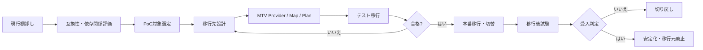

# MTV / VM 移行

> [!NOTE]
> 本資料は、インフラ経験者が実務成果物を読み解くための技術リファレンスです。OpenShift に関する構成とコマンドは OpenShift Container Platform 4.22 を具体例とします。実環境へ適用する前に、対象 z-stream、プラットフォーム、権限、変更手順、製品間の互換性、サポート条件を公式資料と組織標準で確認してください。

VM 移行は「コピーが成功したら完了」ではありません。現行資産の棚卸し、互換性、停止調整、ネットワーク切替、業務試験、切り戻しを一つの計画として管理します。この章では Migration Toolkit for Virtualization（MTV）を VMware から OpenShift Virtualization への移行文脈で整理します。

## Migration Toolkit for Virtualization とは

MTV は、VMware vSphere などの移行元から OpenShift Virtualization へ VM を移行するための Red Hat の Operator／ツール群です。Provider、NetworkMap、StorageMap、Plan などを設定し、インベントリ取得、検証、ディスクコピー、変換、移行先 VM の作成、進捗確認を支援します。

MTV は移行プロジェクト全体を自動判断するものではありません。

- MTV が支援: 接続、インベントリ、マッピング、コピー、変換、移行ジョブ、検証メッセージ。
- 人が判断: 対象・順序、OS／アプリ対応、停止時間、バックアップ、IP/DNS 切替、性能、業務受入、切り戻し。

## VMware から OpenShift Virtualization への流れ



代表的な工程:

1. 移行元と業務台帳を突合し、所有者のない VM を解消する。
2. 対応 OS、仮想ハードウェア、ディスク、デバイス、VMware Tools、暗号化、スナップショットを評価する。
3. 移行先の Project、RBAC、Node、StorageClass、NAD、IP/DNS、バックアップ、監視を設計する。
4. MTV の Provider、StorageMap、NetworkMap、Plan を非本番で構成し validation を読む。
5. PoC／リハーサルで所要時間、停止時間、データ整合、性能、運用を測る。
6. 本番切替では変更凍結、最終同期、停止、起動、ネットワーク切替、試験、承認を時系列で実施する。
7. 安定化期間と切り戻し期限を経てから、移行元を承認の上で廃止する。

## Cold / Warm / Live を混同しない

- **Cold migration:** 移行元 VM を停止してデータをコピー・変換します。単純化しやすい一方、データ量に応じた停止時間が必要です。
- **Warm migration:** VM 稼働中に事前コピーを繰り返し、最終切替時に停止します。停止短縮を狙えますが、変更量、帯域、snapshot、移行元制約を確認します。
- **Live migration:** 用語が二つの文脈で使われます。OpenShift Virtualization 内の Node 間 Live Migration と、MTV が対応する移行元／先間の live migration は別です。

現行の対応 provider、最小 MTV/OCP 版、共通ストレージ要件、Technology Preview の状態は変わります。2026-08 時点でも案件で使う組合せを公式資料で **要確認** とし、「VMware から常に無停止移行できる」と説明しません。

## 移行対象 VM の棚卸し

移行台帳は vCenter の機械的インベントリだけでなく、業務情報と依存関係を結び付けます。

| 分類 | 主な項目 | 理由 |
| --- | --- | --- |
| 識別 | VM 名、UUID、vCenter、Cluster、所有部門、業務名 | 重複や所有者不明をなくす |
| OS | OS/版、kernel、architecture、boot mode、driver | 移行先サポートと起動可否 |
| 計算 | vCPU、予約、平均／ピーク CPU、メモリ、NUMA | 移行先サイジング |
| ディスク | 台数、容量、使用量、IOPS、形式、snapshot、暗号化 | コピー時間、StorageClass、性能 |
| NW | NIC 数、Port Group、VLAN、MAC、IP、GW、DNS、FW | NAD と切替設計 |
| 依存 | DB、共有 FS、AD/LDAP、外部 API、監視、バックアップ | 移行 Wave と試験 |
| 運用 | SLA、監視、ジョブ、起動停止順、パッチ、保守時間 | Runbook 移行 |
| 契約 | OS、DB、製品ライセンス、サポート | 移行先で利用可能か |

### 棚卸しの品質確認

- 電源 OFF、template、orphan、重複名、長期 snapshot を分類する。
- vCenter 値とゲスト OS の実使用量、CMDB、監視実績を突合する。
- 所有者が確認した日付と、移行／廃止／保留の判断根拠を残す。
- 認証情報、実 IP、ホスト名を公開資料や未承認の AI サービスへ投入しない。

## VM 台数

台数は工数・期間を直接決めますが、「100台」のような合計だけでは不足です。

- 業務、重要度、依存グループ、データ量、停止枠、移行方式で Wave を作る。
- 並列数はネットワーク帯域、移行元 datastore、移行先 storage、MTV の制約から決める。
- 失敗再実行、リハーサル、切り戻し、休日対応の余力を含める。
- 移行対象外、廃止、統合、再構築、コンテナ化を分け、不要 VM をそのまま移さない。

## OS

確認項目:

- OS 名、version、architecture、kernel、BIOS/UEFI、Secure Boot。
- ベンダーサポート期限、OpenShift Virtualization 対応ゲスト OS、virtio driver。
- VMware Tools の削除／置換、guest agent、NIC／storage driver、fstab、initramfs。
- Windows activation、RHEL subscription、時刻同期、cloud-init／Sysprep。
- 固定デバイス名、udev rule、MAC 依存ライセンスの有無。

MTV validation が警告なしでも、アプリケーションベンダーが新基盤をサポートするとは限りません。各ベンダーへ **要確認** です。

## CPU / メモリ

- 割当 vCPU／メモリと、監視で得た平均・ピーク・95 percentile を比較する。
- VMware の reservation／limit／share を、Kubernetes requests／limits、専用 CPU、overcommit 方針へマッピングする。
- CPU 命令依存、NUMA、Huge Pages、latency sensitivity、ライセンスの socket/core 数を確認する。
- Node 障害・保守で VM を退避できる容量を残す。
- memory balloon、swap、ゲスト OOM、アプリケーション heap の状態を確認する。

割当値の単純合計をそのまま必要容量とせず、実測と業務成長率、基盤 overhead、障害時余力を使います。

## ディスク容量

確認する値:

- Provisioned、実使用、増加率、thin／thick、snapshot 増分。
- Disk ごとの IOPS、throughput、latency、read/write 比率、block size。
- boot/data/log/temp の用途、整合性グループ、暗号化、multipath。
- コピー元読出し、ネットワーク、移行先書込の実効速度。

所要時間の概算は次の考え方です。

```text
移行時間 ≒ 実コピー量 ÷ 実効スループット + 変換・検証・再試行時間
```

理論帯域ではなく PoC の実測を使い、warm migration では変更率と最終同期量も考慮します。容量単位（GB/GiB、Gbps/GB/s）を混同しません。

## ネットワーク

移行元 Port Group と移行先 NAD／Pod Network を一対一とは限らず、業務フローから再設計します。

- VLAN ID、MTU、NIC 数、MAC、IP、Gateway、DNS、NTP、proxy。
- 物理 Node NIC／bond、switch trunk、CNI、IPAM、NetworkPolicy。
- North-South と East-West の通信、NAT、Firewall、Load Balancer、戻り経路。
- 移行通信専用ネットワークの帯域、暗号化、vCenter／ESXi 到達性。
- パケットキャプチャやログの取得責任。

## 固定 IP

固定 IP は MTV だけで自動的に安全に移るとは限りません。ゲスト内設定、MAC 依存 DHCP、外部 IPAM、DNS、Firewall、監視を確認します。

切替時の基本原則:

1. 変更凍結と最新バックアップを確認する。
2. 移行元 VM を停止し、同一 IP の二重起動を防ぐ。
3. 移行先 VM を起動し、IP、route、DNS、ARP/ND、FW を確認する。
4. 利用者地点から疎通・業務試験を行う。
5. 切り戻し時は移行先を確実に停止してから移行元を起動する。

DNS 切替を伴う場合は TTL 低減の実施日、cache 残存、元に戻す TTL、証明書 SAN まで計画します。

## 停止可能時間

業務側の「停止は短く」という要望を、測定可能な時間に分解します。

- アプリ停止、DB 停止、最終同期、変換、起動、IP/DNS 切替、技術試験、業務試験、承認バッファ。
- 許容停止開始／終了、サービス再開判断者、超過時の判断時刻。
- cold／warm の選択、変更量抑制、移行 Wave の大きさ。
- 移行中のジョブ、バッチ、外部送信、データ更新を止める方法。

リハーサル結果からタイムチャートを更新し、希望値を実績のように扱いません。

## バックアップ

移行直前バックアップでは、次を確認します。

- バックアップ対象、時刻、方式、保存先、暗号化、成功ログ。
- DB／アプリケーション整合性、quiesce、トランザクション停止。
- 移行元だけでなく、移行先で復元できる形式・権限・ネットワークか。
- 復元テスト日、復元所要時間、担当者、手順の版。

snapshot は短期的な差分保持であり、同じ datastore を失う障害への独立バックアップとは限りません。

## 切り戻し

切り戻し計画は「失敗したら戻す」ではなく、判断可能な手順にします。

| 項目 | 記載例 |
| --- | --- |
| 発動条件 | P1 機能試験失敗、性能が基準未満、判断期限超過 |
| 判断者 | 業務責任者、移行責任者、基盤責任者 |
| 最終判断時刻 | 02:00 まで。超過時は自動的に切り戻し等 |
| データ方針 | 移行先で発生した更新を破棄／逆同期／手作業反映 |
| 操作 | 移行先停止、IP/DNS 復元、移行元起動、疎通・業務試験 |
| 証跡 | 時刻、担当、出力、判断、残課題 |

最大の論点は、切替後に移行先で更新されたデータをどう扱うかです。技術担当だけで決めず、業務所有者と事前合意します。

## PoC 対象選定

最初の PoC に「最も簡単な VM だけ」または「最重要 VM」を選ぶのは偏ります。学びたいリスクを代表する少数を選びます。

- 標準 Linux／Windows VM: 基本経路の確認。
- 大容量／高 I/O VM: コピー時間と性能。
- 複数 NIC／固定 IP／VLAN: ネットワークマッピング。
- DB や複数層アプリ: 整合性と起動順。
- 対応が疑わしい OS／デバイス: 非互換を早く発見。ただし PoC 可能な隔離環境で行う。

成功基準、取得メトリクス、停止時間、再現手順、未確認リスクを先に定義します。

## MTV 設定要素

名称や API version は対象版で **要確認** ですが、概念は次のとおりです。

- **Provider:** vCenter 等の移行元と OpenShift Virtualization 移行先への接続情報。
- **StorageMap:** 移行元 datastore を移行先 StorageClass へ対応付ける。
- **NetworkMap:** Port Group／network を Pod Network または NAD へ対応付ける。
- **Plan:** 対象 VM、mapping、移行方式、hooks 等をまとめた移行単位。

資格情報は Secret として最小権限で管理し、Git、公開資料、チケット、AI へ平文を貼り付けません。vCenter 証明書検証を無効化する設定を恒常利用しないよう、信頼 CA を整備します。

## 移行後試験

### 基盤確認

- VM/VMI が期待 Node、CPU、メモリ、disk、NIC で Running／Ready か。
- DataVolume/PVC、StorageClass、容量、I/O、snapshot／backup が正常か。
- IP、route、DNS、NTP、VLAN、Firewall、Load Balancer、監視が正常か。
- guest agent、virtio driver、ログ、時刻、SELinux／Firewall が正常か。

### アプリケーション確認

- サービス起動順、プロセス、待受ポート、DB 接続、外部 API、バッチ、帳票。
- 参照だけでなく、承認されたテストデータによる更新と整合性。
- 性能、応答時間、同時接続、再起動後、日跨ぎ／時刻依存処理。
- 業務所有者の受入と、未確認項目の残留リスク。

### 運用確認

- 監視通知、ログ検索、バックアップ／復元、アカウント、パッチ、起動停止手順。
- Node drain／Live Migration の可否、失敗時のエスカレーション。
- CMDB、構成図、Runbook、ライセンス台帳、問い合わせ先の更新。

## 読み取り中心の確認コマンド

MTV API の正確な short name は導入版で確認します。

```bash
oc get subscriptions.operators.coreos.com -A | grep -Ei 'migration|mtv'
oc api-resources | grep -Ei 'forklift|migration|provider|mapping|plan'
oc get pods -A | grep -Ei 'forklift|migration'
oc get virtualmachines -A
oc get virtualmachineinstances -A -o wide
oc get datavolumes -A
oc get pvc -A
oc get network-attachment-definitions.k8s.cni.cncf.io -A
oc get events -n <mtv-namespace> --sort-by=.lastTimestamp
```

Plan 実行後は Web コンソールまたは対象版 API で、validation、各 phase、失敗 step、転送量、所要時間を証跡化します。エラーだけを再試行せず、移行元と移行先に残ったリソースを確認します。

## 公式情報

- [Migration Toolkit for Virtualization documentation](https://docs.redhat.com/en/documentation/migration_toolkit_for_virtualization/)
- [Planning your migration to Red Hat OpenShift Virtualization](https://docs.redhat.com/en/documentation/migration_toolkit_for_virtualization/2.10/html/planning_your_migration_to_red_hat_openshift_virtualization/)
- [Installing and using Migration Toolkit for Virtualization](https://docs.redhat.com/en/documentation/migration_toolkit_for_virtualization/2.10/html/installing_and_using_the_migration_toolkit_for_virtualization/)
- [Red Hat OpenShift Virtualization](https://docs.redhat.com/en/documentation/openshift_container_platform/4.22/html/virtualization/)

> 参照日は **2026-08-13** です。MTV `2.10`、OCP `4.22` は本資料で用いる具体例です。cold/warm/live の対応元、必要版、Technology Preview、VDDK、ゲスト OS、ネットワーク／ストレージ制約は更新されるため、案件の組合せで **要確認** です。

## 実務での説明要点

- VM 移行は、OS、CPU・メモリ実績、ディスク I/O、ネットワーク、固定 IP、依存先、停止可能時間を棚卸しして計画する。
- StorageMap、NetworkMap、Plan を用いた代表 VM の PoC とリハーサルで、変換・停止・性能・運用上のリスクを確認する。
- 完了判定には業務試験、監視、バックアップを含め、データ差分まで考慮した切り戻し条件と最終判断時刻を事前に決める。
