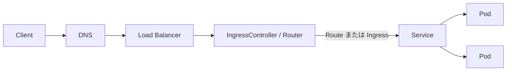

# OpenShift 基本知識

> [!NOTE]
> 本資料は、インフラ経験者が実務成果物を読み解くための技術リファレンスです。OpenShift に関する構成とコマンドは OpenShift Container Platform 4.22 を具体例とします。実環境へ適用する前に、対象 z-stream、プラットフォーム、権限、変更手順、製品間の互換性、サポート条件を公式資料と組織標準で確認してください。

この章では、Kubernetes の基礎を前提に、OpenShift で追加・拡張される概念を「実務では何を確認するか」までつなげて整理します。

## Kubernetes と OpenShift の違い

### 初学者向け説明

Kubernetes はコンテナを配置・回復・拡張するオーケストレーション基盤です。OpenShift Container Platform（OCP）は Kubernetes を中核に、インストール、更新、認証、開発者向けビルド、イメージ管理、Route、監視、Operator 管理などを統合した製品です。

OpenShift でも Pod、Deployment、Service、ConfigMap、Secret など Kubernetes API を使います。その上に、Route、Project、ImageStream、BuildConfig、SCC など OpenShift 固有または拡張された API と運用機能があります。

### 実務での意味

- Kubernetes の知識は土台ですが、OCP のサポートされた変更方法、ClusterOperator、Machine Config Operator、組み込み監視、更新経路を理解する必要があります。
- 「Linux ホストを直接直す」よりも、宣言的 API と Operator の調整ループを使います。RHCOS ノードの永続設定は原則 MachineConfig 等のサポートされた方法を確認します。
- 製品としてのサポート範囲、互換性、更新チャネル、Red Hat 提供 Operator の条件が設計判断に加わります。

### 実務での説明要点

- Kubernetes がコンテナオーケストレーションの中核で、OpenShift はそこへ認証、Route、SCC、Operator、更新、監視、ビルド・イメージ管理などを統合します。実務では、標準 Kubernetes API と OpenShift 固有 API の境界を明確にします。

## Project / Namespace

### 初学者向け説明

Namespace は Kubernetes リソースを論理的に分ける境界です。OpenShift の Project は Namespace を利用者向けに扱いやすくした概念で、Project の表示名・説明、作成時の処理、アクセス制御など OpenShift の仕組みと結び付きます。

### 実務での意味

- システム、環境、チーム、機密度のどれで Project を分けるかを決めます。
- RBAC、ResourceQuota、LimitRange、NetworkPolicy、バックアップ、費用配賦、削除ライフサイクルを Project と対応付けます。
- Namespace は強いマルチテナント境界を単独で保証するものではありません。RBAC、ネットワーク、SCC、ノード分離などを組み合わせます。

```bash
oc new-project demo-app
oc project demo-app
oc get project demo-app
oc describe resourcequota -n demo-app
oc describe limitrange -n demo-app
```

### 実務での説明要点

- Project は Kubernetes Namespace を基盤にした OpenShift の利用単位です。実務では名前を分けるだけでなく、RBAC、Quota、LimitRange、NetworkPolicy、所有者、廃止手順までセットで管理します。

## Route / Ingress

### 初学者向け説明

Service は通常クラスタ内部の入口です。Kubernetes Ingress と OpenShift Route は、HTTP/HTTPS の外部公開ルールを表します。OpenShift の IngressController が Router Pod を管理し、Route をもとに通信を Service、Pod へ転送します。



### 実務での意味

- Route は `edge`、`reencrypt`、`passthrough` などの TLS 終端方式を選べます。方式により証明書の配置場所とバックエンド暗号化が変わります。
- DNS、LB、IngressController、Route、Service、EndpointSlice、Pod readiness を順に追うと切り分けやすくなります。
- Route 固有機能と標準 Ingress の可搬性を比較します。Gateway API を含む採用可否は対象版で **要確認** です。

```bash
oc get ingresscontroller -n openshift-ingress-operator
oc get route -A
oc describe route demo -n demo-app
oc get service demo -n demo-app
oc get endpointslice -n demo-app -l kubernetes.io/service-name=demo
oc get pods -n openshift-ingress -o wide
```

### 実務での説明要点

- Route は OpenShift 固有の外部公開 API で、IngressController が Router を管理します。アクセス障害では DNS、LB、Router、Route、Service、EndpointSlice、Pod の順で確認します。

## SCC

### 初学者向け説明

Security Context Constraints（SCC）は、Pod がどのセキュリティ条件で動けるかを制御する OpenShift のクラスタスコープリソースです。実行 UID、特権コンテナ、Linux capability、hostPath、hostNetwork、SELinux などを制限します。

### 実務での意味

- Pod 作成主体が利用可能な SCC の中から条件を満たす SCC が選ばれます。SCC 名を Pod に単純指定する仕組みではありません。
- 起動できないからと `privileged` を付与すると、ホストへの影響範囲が拡大します。まずイベント、Pod の SecurityContext、イメージが要求する UID／書込先を確認します。
- 独自 SCC は最小権限、専用 ServiceAccount、所有者、期限、監査をセットにします。Pod Security Admission との関係は対象版で **要確認** です。

```bash
oc get securitycontextconstraints
oc describe securitycontextconstraints restricted-v2
oc adm policy who-can use securitycontextconstraints/restricted-v2
oc auth can-i use securitycontextconstraints/restricted-v2 --as=system:serviceaccount:demo-app:demo
oc get pod demo -n demo-app -o jsonpath='{.metadata.annotations.openshift\.io/scc}{"\n"}'
```

### 実務での説明要点

- SCC は Pod の特権、UID、capability、ホスト資源利用を制限します。エラー時は privileged を安易に付けず、イベントと必要権限を比較します。

## RBAC

### 初学者向け説明

Role／ClusterRole は「許可する操作」、RoleBinding／ClusterRoleBinding は「誰に結び付けるか」です。RoleBinding は Namespace 内、ClusterRoleBinding はクラスタ全体に効果を持ちます。ClusterRole を RoleBinding で特定 Namespace にだけ付与することもできます。

### 実務での意味

- 人には IdP グループ経由、自動化には専用 ServiceAccount を使い、`cluster-admin` を常用しません。
- `get`、`list`、`watch` と `create`、`patch`、`delete` の差、サブリソース（例: `pods/log`）まで設計します。
- 付与試験だけでなく、許可していない操作が拒否されることも確認します。

```bash
oc get role,rolebinding -n demo-app
oc get clusterrole,clusterrolebinding
oc auth can-i get pods -n demo-app --as=alice
oc auth can-i delete pods -n demo-app --as=alice
oc auth can-i --list -n demo-app --as=system:serviceaccount:demo-app:demo
```

### 実務での説明要点

- RBAC は操作権限、SCC は Pod の実行条件を制御する点が違います。グループと専用 ServiceAccount へ最小権限を付与し、`oc auth can-i` で肯定・否定の両方を試験します。

## Operator / OperatorHub / OLM

### 初学者向け説明

Operator は、特定ソフトウェアの導入、設定、更新、回復などの運用知識をコントローラーとして実装します。OperatorHub は利用可能な Operator を探す入口です。Operator Lifecycle Manager（OLM）は CatalogSource、Subscription、InstallPlan、ClusterServiceVersion（CSV）などを用いてライフサイクルを管理します。

### 実務での意味

- Subscription の Channel と InstallPlan の自動／手動承認は更新統制に直結します。
- CSV の状態だけでなく、Operator Pod、Subscription、InstallPlan、イベント、対象 Custom Resource の状態を確認します。
- Operator の提供種別、権限、CRD、OCP 互換性、アップグレード経路、バックアップを事前に評価します。

```bash
oc get catalogsources.operators.coreos.com -A
oc get subscriptions.operators.coreos.com -A
oc get installplans.operators.coreos.com -A
oc get clusterserviceversions.operators.coreos.com -A
oc describe subscription <subscription-name> -n <operator-namespace>
oc describe installplan <installplan-name> -n <operator-namespace>
oc get events -n <operator-namespace> --sort-by=.lastTimestamp
```

### 実務での説明要点

- Operator は運用ロジックをコントローラー化したもので、OLM が CatalogSource、Subscription、InstallPlan、CSV を通して導入・更新を管理します。導入時は提供元、Channel、承認方式、権限、更新経路を確認します。

## ClusterOperator

### 初学者向け説明

ClusterOperator は OpenShift の主要プラットフォーム機能の状態を集約して示すリソースです。主に `Available`、`Progressing`、`Degraded` などの Condition を確認します。

### 実務での意味

- `Degraded=True` は入口であり、原因そのものとは限りません。Condition の reason/message、関連 namespace の Operator Pod、イベント、ログへ掘り下げます。
- 更新前後には ClusterVersion と全 ClusterOperator の状態を確認します。
- Status を手作業で直すのではなく、Operator が観測している原因を解消します。

```bash
oc get clusteroperators
oc describe clusteroperator <clusteroperator-name>
oc get clusterversion
oc describe clusterversion version
oc get pods -n <operator-namespace>
oc logs <operator-pod-name> -n <operator-namespace> --all-containers --tail=200
```

### 実務での説明要点

- ClusterOperator の Available、Progressing、Degraded を入口に、Condition のメッセージ、関連 Pod、イベント、ログを追います。状態だけを書き換えず、調整ループが失敗する原因を確認します。

## MachineConfig / MachineConfigPool

### 初学者向け説明

MachineConfig は RHCOS ノードの OS 設定を宣言し、Machine Config Operator（MCO）が適用します。MachineConfigPool（MCP）は `master`、`worker` など同じ設定を受けるノード群を表します。

### 実務での意味

- 設定変更から rendered MachineConfig が生成され、ノードが順次更新されます。変更内容によっては drain、再起動が発生します。
- RHCOS を SSH で直接恒久変更すると、宣言状態と実状態がずれ、後で上書きされる可能性があります。
- PDB、容量余力、更新順序、`maxUnavailable`、保守時間を確認して変更します。

```bash
oc get machineconfig
oc get machineconfigpool
oc describe machineconfigpool worker
oc get nodes -o jsonpath='{range .items[*]}{.metadata.name}{"\t"}{.metadata.annotations.machineconfiguration\.openshift\.io/state}{"\t"}{.metadata.annotations.machineconfiguration\.openshift\.io/currentConfig}{"\t"}{.metadata.annotations.machineconfiguration\.openshift\.io/desiredConfig}{"\n"}{end}'
oc get machineconfigpool worker -o jsonpath='{.status.conditions}{"\n"}'
```

上の JSONPath は、Node の label ではなく MCO が記録する annotation から、`NAME / STATE / CURRENT / DESIRED` の順に値を表示します。列名は出力されないため、調査記録にはこの順序も残します。

### 実務での説明要点

- RHCOS の恒久設定は MachineConfig と MCP を通して宣言的に管理し、直接編集を避けます。適用時は drain・再起動、PDB、退避余力、MCP の Updated/Updating/Degraded を確認します。

## BuildConfig

### 初学者向け説明

BuildConfig は、ソースコードや Dockerfile、入力イメージからコンテナイメージを生成する OpenShift API です。Source-to-Image、Docker/Containerfile、Pipeline 以外のビルド方式などを構成できますが、利用可能方式や推奨は対象版で **要確認** です。

### 実務での意味

- ソース、builder image、Secret、出力 ImageStreamTag、トリガー、リソース制限を管理します。
- ビルド Pod も SCC、Quota、NetworkPolicy、外部 Registry、プロキシの影響を受けます。
- Tekton/OpenShift Pipelines や外部 CI との役割分担、供給網セキュリティ、署名・スキャンを決めます。

```bash
oc get buildconfigs -n demo-app
oc describe buildconfig demo -n demo-app
oc get builds -n demo-app
oc logs build/<build-name> -n demo-app
oc get events -n demo-app --sort-by=.lastTimestamp
```

### 実務での説明要点

- BuildConfig は OpenShift のビルド定義で、入力ソース、builder、出力イメージ、トリガーを管理します。Pipelines や外部 CI との使い分けは、既存標準とライフサイクル要件で決めます。

## ImageStream

### 初学者向け説明

ImageStream は実イメージ本体ではなく、コンテナイメージとタグ、digest の参照・履歴を OpenShift 内で管理する抽象です。ImageStreamTag の変化をビルドやデプロイのトリガーにできます。

### 実務での意味

- `latest` のような可変タグだけに依存せず、digest 固定、昇格、ロールバック、保持方針を決めます。
- 内部 Registry、外部 Registry、認証 Secret、信頼 CA、import policy の関係を確認します。
- ImageStream のメタデータと Registry 上の blob のバックアップ／削除を区別します。

```bash
oc get imagestreams -n demo-app
oc describe imagestream demo -n demo-app
oc get imagestreamtag demo:stable -n demo-app
oc image info image-registry.openshift-image-registry.svc:5000/demo-app/demo:stable
```

最後の `oc image info` は、`.svc` 名を解決できるクラスタ内の端末または承認済み toolbox Pod から、Registry 認証と CA 信頼を設定して実行する例です。クラスタ外の端末では、既定 Route が有効な場合に限り `oc registry info --public` で到達可能な endpoint を確認し、公式手順で認証します。TLS 検証を無効化して回避しません。

### 実務での説明要点

- ImageStream はイメージそのものではなく、タグや digest の参照を OpenShift 内で管理する仕組みです。ビルドやデプロイのトリガー、環境間昇格、履歴管理に関係します。

## Internal Registry

### 初学者向け説明

OpenShift Image Registry はクラスタ内のコンテナイメージを保管する組み込み Registry です。BuildConfig の出力や ImageStream と組み合わせられます。

### 実務での意味

- Registry Operator、Registry Pod、ストレージ、Route、認証、容量、pruning を確認します。
- マネージドサービスやプラットフォームによりストレージと公開方法が異なるため **要確認** です。
- 可用性とバックアップ要件は「再ビルドできるか」「外部 Registry が原本か」により変わります。

```bash
oc get configs.imageregistry.operator.openshift.io cluster -o yaml
oc get clusteroperator image-registry
oc get pods -n openshift-image-registry
oc get pvc -n openshift-image-registry
oc get route default-route -n openshift-image-registry
```

### 実務での説明要点

- 内部 Registry は BuildConfig の成果物などを保管し、ImageStream と連携します。実務設計では永続ストレージ、容量、pruning、公開範囲、外部 Registry との役割を確認します。

## OpenShift Monitoring

### 初学者向け説明

組み込み監視は OpenShift プラットフォームのメトリクス、アラート、ダッシュボードを提供します。ユーザーワークロード監視を有効化すれば、アプリケーション側の ServiceMonitor／PodMonitor 等も扱えます。

### 実務での意味

- Platform 監視とユーザーワークロード監視の責任・設定を分けます。
- Prometheus、Alertmanager、Thanos Querier などの構成は版により変わるため、サポートされた設定箇所を **要確認** です。
- 保持期間、PVC、cardinality、アラート通知、サイレンス、Runbook を設計します。

```bash
oc get clusteroperator monitoring
oc get pods -n openshift-monitoring
oc get prometheusrules -A
oc get servicemonitors -A
oc get configmap cluster-monitoring-config -n openshift-monitoring -o yaml
oc adm top nodes
oc adm top pods -A
```

### 実務での説明要点

- OpenShift Monitoring は組み込みのプラットフォーム監視で、ユーザーワークロード監視とは責任を分けます。保持容量、通知経路、一次対応、通知試験まで設計します。

## OpenShift Logging

### 初学者向け説明

OpenShift Logging は、コンテナ、インフラ、監査ログの収集・転送・保存・検索を構成するための機能群です。近年の構成では Loki と Vector などが使われますが、製品版と採用構成で異なります。

### 実務での意味

- ログ種別、収集 namespace、転送先、保持、権限、機密情報、時刻同期を決めます。
- Logging は OCP 本体と別の Operator／製品ライフサイクルを持つ場合があるため、互換性を **要確認** です。
- `ClusterLogForwarder` などの API バージョン、受信先停止時のバッファ・再送・欠損を確認します。

```bash
oc get subscriptions.operators.coreos.com -A | grep -i logging
oc api-resources | grep -Ei 'loki|logforward|logging'
oc get pods -A | grep -Ei 'loki|vector|logging'
oc get events -n <logging-namespace> --sort-by=.lastTimestamp
```

### 実務での説明要点

- OpenShift Logging はログ収集・転送・保存・検索の仕組みで、構成要素は版依存です。application、infrastructure、audit を区分し、保持・権限・転送障害時の動作を設計します。

## oc / kubectl

### 初学者向け説明

`kubectl` は Kubernetes API の標準 CLI です。`oc` は Kubernetes リソースを操作できる上で、Project、Route、Build、Image、管理診断など OpenShift 固有の機能を追加します。

### 実務での意味

- 通常の Kubernetes 操作にはどちらも使えますが、OCP 固有リソースや `oc adm`、`oc debug` では `oc` を使います。
- CLI とクラスタの互換性、ログイン先、現在 Project、実行ユーザーを最初に確認します。
- 変更コマンドは YAML、差分、チケット、ロールバックを用意し、読み取りコマンドと区別します。

### 実務での説明要点

- `oc` は `kubectl` 相当の Kubernetes 操作に加え、Project、Route、Build、Image、`oc adm` など OpenShift 固有機能を扱う CLI です。

## よく使う oc コマンド

最初にコンテキストとクラスタ全体の健全性を確認します。

```bash
oc version
oc whoami
oc whoami --show-server
oc project
oc get clusterversion
oc get clusteroperators
oc get nodes -o wide
oc get pods -A
oc get events -A --sort-by=.lastTimestamp
```

対象 Project のリソースを確認します。

```bash
PROJECT_NAME=demo-app
oc get deployment,statefulset,daemonset -n "${PROJECT_NAME}"
oc get pods -n "${PROJECT_NAME}" -o wide
oc get service,endpointslice -n "${PROJECT_NAME}"
oc get route,ingress -n "${PROJECT_NAME}"
oc get configmap,secret -n "${PROJECT_NAME}"
oc get pvc -n "${PROJECT_NAME}"
oc get networkpolicy -n "${PROJECT_NAME}"
oc get role,rolebinding,serviceaccount -n "${PROJECT_NAME}"
```

個別リソースの原因を掘り下げます。

```bash
oc describe pod <pod-name> -n <project-name>
oc logs <pod-name> -n <project-name> --all-containers --tail=200
oc logs <pod-name> -n <project-name> --all-containers --previous --tail=200
oc get pod <pod-name> -n <project-name> -o yaml
oc get events -n <project-name> --sort-by=.lastTimestamp
oc auth can-i --list -n <project-name>
```

`Secret` の YAML、トークン、kubeconfig、環境変数は不用意に画面やチケットへ貼り付けません。

## Pod 障害時の基本確認

### 初学者向け説明

最初に「いつから、どの範囲で、直前に何が変わったか」を固定し、Pod の Phase だけでなく Container の waiting/terminated reason とイベントを見ます。

### 実務での意味

次の順番にすると、推測で設定を変えることを避けられます。

1. **範囲:** 1 Pod、1 Node、1 Project、クラスタ全体のどこか。
2. **状態:** `get` と JSON/YAML で Pod、Container、readiness、restartCount を確認。
3. **イベント:** スケジューリング、image pull、mount、SCC、probe の失敗を確認。
4. **ログ:** 現在と `--previous`、init container、sidecar を確認。
5. **依存先:** Node、PVC、ServiceAccount/SCC、Secret、DNS、NetworkPolicy、外部 API を確認。
6. **変更:** Deployment、Image、ConfigMap、Secret、Operator、Node の変更履歴と時刻を照合。

```bash
oc get pod <pod-name> -n <project-name> -o wide
oc describe pod <pod-name> -n <project-name>
oc get pod <pod-name> -n <project-name> -o jsonpath='{range .status.containerStatuses[*]}{.name}{"\t"}{.state}{"\t"}{.restartCount}{"\n"}{end}'
oc logs <pod-name> -n <project-name> --all-containers --tail=200
oc logs <pod-name> -n <project-name> --all-containers --previous --tail=200
oc get events -n <project-name> --sort-by=.lastTimestamp
oc get node <node-name>
oc get pvc -n <project-name>
oc auth can-i use securitycontextconstraints/<scc-name> --as=system:serviceaccount:<project-name>:<serviceaccount-name>
```

### 実務での説明要点

- Pod 障害では、範囲と変更時刻を確認し、`get`、`describe`、イベント、現在／直前ログを見て、Node、PVC、SCC、Secret、DNS・NetworkPolicy へ依存関係を広げます。

## 公式情報

- [Red Hat OpenShift Container Platform ドキュメント](https://docs.redhat.com/en/documentation/openshift_container_platform/)
- [OpenShift CLI (`oc`)](https://docs.redhat.com/en/documentation/openshift_container_platform/4.22/html/cli_tools/openshift-cli-oc)
- [Authentication and authorization](https://docs.redhat.com/en/documentation/openshift_container_platform/4.22/html/authentication_and_authorization/)
- [Operators](https://docs.redhat.com/en/documentation/openshift_container_platform/4.22/html/operators/)
- [Machine configuration](https://docs.redhat.com/en/documentation/openshift_container_platform/4.22/html/machine_configuration/)
- [Monitoring](https://docs.redhat.com/en/documentation/openshift_container_platform/4.22/html/monitoring/)

> 参照日は **2026-08-13** です。リンク中の `4.22` は本資料で用いる具体例で、採用版を意味しません。API、既定値、非推奨機能、Logging の構成は変わり得るため、実案件では対象 z-stream の公式文書と `oc api-resources` で **要確認** です。

## 実務での説明要点

- OpenShift は Kubernetes を中核に、Route、SCC、Operator、更新、監視、ビルド、イメージ管理などを統合する。
- 障害調査では API リソースの状態と Operator の調整ループを起点にし、RHCOS を直接変更しない。
- OCP 4.22 の API、既定値、非推奨機能を公式資料と `oc api-resources` で確認してから設計・操作する。
