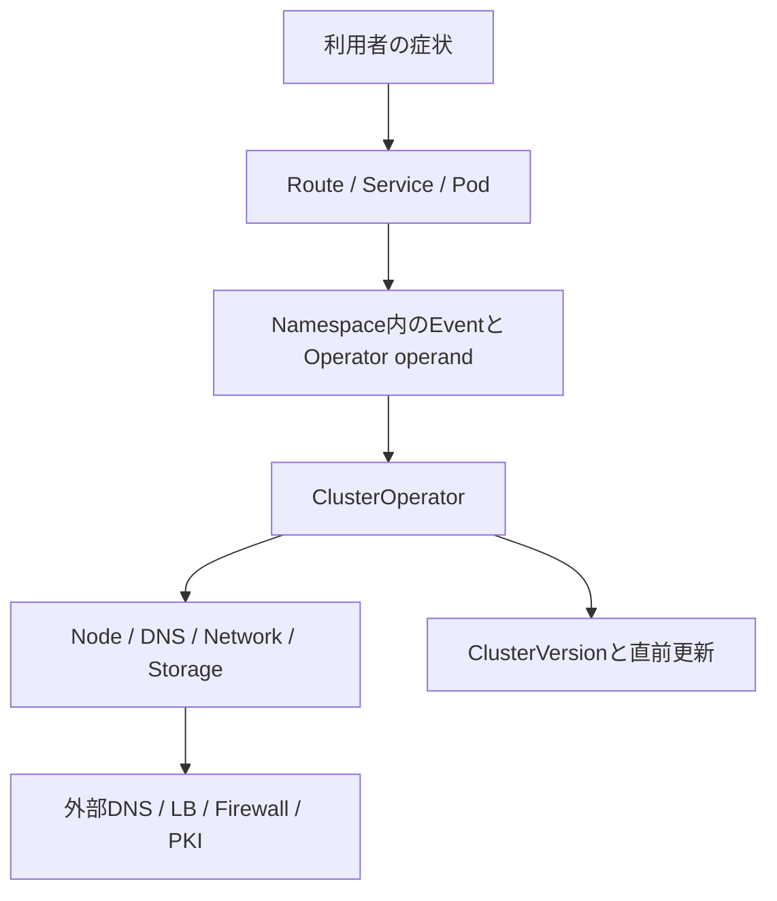

# OpenShiftトラブルシューティング

> [!NOTE]
> 本資料は、インフラ経験者が実務成果物を読み解くための技術リファレンスです。OpenShift に関する構成とコマンドは OpenShift Container Platform 4.22 を具体例とします。実環境へ適用する前に、対象 z-stream、プラットフォーム、権限、変更手順、製品間の互換性、サポート条件を公式資料と組織標準で確認してください。

> 更新基準日: 2026-08-13。例はOpenShift Container Platform 4系の一般的な考え方であり、Hosted/Managed、クラウド、採用バージョン、権限、Red Hatサポート指示により手順が変わるため**要確認**。

## OpenShiftで追加して見る層

KubernetesのPod、Node、Service、Storageに加え、OpenShiftではClusterOperator、ClusterVersion、Operator Lifecycle Manager（OLM）、SCC、Route、Ingress/DNS/Network Operatorを確認する。`Available=False`、`Progressing=True`、`Degraded=True` は重要な入口だが、各ConditionのReason/Messageと発生時刻まで読む。



## 初動コマンドと証跡

```bash
oc whoami
oc version
oc get clusterversion
oc get clusterversion version -o yaml
oc get co
oc get co -o wide
oc get nodes -o wide
oc get pods -A -o wide
oc get route -A
oc adm top nodes
oc adm top pods -A
oc get events -A --sort-by=.metadata.creationTimestamp
```

`oc adm top` はメトリクスが利用可能で、実行者に権限がある場合に動く。`oc adm must-gather` は大量の情報と環境情報を含み得るため、保存先、容量、持ち出し、マスキング、サポートへの送付可否を**要確認**とする。

```bash
oc adm must-gather --dest-dir=./must-gather-$(date +%Y%m%d-%H%M%S)
```

## SCCによる起動失敗

### 典型的な症状

リソース作成時に `unable to validate against any security context constraint`、`runAsUser`、`privileged`、`hostPath`、Capability等の拒否が出る。Admissionで拒否されPod自体が作られない場合と、作成後に別要因で起動しない場合を分ける。

### 最初に見るコマンド

```bash
oc get events -n <project名> --sort-by=.lastTimestamp
oc get deployment <deployment名> -n <project名> -o yaml
oc get serviceaccount <serviceaccount名> -n <project名> -o yaml
oc adm policy scc-subject-review -f <pod-manifest.yaml>
oc adm policy who-can use scc/<scc名>
oc get scc <scc名> -o yaml
oc get pod <pod名> -n <project名> -o jsonpath='{.metadata.annotations.openshift\.io/scc}{"\n"}'
```

### 原因候補

イメージが固定UIDやrootを前提とする、許可範囲外のUID/GID、privileged/hostNetwork/hostPath/Capability要求、ServiceAccountとSCCの関連不足、Volume type不許可がある。

### 切り分け手順

1. API応答またはEventsの拒否メッセージから、具体的なフィールドを特定する。
2. Deployment/Podの `securityContext` と、利用候補SCCの許可条件を比較する。
3. 既存Podなら実際に適用されたSCC annotationを確認する。
4. アプリが任意UIDで動く設計か、書込先権限を含めてイメージ側を確認する。
5. `scc-subject-review` でServiceAccountに適用可能なSCCを確認する。

### よくある対処

まずイメージを非root・任意UID対応に修正する。必要最小限の専用SCCと専用ServiceAccountを設計し、対象を限定する。`privileged` SCCを広く付与するのは権限過大なので避け、例外理由、リスク、承認、期限を記録する。

### 実務での説明要点

- SCC起因では拒否メッセージ、PodのsecurityContext、ServiceAccount、適用可能SCCを照合します。通すためにprivilegedを付けるのではなく、任意UID対応と最小権限を優先します。例外は承認・期限・棚卸しの対象にします。

## Operator異常

### 典型的な症状

OperatorHubから導入したOperatorのCSVが `Pending` / `Failed`、Subscriptionが更新されない、InstallPlanが承認待ち、OperandがReadyにならない、Operator Podが再起動する。

### 最初に見るコマンド

```bash
oc get subscription,csv,installplan -A
oc describe subscription <subscription名> -n <operator-namespace>
oc describe csv <csv名> -n <operator-namespace>
oc get installplan -n <operator-namespace>
oc get pods -n <operator-namespace> -o wide
oc logs deployment/<operator-deployment名> -n <operator-namespace> --all-containers=true --tail=200
oc get catalogsource -n openshift-marketplace
oc get events -n <operator-namespace> --sort-by=.lastTimestamp
```

### 原因候補

CatalogSource不調、Bundle/Image取得失敗、InstallPlan未承認、依存Operator/API不足、CRD競合、RBAC/SCC、Webhook/証明書、アップグレード経路・Channel不整合、Operator自身の障害がある。

### 切り分け手順

1. SubscriptionのState/Conditionsから、Catalog解決、InstallPlan、CSVのどこで止まったか特定する。
2. CSVのReason/Message、要件（required APIs）、関連Deploymentを確認する。
3. Operator PodのログとEventを発生時刻で突き合わせる。
4. CatalogSource Pod/接続、Registry到達性を確認する。
5. Operator管理対象のCustom Resource（Operand）のStatus/Conditionsを別に確認する。

### よくある対処

承認方針に沿ったInstallPlan承認、Registry/Catalog復旧、依存関係やChannelの是正を行う。CSV/CRDを手動削除すると依存資源へ影響するため、製品のアップグレード/アンインストール手順とサポート指示を**要確認**。

### 実務での説明要点

- Operator異常はSubscription、InstallPlan、CSV、Operator Pod、管理対象CRの順に制御面と実体を分けます。Condition と依存関係を追い、制御面と管理対象を分けて確認します。

## ClusterOperator異常

### 典型的な症状

`oc get co` で `AVAILABLE=False`、`PROGRESSING=True` が長時間継続、または `DEGRADED=True`。アップグレードが完了しない、Console、Authentication、Ingress、DNS、Network等が利用できない。

### 最初に見るコマンド

```bash
oc get co
oc describe co <clusteroperator名>
oc get co <clusteroperator名> -o yaml
oc get clusterversion
oc get clusterversion version -o yaml
oc get pods -n <関連namespace> -o wide
oc get events -n <関連namespace> --sort-by=.lastTimestamp
```

### 原因候補

Operator operandの未Ready、Node/ネットワーク/ストレージ障害、証明書、設定不整合、更新中、外部依存不通、手動変更による管理対象との競合がある。

### 切り分け手順

1. ConditionのType、Status、Reason、Message、LastTransitionTimeを記録する。
2. Messageに示されたNamespace、Deployment、DaemonSet、Nodeへ進む。
3. 単一ClusterOperator固有か、複数に波及する共通障害かを確認する。
4. ClusterVersionの更新履歴、現在Version、更新中かを確認する。
5. 既知問題とサポート記事は、正確なOCP z-streamとPlatformを指定して照合する。

### よくある対処

Conditionが示す下位原因を修正する。Operatorが管理するResourceを根拠なく直接変更しない。アップグレード中断、強制的なVersion変更、制御Plane操作はRed Hatサポートと手順を**要確認**。

### 実務での説明要点

- ClusterOperatorではAvailable、Progressing、DegradedのCondition、Reason、Message、遷移時刻を見て、示されたOperandへ降ります。複数COの異常ならDNS、Network、Nodeなど共通原因も疑います。

## Routeでアクセスできない

### 典型的な症状

RouteのFQDNで名前解決不可、timeout、TLS handshake error、503、404となる。OpenShift Routerから503が返る場合は、Routeは到達してもBackendが利用不能な可能性がある。

### 最初に見るコマンド

```bash
oc get route -A
oc get route <route名> -n <project名> -o wide
oc describe route <route名> -n <project名>
oc get service <service名> -n <project名> -o yaml
oc get endpointslice -n <project名> -l kubernetes.io/service-name=<service名> -o wide
oc get ingresscontroller -n openshift-ingress-operator
oc get pods -n openshift-ingress -o wide
dig <routeのFQDN>
curl -vk --connect-timeout 5 https://<routeのFQDN>/
```

### 原因候補

Route host/path、Service名/targetPort、Endpointなし、TLS terminationとBackend protocol不整合、証明書/Secret、wildcard DNS、LB/Firewall、IngressController/Router異常がある。

### 切り分け手順

1. `oc describe route` のRequested Host、Admitted状態、Router名を確認する。
2. DNS、TCP、TLS、HTTPの順に試し、どの層で失敗するか記録する。
3. ServiceとEndpointSlice、PodのReadiness、Pod直通を確認する。
4. edge/passthrough/reencryptと、宛先PodのHTTP/HTTPS、証明書信頼を照合する。
5. 複数Route共通ならIngressController、Router Pod、LB health check、wildcard DNSへ広げる。

### よくある対処

Service/targetPort、Route termination、証明書、DNS/LB/Firewallを是正する。`insecureEdgeTerminationPolicy` の緩和やTLS検証無効化はセキュリティ要件を確認せずに行わない。

### 実務での説明要点

- Route不通ではRouteのAdmitted、DNS、LB/TLS、Router、Service、Endpoint、Podの順で確認します。503ならRouterまで届いた可能性を手掛かりに、Backend側を優先します。

## 証明書問題

### 典型的な症状

`certificate expired`、`x509: certificate signed by unknown authority`、hostname mismatch、TLS handshake errorが発生する。API、Route、Webhook、Registry、外部連携など影響箇所は広い。

### 最初に見るコマンド

```bash
openssl s_client -connect <host名>:443 -servername <host名> -showcerts </dev/null
echo | openssl s_client -connect <host名>:443 -servername <host名> 2>/dev/null | openssl x509 -noout -subject -issuer -serial -dates -ext subjectAltName
curl -v --connect-timeout 5 https://<host名>/
oc get secret <tls-secret名> -n <project名> -o jsonpath='{.data.tls\.crt}' | base64 -d | openssl x509 -noout -subject -issuer -dates -ext subjectAltName
oc get co
oc get events -A --sort-by=.metadata.creationTimestamp
```

### 原因候補

期限切れ、SAN不一致、秘密鍵との不一致、中間CA欠落、クライアントTrust Store不足、古いSecret参照、時刻ずれ、自動ローテーション停滞、reencrypt宛先CA不一致がある。

### 切り分け手順

1. 接続先FQDN、提示された証明書Chain、SAN、Issuer、期限を確認する。
2. サーバ側証明書、クライアントTrust、SNI/hostnameを別々に確認する。
3. すべての利用者か特定クライアントだけかを比較する。
4. Route termination、Secret参照、LBでTLS終端しているかを構成図で特定する。
5. NTPと証明書ローテーションを管理するOperatorのConditionを確認する。

### よくある対処

正しい証明書Chain/Secretへの更新、Trust Store配布、時刻同期、Operatorの下位原因修正を行う。秘密鍵を画面、ログ、Git、調査資料へ貼らない。OpenShift管理証明書を手動交換する前に該当版手順を**要確認**。

### 実務での説明要点

- 証明書問題では、FQDN、SNI、SAN、期限、Issuer、Chainを確認し、サーバ証明書とクライアント信頼を分けます。秘密鍵は取得・共有せず、管理主体と更新手順を確認します。

## DNS問題

### 典型的な症状

Pod内Service名、API名、Route wildcard名、外部FQDNのいずれかが解決できない。全体、特定Node、特定Namespace、特定suffixのみなど影響範囲が異なる。

### 最初に見るコマンド

```bash
oc get co dns
oc describe co dns
oc get dns.operator/default -o yaml
oc get pods -n openshift-dns -o wide
oc logs -n openshift-dns -l dns.operator.openshift.io/daemonset-dns=default -c dns --tail=200
oc exec -n <project名> <確認元pod名> -- cat /etc/resolv.conf
oc exec -n <project名> <確認元pod名> -- dig kubernetes.default.svc.cluster.local
dig api.<cluster名>.<baseDomain>
dig test.apps.<cluster名>.<baseDomain>
```

### 原因候補

DNS Operator/CoreDNS Pod異常、上流Resolver不通、forward設定、Nodeごとの差、Pod/Service CIDR通信、NetworkPolicy、外部ゾーンのAPI/wildcard record誤り、negative cacheがある。

### 切り分け手順

1. クラスタ内Service、API FQDN、apps wildcard、一般外部FQDNを別々に確認する。
2. Pod内 `/etc/resolv.conf` とDNS Serviceへの到達性を確認する。
3. DNS ClusterOperator、DaemonSet、Podログ、Node偏りを確認する。
4. 外部DNSの権威サーバ、委任、TTL、A/AAAA/CNAMEを管理者と確認する。
5. 変更後はResolver cacheとTTLを考慮し、複数地点から再確認する。

### よくある対処

上流Resolver、DNS Operator設定、外部API/wildcard record、Firewallを是正する。`/etc/resolv.conf` やOperator管理Resourceの直接編集を恒久対処にしない。

### 実務での説明要点

- OpenShiftのDNS問題は、Service名、API、apps wildcard、外部名を分け、DNS ClusterOperator、Pod、上流DNS、外部権威DNSのどこかを特定します。

## Firewall / LB問題

### 典型的な症状

API `:6443` やRoute `:443` に接続できない、LB health check不合格、一部Node/Network Segmentだけtimeout、送信元により結果が違う。疎通が片方向だけの場合もある。

### 最初に見るコマンド

```bash
dig api.<cluster名>.<baseDomain>
dig test.apps.<cluster名>.<baseDomain>
curl -vk --connect-timeout 5 https://api.<cluster名>.<baseDomain>:6443/readyz
curl -vk --connect-timeout 5 https://test.apps.<cluster名>.<baseDomain>/
openssl s_client -connect api.<cluster名>.<baseDomain>:6443 -servername api.<cluster名>.<baseDomain> </dev/null
oc get endpoints -n default kubernetes -o wide
oc get pods -n openshift-ingress -o wide
oc get ingresscontroller -n openshift-ingress-operator -o yaml
```

### 原因候補

VIP/DNS誤り、Listener/Pool/health check/Source NAT設定、Backend登録漏れ、Security Group/ACL/Firewall、戻り経路非対称、MTU、Proxy、証明書/SNIがある。

### 切り分け手順

1. 送信元、宛先FQDN/IP/Port/時刻を固定し、DNS→TCP→TLS→HTTPで確認する。
2. LB VIP直前、LB Backend、Node/Router、Service/Podの各境界で正常性を比較する。
3. LB health checkのProtocol、Port、Path、期待コードをBackend実装と照合する。
4. Firewall両方向、戻りRoute、NAT、Proxy/no_proxyをネットワーク担当と確認する。
5. packet captureが必要なら、顧客承認、個人情報/機密情報、取得時間、保存先を**要確認**。

### よくある対処

誤ったDNS/VIP、Backend pool、health check、Firewall rule、Route/NATを設計値へ戻す。広いCIDRや全Port許可で回避せず、通信要件表に送信元・宛先・Port・方向・用途・管理者を記録する。

### 実務での説明要点

- Firewall/LBでは、送信元と宛先を固定し、DNS、TCP、TLS、HTTP、Backend healthの順に境界を分けます。LB設定だけでなく戻り経路とno_proxyも確認します。

## サポートへエスカレーションする情報

- 発生時刻・Timezone、影響範囲、再現手順、直前変更
- `oc version`、Cluster IDの扱い、Platform、該当OperatorのVersion
- ClusterOperator/ClusterVersion Conditions、Event、関連ログ
- 実施済み確認と結果、実施した変更、現在の影響
- 必要に応じたmust-gather。顧客・秘密・個人情報の扱いは送付前に**要確認**

## 公式リファレンス

- [Red Hat OpenShift Container Platform 4.22: Support](https://docs.redhat.com/en/documentation/openshift_container_platform/4.22/html/support/index)
- [Red Hat OpenShift Container Platform 4.22: Operators](https://docs.redhat.com/en/documentation/openshift_container_platform/4.22/html/operators/index)
- [Red Hat OpenShift Container Platform 4.22: Authentication and authorization](https://docs.redhat.com/en/documentation/openshift_container_platform/4.22/html/authentication_and_authorization/index)
- [Red Hat OpenShift Container Platform 4.22: Ingress and load balancing](https://docs.redhat.com/en/documentation/openshift_container_platform/4.22/html/ingress_and_load_balancing/index)
- [Red Hat OpenShift Container Platform 4.22: Networking overview](https://docs.redhat.com/en/documentation/openshift_container_platform/4.22/html/networking_overview/index)

4.22は本資料の具体例であり、案件の採用Versionとは限らない。Managed Serviceでは利用者が操作できない範囲やサポート責任分界があるため**要確認**。

## 実務での説明要点

- Pod、Event、Log に加え、ClusterOperator、ClusterVersion、SCC、OLM、Route、Ingress/DNS Operator を確認する。
- API リソースの Condition から管理対象へ降り、複数機能の異常時は DNS、Network、Node、Storage など共通原因を探す。
- 外部 DNS、LB、Firewall、Proxy まで含めて通信境界を分け、証拠を保全してから承認済みの変更を行う。
