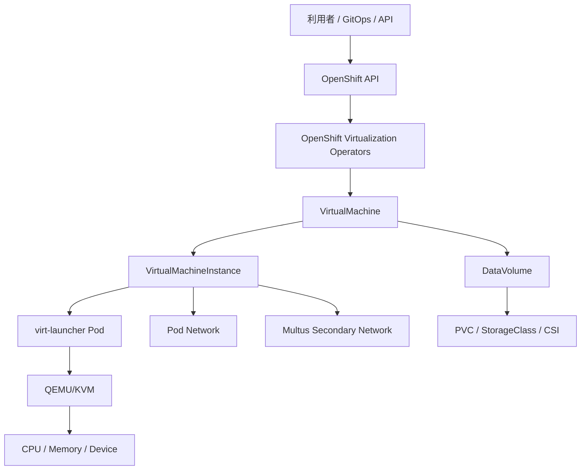

# OpenShift Virtualization

> [!NOTE]
> 本資料は、インフラ経験者が実務成果物を読み解くための技術リファレンスです。OpenShift に関する構成とコマンドは OpenShift Container Platform 4.22 を具体例とします。実環境へ適用する前に、対象 z-stream、プラットフォーム、権限、変更手順、製品間の互換性、サポート条件を公式資料と組織標準で確認してください。

OpenShift Virtualization は、コンテナと仮想マシン（VM）を OpenShift の API と運用基盤で管理するための機能です。この章では、製品の価値と構成要素だけでなく、VM 移行先として設計するときの論点を整理します。

## OpenShift Virtualization とは

OpenShift Virtualization は、OCP 上で VM を宣言・起動・停止・移行・監視するための機能です。上流の KubeVirt 技術を中心に、VM 管理を Kubernetes API へ統合し、Red Hat が OCP と組み合わせて製品として提供・サポートします。

VM は Pod の代わりにコンテナへ変換されるわけではありません。ゲスト OS と仮想ハードウェアを持つ VM が、Kubernetes によりスケジュールされる `virt-launcher` Pod などの仕組みを通して実行されます。利用者は通常、ホストの KVM プロセスを直接操作せず、`VirtualMachine` などの API と Web コンソール／`oc`／`virtctl` を使います。



## なぜ VM を OpenShift 上で動かすのか

主な価値は管理基盤の統合です。

- VM とコンテナを同じ Kubernetes API、RBAC、Project、GitOps、監視の考え方で管理できる。
- VMware 等にある既存 VM を、アプリケーションを直ちに作り替えず移行する選択肢になる。
- VM のまま基盤を移し、その後 API、周辺機能、アプリケーション単位で段階的にコンテナ化できる。
- Operator や宣言的構成を用いて、VM の標準化とセルフサービス化を検討できる。

ただし、単一基盤化が必ずコスト削減や運用簡素化になるとは限りません。既存 VM の対応 OS、性能、デバイス、バックアップ、運用ツール、ライセンス、担当者スキルを評価し、適合しない VM は別基盤へ残す判断も必要です。

## VMware 代替・VM 移行の文脈

OpenShift Virtualization は VMware vSphere からの移行候補の一つですが、「ハイパーバイザーを交換するだけ」ではありません。次の差分を確認します。

| 論点 | 確認内容 |
| --- | --- |
| 管理モデル | vCenter の VM 操作から Kubernetes API、Project、RBAC、宣言的管理へ変わる |
| ネットワーク | Port Group／VLAN と NetworkAttachmentDefinition、Pod Network のマッピング |
| ストレージ | Datastore と StorageClass／PVC、スナップショット、access mode のマッピング |
| 可用性 | HA、DRS、vMotion 相当の要件を、スケジューラ、Live Migration、退避余力で再設計 |
| バックアップ | VMware 向け方式をそのまま使えるとは限らず、OADP、CSI、対応製品を再評価 |
| 運用 | VM 管理者と OCP 管理者の責任、変更、監視、パッチ、障害切り分けを再定義 |
| ライセンス | OS、DB、ミドルウェア、CPU 課金、サポート条件をベンダーへ **要確認** |

Migration Toolkit for Virtualization（MTV）は移行作業を支援しますが、棚卸し、互換性判断、業務停止調整、アプリケーション試験、切り戻し判断まで自動化するものではありません。

## 既存 VM をすぐにコンテナ化できない理由

- アプリケーションが OS 固有機能、systemd、カーネルモジュール、固定ホスト名、ローカルディスクへ依存している。
- ベンダー製品がコンテナ実行をサポートしていない、または再認証が必要である。
- ソースコードやビルド手順がなく、改修の影響範囲を特定できない。
- モノリス、密結合、長時間プロセス、GUI、特殊デバイスなどの特性がある。
- 改修、再試験、運用変更に必要な時間と予算をすぐ確保できない。

この場合、VM のまま移行することは「モダナイズ完了」ではなく、基盤移行とアプリケーション改修を分ける段階的な選択です。技術的負債、ライフサイクル、将来のコンテナ化候補を台帳で管理します。

## VM とコンテナの違い

| 観点 | VM | コンテナ |
| --- | --- | --- |
| OS | ゲスト OS と独自カーネルを持つ | ホストのカーネルを共有する |
| 分離 | 仮想ハードウェア境界 | namespace/cgroup 等のプロセス分離 |
| 起動 | 一般に OS 起動を含み重い | 一般にプロセス起動で軽い |
| イメージ | OS を含むディスクイメージ | アプリと依存物のコンテナイメージ |
| 状態 | VM ディスクに長期状態を持ちやすい | イメージ不変・状態は外部永続化が基本 |
| 運用 | ゲスト OS パッチ、バックアップ、エージェントが必要 | イメージ再ビルド／再配置が中心 |

OpenShift 上で管理されても、VM のゲスト OS パッチ、ウイルス対策、ユーザー、時刻、ファイルシステム、アプリケーション整合バックアップは引き続き必要です。

## KubeVirt、KVM、QEMU の関係

- **KVM:** Linux カーネルの仮想化機能です。CPU 仮想化支援を使い、Linux をハイパーバイザーとして動作させます。
- **QEMU:** 仮想 CPU、メモリ、デバイス等を提供するユーザー空間の仮想マシンモニターです。KVM と組み合わせてハードウェア支援を利用します。
- **KubeVirt:** VM のライフサイクルを Kubernetes API とコントローラーへ統合する上流プロジェクトです。
- **OpenShift Virtualization:** KubeVirt を中心とするコンポーネントを OCP 上で統合・検証・サポートする製品機能です。

正確な内部コンポーネント、コンテナ名、デーモンの構成は版で変わるため、トラブルシュート時は対象版の公式アーキテクチャを **要確認** とします。

## VirtualMachine

`VirtualMachine`（VM）は、VM の望ましい構成と実行方針を表す永続的な API リソースです。CPU、メモリ、ディスク、ネットワーク、起動方法などを宣言します。停止中でも VM リソースは残ります。

実務では次を確認します。

- `runStrategy` と起動・停止の運用。古い `running` フィールドとの使い分けは版依存。
- instance type／preference を使った標準化可否。
- ラベル、Project、所有者、バックアップポリシー、停止順序。
- 変更が即時反映か、再起動・再作成を要するか。

## VirtualMachineInstance

`VirtualMachineInstance`（VMI）は、実行中の VM インスタンスを表します。VM を起動すると VMI が作成され、停止すると通常 VMI は削除されます。

`VirtualMachine` が設計・希望状態、`VirtualMachineInstance` が現在の実行状態、という関係で捉えると理解しやすくなります。障害調査では VM、VMI、`virt-launcher` Pod、Node、PVC、NetworkAttachmentDefinition を関連付けます。

## DataVolume

`DataVolume`（DV）は Containerized Data Importer（CDI）が提供するリソースで、PVC の作成と、HTTP、Registry、既存 PVC、アップロードなどからのデータ取り込みを宣言します。

- DataVolume の Phase、PVC、importer／cloner Pod、イベントを確認します。
- 取り込み元 URL、認証 Secret、証明書、プロキシ、容量、StorageClass を確認します。
- 対応 source、クローン方式、VolumeSnapshot 利用可否は対象版と CSI で **要確認** です。

## PVC / StorageClass

VM の永続ディスクは多くの場合 PVC と StorageClass を通して提供されます。設計では次を確認します。

- ブロック／ファイル、`Filesystem`／`Block`、RWO／RWX、性能、遅延、IOPS、容量拡張。
- VM 起動ノードとボリュームの障害ドメイン、`volumeBindingMode`、接続上限。
- スナップショット、クローン、バックアップ、暗号化、reclaimPolicy。
- Live Migration、バックアップ、DR が要求する CSI 機能。

「PVC がある」ことと「Live Migration／スナップショット／復元がサポートされる」ことは別です。StorageProfile と公式サポート条件を **要確認** とします。

## VM 用ノード設計

VM を実行するノードでは、通常のコンテナ Worker に加えて次を検討します。

- CPU 仮想化支援、CPU モデルの互換性、メモリ、NUMA、巨大ページ、オーバーコミット。
- VM ディスク I/O、Live Migration 用帯域、業務ネットワークの NIC／VLAN／SR-IOV。
- ノードラベル、taint/toleration、affinity、VM の分散、保守時の退避先。
- 同時ノード障害・drain を想定した CPU／メモリの空き容量。
- ベアメタル、クラウド、ネスト仮想化でのサポート可否を対象版のマトリクスで **要確認**。

## CPU / メモリ設計

- **requests:** スケジューラが配置判断に使う保証量です。VM が要求するメモリだけでなく、実行オーバーヘッドも考慮します。
- **limits／overcommit:** 集約率を高められますが、CPU contention や OOM のリスクがあります。業務 SLA ごとに方針を分けます。
- **CPU model:** Live Migration 先でも互換な CPU 機能が必要です。異世代ノード混在時は共通モデル／機能を確認します。
- **専用 CPU／NUMA／Huge Pages:** 低遅延・高性能用途で検討しますが、スケジューリング柔軟性と移行可能性が下がる場合があります。
- **メモリ ballooning／overcommit:** ゲスト OS、ワークロード、対象版の対応を確認し、過剰な集約を避けます。

サイジングは「VM の割当 vCPU／メモリ合計」だけでなく、ピーク実測、予約、基盤 Pod、障害・保守時余力、成長率から算定します。

## Live Migration

Live Migration は、実行中 VMI を停止時間を最小化して別ノードへ移す機能です。ノード保守や退避に使います。

現行公式資料の代表的な前提には、共有可能なストレージ、十分な RAM とネットワーク帯域、互換 CPU が含まれます。ただし、次は版・構成依存のため **要確認** です。

- StorageClass、access mode、volumeMode、CSI が Live Migration をサポートするか。
- bridge、masquerade、SR-IOV など VM インターフェース種別の制約。
- 専用 CPU、Huge Pages、ホストデバイス、GPU、ローカルディスクの制約。
- 同時移行数、帯域、タイムアウト、暗号化、退避用空きメモリ。
- 移行中のアプリケーション遅延と、失敗時の VM 状態。

Live Migration はバックアップや DR の代わりではありません。また「無停止」を保証する言葉として使わず、許容中断とアプリケーション試験を定義します。

## VM ネットワーク

VM には主に次の接続方式を検討します。

- **既定 Pod Network:** クラスタ内 Service や外部への接続に使います。masquerade 等の binding と IP の見え方を確認します。
- **Multus secondary network:** 1台の VM に追加インターフェースを付け、業務 VLAN、管理、バックアップなどを分離します。
- **サービス公開:** Kubernetes Service、Route（HTTP/HTTPS）、LoadBalancer、NodePort 等を用途に応じて選びます。

MAC／IP 管理、DNS、MTU、NetworkPolicy、送信元 IP、DHCP／固定 IP、冗長化、帯域、ネットワーク担当との責任分界を設計します。

## Multus

Multus は Pod／VM に複数ネットワークインターフェースを接続するためのメタ CNI です。追加ネットワークは一般に `NetworkAttachmentDefinition`（NAD）で表します。

- NAD を誰が作成・変更できるか。Project 共通か個別か。
- 使用する CNI（bridge、macvlan、SR-IOV 等）と対象版のサポート。
- IPAM、VLAN、MTU、物理スイッチ、Node NIC の対応。
- Live Migration、NetworkPolicy、監視、バックアップの制約。

Multus を使えば既存 VLAN が自動的に接続されるわけではありません。ノード側 NIC、スイッチ trunk/access、VLAN 許可、IPAM、Firewall の一貫した設計が必要です。

## 既存 VLAN 接続

既存 VM の VLAN を引き継ぐ場合は、次のマッピング表を作ります。

| 移行元 | 移行先 | 確認項目 |
| --- | --- | --- |
| vSphere Port Group | NAD | VLAN ID、MTU、CNI、namespace |
| VM NIC | VM interface/network | MAC 引継ぎ、モデル、起動順 |
| 固定 IP | guest OS／IPAM | 重複、Gateway、DNS、切替時刻 |
| 物理 uplink | Node NIC／bond | trunk、冗長化、帯域、障害時経路 |
| FW ルール | 新経路の FW | 送信元変化、NAT、戻り経路、ログ |

同一 IP を移行元と移行先で同時に有効化しない切替手順、ARP/ND キャッシュ、DNS TTL、監視抑止、切り戻し条件も決めます。

## バックアップ

VM バックアップでは、次の層を分けます。

1. VM／DataVolume／Secret 等の Kubernetes リソース。
2. PVC 上の仮想ディスク。
3. ゲスト OS 内のファイルシステム、DB、アプリケーション整合性。
4. 別クラスタ／別サイトでの復元に必要なネットワーク、StorageClass、イメージ、鍵。

OADP、CSI VolumeSnapshot、対応バックアップ製品、ゲストエージェントや hook を組み合わせる場合があります。クラッシュ整合とアプリケーション整合、スナップショットとバックアップ、同一障害ドメイン内の複製と遠隔保管を区別します。製品・CSI・VM OS の対応は **要確認** です。

## 監視

最低限、次を監視対象にします。

- VM/VMI の起動状態、再起動、migration、eviction、異常イベント。
- vCPU、ゲストメモリ、ディスク I/O・遅延・容量、ネットワーク throughput/error。
- VM 実行ノードの CPU、メモリ、KVM、NIC、ストレージ、退避余力。
- `virt-*` Operator／Pod、CDI import、DataVolume、PVC、NAD。
- ゲスト OS 内のサービスやファイルシステム。これはクラスタ側メトリクスだけでは分かりません。

アラートには、閾値根拠、継続時間、一次対応、抑止、ゲスト管理者へのエスカレーションを付けます。

## MTV との関係

Migration Toolkit for Virtualization（MTV）は、移行元 provider と OpenShift Virtualization を接続し、storage map、network map、移行 Plan を使って VM 移行を支援する Operator です。

MTV が支援する範囲と、プロジェクト側が担う範囲を分けます。

- **MTV:** インベントリ取得、互換性検証、ディスクコピー、変換、移行先 VM 作成、進捗表示など。
- **プロジェクト:** 対象選定、OS／アプリのサポート確認、業務停止、バックアップ、ネットワーク切替、機能・性能試験、受入、切り戻し判断。

移行元、cold/warm/live の対応範囲、Technology Preview、必要権限、VDDK 等の前提は MTV と OCP の版で変わるため、必ず公式マトリクスで **要確認** とします。

## 基本確認コマンド

API と Operator の存在を確認してから、VM → VMI → Pod → Node、DataVolume → PVC の関係を追います。

```bash
oc api-resources | grep -Ei 'kubevirt|virtualmachine|datavolume|networkattachment'
oc get hyperconverged -n openshift-cnv
oc get pods -n openshift-cnv
oc get virtualmachines -A
oc get virtualmachineinstances -A -o wide
oc get datavolumes -A
oc get pvc -A
oc get network-attachment-definitions.k8s.cni.cncf.io -A
oc get events -n <project-name> --sort-by=.lastTimestamp
```

個別 VM の確認例です。

```bash
oc describe virtualmachine <vm-name> -n <project-name>
oc describe virtualmachineinstance <vm-name> -n <project-name>
oc get pod -n <project-name> -l kubevirt.io=virt-launcher -o wide
oc describe datavolume <datavolume-name> -n <project-name>
oc describe pvc <pvc-name> -n <project-name>
virtctl console <vm-name> -n <project-name>
virtctl guestosinfo <vm-name> -n <project-name>
```

`virtctl console` は対話接続です。対象、権限、監査、終了方法を確認して使用します。コマンドやラベルは対象版で **要確認** です。

## 設計・PoC の試験観点

- VM 作成、起動、停止、再起動、削除保護、コンソール接続。
- DataVolume import／clone、PVC 拡張、スナップショット、バックアップ／復元。
- Pod Network、secondary network、既存 VLAN、DNS、固定 IP、Firewall。
- Node drain、Live Migration、移行失敗、容量不足、Node 障害。
- CPU／メモリ／ディスク／ネットワーク性能と、ピーク時の他 VM 影響。
- RBAC、SCC、NAD 作成権限、Secret、監査ログ。
- ゲスト OS、ミドルウェア、バックアップ製品、監視エージェントのベンダーサポート。

期待値は「動くこと」ではなく、最大中断時間、性能値、復元時間、許容エラー、証跡で記述します。

## 公式情報

- [Red Hat OpenShift Virtualization product documentation](https://docs.redhat.com/en/documentation/openshift_container_platform/4.22/html/virtualization/)
- [OpenShift Virtualization architecture](https://docs.redhat.com/en/documentation/openshift_container_platform/4.22/html/virtualization/about)
- [Live migration](https://docs.redhat.com/en/documentation/openshift_container_platform/4.22/html/virtualization/live-migration)
- [KubeVirt User Guide](https://kubevirt.io/user-guide/)
- [Migration Toolkit for Virtualization documentation](https://docs.redhat.com/en/documentation/migration_toolkit_for_virtualization/)

> 参照日は **2026-08-13** です。リンク中の OCP `4.22` は本資料で用いる具体例で、採用版を意味しません。OpenShift Virtualization、MTV、CSI、CNI の組合せ、Live Migration、対応ゲスト OS、Technology Preview の扱いは、対象 z-stream と Red Hat サポートマトリクスで **要確認** です。

## 実務での説明要点

- OpenShift Virtualization は KubeVirt を中心に、VM を Kubernetes API と OpenShift の運用基盤へ統合する。
- VM 用ノードの退避余力、CPU 互換性、StorageClass、Live Migration、Multus、バックアップ、監視を一体で設計する。
- 対応ゲスト OS、CSI/CNI、移行方式、Technology Preview の扱いは OCP 4.22 と採用 Operator の組合せで確認する。
