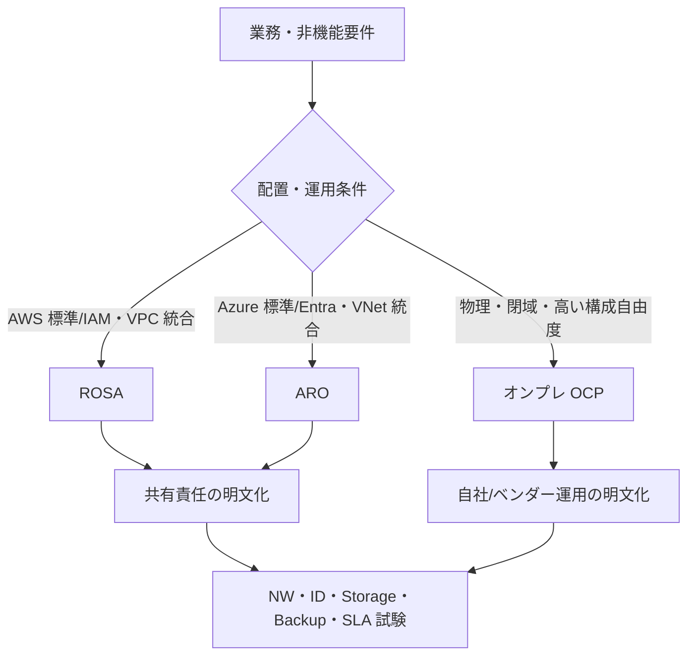

# ROSA / ARO 比較

> [!NOTE]
> 本資料は、インフラ経験者が実務成果物を読み解くための技術リファレンスです。OpenShift に関する構成とコマンドは OpenShift Container Platform 4.22 を具体例とします。実環境へ適用する前に、対象 z-stream、プラットフォーム、権限、変更手順、製品間の互換性、サポート条件を公式資料と組織標準で確認してください。

ROSA と ARO は、OpenShift の管理作業の一部をクラウド事業者と Red Hat が担うマネージドサービスです。「OpenShift の操作が同じ」だけで選ばず、責任分界、ネットワーク、ID、ストレージ、接続、規制、既存クラウド標準との適合で比較します。

## サービスの位置付け

### ROSA とは

Red Hat OpenShift Service on AWS（ROSA）は AWS 上のマネージド OpenShift サービスで、AWS と Red Hat が共同でサポート・運用します。AWS の VPC、IAM/STS、EC2、EBS、Load Balancer などと統合し、利用者は OpenShift の Project、アプリケーション、データ、利用者権限などを担当します。

ROSA には Hosted Control Planes（HCP）など複数の提供形態・構成選択肢があり、Control Plane の配置、課金、対応機能、ネットワーク要件が異なります。既存方式を前提にせず、新規案件で利用可能な方式を **要確認** とします。

### ARO とは

Azure Red Hat OpenShift（ARO）は Microsoft Azure 上のマネージド OpenShift サービスで、Microsoft と Red Hat が共同で開発・運用・サポートします。クラスタは顧客の Azure subscription 内に展開され、VNet、Microsoft Entra ID、Azure Disk／Files、Azure Load Balancer などと連携します。

マネージドであっても、利用者のアプリケーション、Project/RBAC、データ保護、ネットワーク接続、コスト、法令対応が自動的に解決するわけではありません。

## オンプレ OCP との比較

| 観点 | ROSA | ARO | オンプレ OCP |
| --- | --- | --- | --- |
| 配置先 | AWS | Azure | 自社 DC／ホスティング等 |
| 基盤運用 | AWS/Red Hat と責任分担 | Microsoft/Red Hat と責任分担 | 原則、利用組織／構築・保守ベンダー |
| Control Plane | サービス方式により管理・配置が異なる | サービス側が管理 | 利用組織側が設計・容量・更新を担う |
| 物理設備 | AWS が管理 | Azure が管理 | ラック、電源、サーバー、SAN、NW も設計対象 |
| 変更自由度 | サービス制約内 | サービス制約内 | 高いが、設計・運用責任も大きい |
| クラウド連携 | IAM/STS、ELB、EBS/EFS、Route 53 等 | Entra ID、Azure LB、Disk/Files、DNS 等 | 既存 AD/DNS/LB/SAN 等を個別統合 |
| 支払い | AWS 経由のサービス／基盤費用等 | Azure billing | HW、保守、OCP subscription、設備等 |
| 障害対応 | 共有責任。サービス窓口と利用者切り分け | 共有責任。サービス窓口と利用者切り分け | 組織の保守体制と複数ベンダー調整 |

具体的な SLA と責任分界はプラン、リージョン、契約、構成で異なるため、営業資料ではなく契約文書で **要確認** です。



## 共通して決めること

- リージョン、可用性ゾーン、クラスタ数、本番／非本番分離、可用性目標。
- Public／Private API と Ingress、社内接続、Internet egress、proxy、DNS。
- IdP、管理者、break-glass、Project/RBAC、監査ログ。
- Worker machine pool、サイジング、autoscaling、Node label／taint、GPU 等。
- StorageClass、暗号鍵、snapshot、backup、RPO/RTO、別リージョン DR。
- アップグレード、保守通知、サポート連絡、重大障害時の責任分界。
- 料金、データ転送、ログ保存、予算アラート、タグ／label による費用配賦。

## AWS 側の設計要素

### VPC

- 新規 VPC か既存 VPC（Bring Your Own VPC）か、CIDR、所有アカウント、タグ、Flow Logs を決めます。
- オンプレ、Transit Gateway、他 VPC、VPN／Direct Connect、共有サービス VPC との経路と CIDR 重複を確認します。
- ROSA サービスが必要とする VPC endpoint、NAT、Internet Gateway、PrivateLink 等は方式・版で **要確認**。
- クラスタ削除時に残す共有資源と削除対象を識別します。

### Subnet

- Public／Private、AZ ごとの subnet、node／load balancer の配置、利用可能 IP 数を決めます。
- machine pool の最大台数、Load Balancer、ENI、更新・置換時の一時リソースを含めて IP を見積もります。
- route table、NACL、DHCP option、VPC DNS 設定を確認します。
- ROSA with HCP と別方式では要求する subnet 数・tag・接続が異なるため **要確認**。

### Security Group

- Node、Control Plane 接続、Load Balancer、管理端末、社内サービスへの通信を SG で制御します。
- 送信元／宛先を CIDR だけでなく SG reference で表せるか検討します。
- 利用者が変更可能な SG とサービス管理 SG を区別し、勝手に削除・狭窄しません。
- NetworkPolicy は Pod レベル、SG は AWS ネットワークレベルであり、両方を整合させます。

### Route 53

- Public／Private hosted zone、クラスタドメイン、API、`*.apps`、社内 DNS からの委任／転送を決めます。
- Private Hosted Zone をオンプレから引く場合、Route 53 Resolver inbound/outbound endpoint と転送 rule を検討します。
- DNS 所有者、TTL、証明書、DR 切替、cluster delete 時の record 管理を決めます。
- ROSA が自動管理する record と利用者管理 record の境界は **要確認**。

### IAM / STS

- ROSA のサービス／Operator が AWS API を呼ぶための IAM role、policy、OIDC provider、STS を設計します。
- 長期 access key より一時 credential と最小権限を基本にし、role 作成・更新・監査の責任を決めます。
- account role、operator role、OIDC configuration 等の名称と要件は ROSA 方式・CLI 版で **要確認**。
- SCP、permissions boundary、CloudTrail、組織の naming/tagging standard との整合を確認します。

### EBS / EFS

- EBS は主にブロック／RWO、EFS は共有ファイル／RWX の候補です。CSI driver と StorageClass を通して利用します。
- EBS volume type、IOPS、throughput、AZ、暗号化 KMS key、snapshot、拡張を決めます。
- EFS の mount target、security group、access point、性能 mode、backup を決めます。
- アプリケーションや OpenShift Virtualization の要求する access mode、snapshot、clone、Live Migration 対応を **要確認**。

### Load Balancer

- OpenShift API と Ingress、内部／外部 Route、NLB／ALB 等の用途を区別します。
- ROSA が作成・管理する LB と、アプリケーション用 AWS Load Balancer Controller 等の責任を分けます。
- Public／internal、subnet、security group、TLS、source IP、health check、connection timeout を決めます。
- サービス方式が許可する LB 種別・annotation・quota を **要確認**。

### AWS 確認コマンド例

以下は read-only の具体例です。profile、region、cluster tag は実環境に合わせます。

```bash
aws sts get-caller-identity
aws ec2 describe-vpcs --region ap-northeast-1
aws ec2 describe-subnets --region ap-northeast-1
aws ec2 describe-route-tables --region ap-northeast-1
aws ec2 describe-security-groups --region ap-northeast-1
aws route53 list-hosted-zones
aws iam list-open-id-connect-providers
aws ec2 describe-volumes --region ap-northeast-1
aws elbv2 describe-load-balancers --region ap-northeast-1
rosa list clusters
rosa describe cluster --cluster <cluster-name>
```

## Azure 側の設計要素

### VNet

- 新規／既存 VNet、address space、resource group、subscription、region、tag を決めます。
- Hub-Spoke、VNet peering、VPN／ExpressRoute、Private Link、Firewall、UDR を含む社内経路を確認します。
- Platform が必要とする egress、service endpoint／private endpoint、DNS 解決を確認します。
- ARO がサポートするネットワーク方式、既存 VNet 条件、resource provider 登録を **要確認**。

### Subnet

- Control Plane と Worker の subnet、CIDR、利用可能 IP、delegation／policy 条件を決めます。
- autoscale、更新、増設、Load Balancer frontend/backend、private endpoint の IP 余力を見積もります。
- UDR、NAT Gateway、NSG、Azure Firewall、DNS server 設定を対応付けます。
- クラスタ作成後に変更できない値や制約を公式手順で **要確認**。

### NSG

- Network Security Group（NSG）で subnet／NIC レベルの通信を制御します。
- ARO サービスが必要とする inbound/outbound rule と利用者追加 rule を区別します。
- service tag、application security group、優先順位、effective rules、Network Watcher flow logs を検討します。
- OpenShift NetworkPolicy との二重制御で、どちらが拒否したかを切り分けられる運用にします。

### Azure Load Balancer

- API／Ingress の public／private frontend、backend pool、health probe、rule を確認します。
- サービス管理の Load Balancer を直接変更できる範囲と、アプリ用 `Service type=LoadBalancer` の扱いを区別します。
- source IP、idle timeout、SNAT port、zone、Private Link Service 等の必要性を確認します。
- ARO の管理対象とサポートされる変更は **要確認**。

### Azure DNS

- Azure DNS public／Private DNS zone、社内 DNS、Private Resolver／conditional forwarder の構成を決めます。
- API、`*.apps`、Private endpoint、VNet link、TTL、証明書名を整合させます。
- ARO が管理する zone／record と顧客管理範囲を確認します。
- オンプレ、管理端末、Node、Pod、外部利用者の各地点から名前解決試験を行います。

### Microsoft Entra ID

- Entra ID を Identity Provider として連携し、ユーザー／group と OpenShift RBAC を対応付けます。
- tenant、application／service principal または managed identity、redirect URI、Secret／certificate、有効期限を管理します。
- MFA、Conditional Access、Privileged Identity Management、break-glass の適用範囲を確認します。
- ARO 作成・Operator 用 managed identity／role assignment の現行要件は **要確認**。

### ACR

- Azure Container Registry（ACR）をアプリケーションイメージの外部 Registry として使うかを決めます。ARO の内部 Registry と同一ではありません。
- private endpoint、DNS、Firewall、managed identity／pull secret、content trust／署名、retention、geo-replication を検討します。
- Project ごとの pull 権限、CI/CD push 権限、脆弱性 scanning、イメージ昇格を設計します。
- ACR は必須とは限らないため、組織標準とサービス要件で **要確認**。

### Azure Disk / Azure Files

- Azure Disk は主にブロック／RWO、Azure Files は共有ファイル／RWX の候補で、CSI／StorageClass を通して使います。
- SKU、IOPS／throughput、zone、最大接続、暗号化、snapshot、backup、拡張を決めます。
- Storage Account の network ACL、private endpoint、identity、key rotation を確認します。
- OpenShift Virtualization、Live Migration、snapshot／clone の対応は ARO/OCP/CSI の組合せで **要確認**。

### Azure 確認コマンド例

```bash
az account show
az aro list --output table
az aro show --resource-group <resource-group> --name <cluster-name>
az network vnet show --resource-group <resource-group> --name <vnet-name>
az network vnet subnet list --resource-group <resource-group> --vnet-name <vnet-name> --output table
az network nsg list --resource-group <resource-group> --output table
az network lb list --resource-group <resource-group> --output table
az network private-dns zone list --resource-group <resource-group> --output table
az identity list --resource-group <resource-group> --output table
az disk list --resource-group <resource-group> --output table
az acr list --resource-group <resource-group> --output table
```

## ROSA / ARO 選定の比較軸

| 比較軸 | 確認質問 |
| --- | --- |
| 既存クラウド | AWS と Azure のどちらにネットワーク、ID、監視、運用標準があるか |
| 接続 | オンプレ接続、private API/Ingress、DNS、egress の要件を満たせるか |
| データ | 対応 StorageClass、暗号鍵、backup、データ所在地、DR を満たせるか |
| 運用 | 共有責任、権限、保守時間、更新、サポート窓口が組織に合うか |
| セキュリティ | IAM/Entra、ログ、脆弱性、Private endpoint、規制を満たせるか |
| コスト | service、compute、storage、LB、NAT、ログ、通信、support を総額比較したか |
| 移行 | image、YAML、データ、IP/DNS、依存クラウドサービスを移せるか |

## 移行時の論点

オンプレ OCP、別クラウド、セルフマネージド Kubernetes からの移行では、次を棚卸しします。

1. **Kubernetes/OpenShift API:** deprecated API、Operator、CRD、SCC、Route、BuildConfig、ImageStream。
2. **イメージ:** Registry、pull secret、署名、architecture、外部通信、ミラー。
3. **データ:** CSI、access mode、snapshot、DB 整合、転送量、暗号鍵、RPO/RTO。
4. **ネットワーク:** CIDR 重複、IP 固定、DNS、LB、egress IP、NetworkPolicy、Firewall、遅延。
5. **ID/権限:** LDAP/OIDC から IAM/Entra への mapping、group、ServiceAccount、Secret。
6. **運用:** 監視、ログ、backup、SIEM、patch、保守、support、Runbook。
7. **クラウド依存:** AWS/Azure 固有 DB、queue、object storage、KMS、private endpoint。
8. **移行方式:** 再デプロイ、GitOps、データ replication、blue/green、DNS 切替、rollback。

マネージドサービスでは Control Plane の shell や一部設定へ利用者がアクセスできない場合があります。既存 Runbook をそのまま移さず、責任分界と代替診断方法を **要確認** とします。

## 運用責任を確認する質問

- API／Ingress／Control Plane 障害時、利用者が収集する情報とサービス側が見る情報は何か。
- 更新版と時期を誰が決め、延期可能期間、通知、失敗時対応はどうなるか。
- Node、Load Balancer、DNS、証明書、Operator、StorageClass の変更権限は誰にあるか。
- `must-gather`、クラウド診断ログ、監査ログをどこへ保管し、誰が参照できるか。
- 重大障害時の一次窓口、Red Hat／AWS／Microsoft への連携、severity 条件は何か。

## 公式情報

- [AWS: What is Red Hat OpenShift Service on AWS?](https://docs.aws.amazon.com/rosa/latest/userguide/what-is-rosa.html)
- [Red Hat: ROSA documentation](https://docs.redhat.com/en/documentation/red_hat_openshift_service_on_aws/)
- [Microsoft: Introduction to Azure Red Hat OpenShift](https://learn.microsoft.com/en-us/azure/openshift/intro-openshift)
- [Microsoft: Azure Red Hat OpenShift documentation](https://learn.microsoft.com/en-us/azure/openshift/)
- [Red Hat OpenShift Container Platform documentation](https://docs.redhat.com/en/documentation/openshift_container_platform/)

> 参照日は **2026-08-13** です。`latest` ページは更新されます。サービス方式、利用可能リージョン、SLA、料金、quota、IAM/managed identity、public/private 接続、サポート範囲は契約・作成時点の AWS、Microsoft、Red Hat 公式文書で **要確認** です。

## 実務での説明要点

- ROSA は AWS、ARO は Azure の管理サービスであり、オンプレミス OCP と同じ Kubernetes API だけで方式を決めない。
- 責任分界、ネットワーク、ID、ストレージ、Load Balancer、更新、監視、サポート、規制要件を比較する。
- リージョン、SLA、料金、機能、quota は変化するため、採用時点の各社公式資料と契約条件を確認する。
