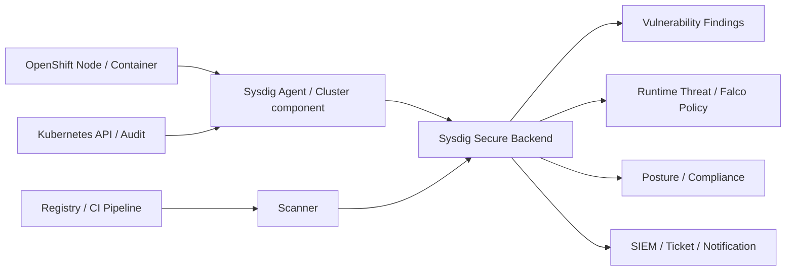

# Sysdig / コンテナセキュリティ

> [!NOTE]
> 本資料は、インフラ経験者が実務成果物を読み解くための技術リファレンスです。OpenShift に関する構成とコマンドは OpenShift Container Platform 4.22 を具体例とします。実環境へ適用する前に、対象 z-stream、プラットフォーム、権限、変更手順、製品間の互換性、サポート条件を公式資料と組織標準で確認してください。

> 更新基準日: 2026-08-13。Sysdig SaaS/On-Prem、Agent/Cluster Shield、Scanner、License機能は更新が速い。導入時は契約Edition、Release、OpenShift/OCP Compatibility、Data送信先を**要確認**。

## Sysdigとは

SysdigはCloud-native環境向けのObservability/Security製品群である。大きく、性能・可用性を観測するSysdig Monitorと、脆弱性・設定・Runtime threat等を扱うSysdig Secureを区別する。本章は主にSysdig Secureを扱う。

Sysdig SecureはCNAPPとして、Runtime Threat Detection、Vulnerability Management、Posture/Compliance、Identity/Entitlement等を提供する。実際に契約・有効化されたModuleは**要確認**。



## コンテナ監視

Containerは短命でIP/IDが変わるため、Host名だけでなくCluster、Namespace、Workload、Pod、Container、Image等のKubernetes Contextで見る。CPU、Memory、Network、File I/O、Restart、Latencyと、Deployment変更やEventを同じ時刻で相関させる。

Sysdig MonitorはMetrics、Dashboard、Alert、Application/Infrastructureの可視化を扱う。Prometheus Metricsを取り込む構成もあり、完全な代替関係とは限らない。Agent負荷、収集Data量、保持、SaaSへのEgressを設計する。

## ランタイムセキュリティ

Runtime Securityは「稼働中に何が起きたか」を検知する。例:

- Container内でShellやPackage managerが起動した
- Sensitive fileが読み書きされた
- 予期しないNetwork接続やPrivilege escalationが行われた
- Kubernetes ResourceやSecretへ異常なRequestがあった
- Cryptominer等の既知挙動が見られた

Rule matchは必ずIncidentとは限らない。Policy、Severity、Workload Context、実行User、Process tree、Image digest、変更時刻を確認し、False positiveを抑える。自動Kill/Pause等のResponse actionは業務停止を招くため、段階導入と承認が必要である。

## Falco

FalcoはCNCFのOpen Source Runtime Security toolで、Linux syscallやKubernetes Audit等のEvent sourceをRuleで評価し、異常行動を通知する。Sysdigが開発しCNCFへ寄贈した経緯があり、Sysdig SecureはFalco Rule Engineとruleを利用する。

Ruleの概念:

```yaml
- rule: Unexpected shell in container
  desc: Detect an interactive shell in a container for operational investigation
  condition: container and spawned_process and proc.name in (bash, sh, zsh)
  output: "Shell started in container (user=%user.name command=%proc.cmdline container=%container.name)"
  priority: NOTICE
  tags: [container, process]
```

これは参照用であり、そのまま本番へ適用すると保守作業まで大量検知する。Macro/List/Exception、対象Workload、Expected behavior、Rule test、Ownerを設計する。利用可能FieldとSyntaxはFalco/Sysdig Versionで**要確認**。

## 脆弱性管理

Vulnerability ManagementはImage等からSBOMを抽出し、CVE/脆弱性DBと照合し、Severity、Exploit、Fix availability、Runtimeで実際に使われるPackage等で優先度を付ける。

「Critical CVEがある」だけで即本番停止とは限らず、次を評価する。

- 該当Package/VersionがImageに含まれるか
- 実行時にload/useされるか、外部から到達可能か
- 公開Exploit、権限、Attack path
- Vendor fix/mitigation、Base image更新
- 業務影響と対応期限、Risk acceptanceの承認

Risk acceptanceは脆弱性を消す操作ではない。理由、期限、補完Control、承認者を記録する。

## イメージスキャン

代表的なscan pointは三つある。

1. CI/Pipeline: Build時にPolicy違反を早期検出する。
2. Registry: 保存Imageを定期評価し、新しいCVEにも追随する。
3. Runtime: 実際に稼働しているImageをContext付きで優先する。

Tagは再利用され得るためDigestで結果を追跡する。Base image、OS package、Language package、license、malware/secret検出の範囲はScannerごとに**要確認**。

OpenShift側の棚卸し例:

```bash
oc get pods -A -o jsonpath='{range .items[*]}{.metadata.namespace}{"\t"}{.metadata.name}{"\t"}{range .spec.containers[*]}{.image}{" "}{end}{"\n"}{end}'
oc get imagestream -A
oc get image -o custom-columns=NAME:.metadata.name,DOCKER-REF:.dockerImageReference
```

出力には内部Registry名等が含まれるため、外部共有前にmaskする。

## Kubernetes Audit

Kubernetes AuditはAPI ServerへのRequestを記録し、「誰が、いつ、どのResourceへ、何を要求し、どう応答したか」を調査する。Sysdig SecureはAudit integrationによりResource作成/削除、ConfigMap/Secret変更等を検知・Activity Auditへ利用できる。

Audit BackendとAdmission由来のemulated auditでは可視性が異なる。Managed OpenShiftではControl Plane AuditへのAccess方法やWebhook設定に制約があるため**要確認**。

設計項目:

- Audit policy / Stage / Verb / Resource / User
- Secret本文等の機密Dataを記録しすぎない
- 転送のTLS、認証、Buffer、欠損、再送
- 保持、検索権限、改ざん防止、時刻同期
- Detection ruleとIncident response runbook

## Sysdig Agent

Agent/Cluster componentはNode/ContainerのRuntime dataとKubernetes Metadataを収集し、Backendへ送る。一般にDaemonSet等で配置され、Hostの情報へAccessするため高い権限やSCCが必要になる場合がある。

導入前に確認する項目:

- Kernel/eBPF/driver、RHCOS、CPU architectureの対応
- Privileged/SCC/SELinux、HostPath、Capability
- Proxy/no_proxy、Firewall、SaaS Region/Data Residency
- Agent access tokenをSecret管理し、logへ出さない
- CPU/Memory/Network overheadと障害時buffer
- Agent/Backend upgrade順、canary、rollback

状態確認の一般例:

```bash
oc get daemonset -A | grep -i sysdig
oc get pods -A -o wide | grep -i sysdig
oc get events -A --sort-by=.metadata.creationTimestamp | grep -i sysdig
oc logs <sysdig-pod名> -n <sysdig-namespace> --all-containers=true --since=30m --timestamps=true
oc get pod <sysdig-pod名> -n <sysdig-namespace> -o jsonpath='{.metadata.annotations.openshift\.io/scc}{"\n"}'
```

実際のComponent名やHelm chartはReleaseにより変わるため、install guideを**要確認**。

## Prometheus / Grafanaとの違い

| 観点 | Prometheus / Grafana | Sysdig Monitor | Sysdig Secure |
|---|---|---|---|
| 主目的 | Metrics収集・Query・可視化 | SaaS/製品としてのObservability | Security riskとRuntime detection |
| 主データ | Exporter/Application metrics | Metrics、Kubernetes Context等 | Syscall/Audit、Image/SBOM、Cloud context等 |
| 代表出力 | Dashboard、Alert | Dashboard、Alert、Topology | Finding、Threat、Policy violation |
| 運用 | Storage/HA/Upgradeを設計 | 製品Backend/Agentを設計 | Rule tuning、Risk/Incident processを設計 |

SysdigでもPrometheus metricsを扱え、機能は重なる。既存監視、Data保管、Cost、Support、Team skillで責任分界を決める。

## RHACSとの違い

RHACSとSysdig SecureはいずれもKubernetes Security領域を扱う。比較は製品名ではなくUse Caseで行う。

| 選定軸 | 確認内容 |
|---|---|
| Platform | OpenShift中心か、複数Kubernetes/Cloudを横断するか |
| Runtime | Event source、Rule、Forensics、Response action |
| Vulnerability | CI/Registry/Runtime、SBOM、Risk prioritization |
| Admission | Deploy前Policy、Exception、Developer feedback |
| Compliance | Framework、Evidence、Report、Multi-cluster |
| Integration | Registry、CI/CD、SIEM、Ticket、Identity |
| Operation | SaaS/On-Prem、Data Residency、Agent、Upgrade |
| Commercial | Subscription、Support、既存契約、責任分界 |

RHACSはRed Hat/OpenShiftとの製品統合が選定要素になり、SysdigはMulti-cloud/CNAPP/Runtimeの要件が選定要素になり得る。ただし各Versionの機能を比較表で**要確認**。

## OpenShift案件で関係する場面

### 要件・基本設計

保護対象Cluster、Threat model、規制、Data residency、SaaS可否、SOC/SIEM、保持、RTOを決める。

### 詳細設計・構築

Namespace、SCC/RBAC、Secret、Agent resource、Proxy/Firewall、Rule、Notification、Scanner/Registry/CI連携を定義する。

### 試験

- 全NodeでAgent Ready、再起動後も復旧
- 承認された疑似EventでRuleを検知
- Notification/SIEM/Ticketへ一意のIncident IDを連携
- 脆弱Imageを非本番でscanし、Policy/Exception workflowを確認
- Backend停止/Network断時のbuffer・欠損・Node影響
- Upgrade/rollback、Agent overhead

### 運用

Rule tuning、False positive、CVE triage、Exception期限、Agent health、License/容量、Incident responseを定期Reviewする。

## Alert調査の型

1. Alert ID、Rule、時刻、Cluster/Namespace/Workloadを記録する。
2. 実行User、Process、Parent、Command、Container/Image digestを確認する。
3. Deployment、Admission、Audit、Network、直前変更を同時刻で相関する。
4. True/False positiveを判断し、影響範囲と封じ込め案を作る。
5. 自動/手動対応は承認後に行い、証拠保全と再発防止を記録する。

Alert本文やcaptureにはCommand引数、File path、IP、User情報が含まれ得る。外部AIや未承認Channelへ貼らない。

## 公式リファレンス

- [Sysdig Secure documentation](https://docs.sysdig.com/en/docs/sysdig-secure/)
- [Sysdig: Vulnerability Management](https://docs.sysdig.com/en/sysdig-secure/vulnerability-management/)
- [Sysdig: Kubernetes Audit Integration](https://docs.sysdig.com/en/sysdig-secure/kube-audit)
- [Sysdig: Threat Detection Policies and Falco](https://docs.sysdig.com/en/sysdig-secure/threat-detection-policies/)
- [Falco official documentation](https://falco.org/docs/)
- [Red Hat Advanced Cluster Security for Kubernetes 4.11 documentation](https://docs.redhat.com/en/documentation/red_hat_advanced_cluster_security_for_kubernetes/4.11)

## 実務での説明要点

- Sysdig Secure はイメージや実行時の脆弱性、Falco ルール、Kubernetes Audit などを扱うクラウドネイティブセキュリティ製品である。
- OpenShift 導入時は Agent の SCC/RBAC、カーネル対応、負荷、外部通信、データ所在地、ルール調整、SIEM 連携を確認する。
- Prometheus/Grafana や RHACS との役割重複は、検知・可観測性・運用責任・契約要件で比較する。
